# Build a cloud app on Mac OSX

Let's start by ensuring that the environment we are using for development is up to the task of mobile development by building and running a base app.  There is a `code` folder with all the code for the book n the [GitHub repository for this book][github-repo].  

* Clone or Download the [GitHub repository][github-repo].
* Ensure you have opened XCode at least once and accepted the license terms.  Also, download any iOS simulators you want to use.  You can close XCode after this and forget it exists for a while.
* Open the `code/Chapter1` folder, then double-click the `Chapter1.sln` file to open the solution in Visual Studio for Mac.
* Right-click the `Todo.iOS` project and select **Set as Startup Project...**.
* Ensure an appropriate simulator is selected in the top-left corner:

    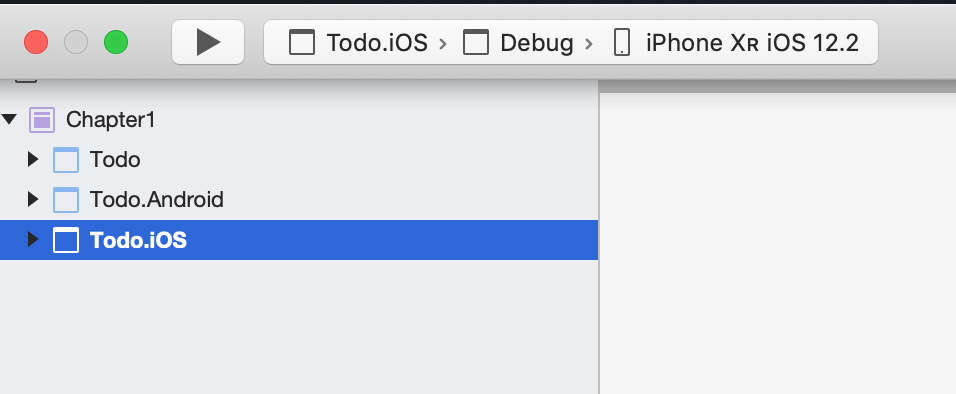

* Click the Run button in the top-left corner.

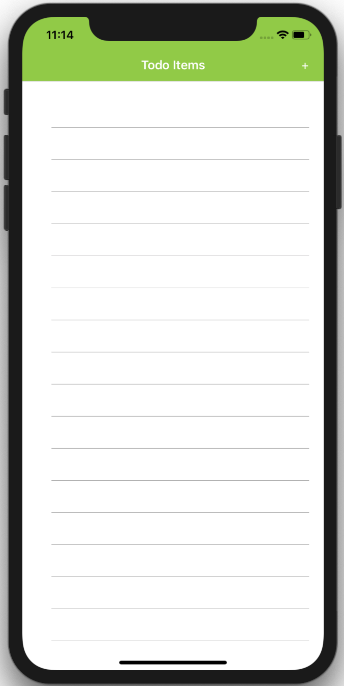

You should become familiar with the code in the `Todo` project, where the majority of the code lives.  Pay particular attention to the `Todo.Data` namespace as this contains all the code necessary to communicate with the database.  It is these classes we will be adjusting for the cloud.

## Prepare for a move to the cloud

The application as designed is a fairly standard implementation with a local database and based on a standard [Xamarin.Forms sample][sample].  However, there is one major gotcha with the code.  It uses an auto-incrementing numeric integer as a unique ID.  This is a normal design pattern for database-driven applications when a single application is creating and accessing data records, but it is not suitable for an app that accesses data in the cloud in a potentially concurrent manner.  Let's say you have just produced a great task list app with such an ID that we have.  Two users are now using the app.  Both users have downloaded the data from the cloud and are up to record 5.  Now both users create a record.  Each record will be numbered 6.  What happens when the record gets updated?  Since the ID is the primary key for the database, it has to be unique within that database.  Which one "wins"?  The answer is "it depends on who writes first".  The creation of the second record will likely fail, causing the user to see an error.

Before we can connect the app to the cloud, we have to adjust the database model to use something that is globally unique across all users of the app.  Unless there is a compelling alternate reason, I suggest using [universally unique ID](https://en.wikipedia.org/wiki/Universally_unique_identifier) as the primary key of the database.  Refactoring for this, we need to:

1. Adjust the model to have an internal ID and a user-visible ID.
2. Adjust the database client to only allow the use of a user-visible ID.  It should also auto-generate the user-visible ID when necessary.
3. Adjust all the places that use the database client to ensure that only the user-visible ID is provided.

Let's take a look at the code for each of these:

### Update the TodoItem model

The first step is to separate the internal ID from the user-visible one:

```csharp
using SQLite;

namespace Todo.Data
{
    public class TodoItem
    {
        [PrimaryKey,AutoIncrement]
        public int internalID { get; set; }
        public string ID { get; set; }
        public string Name { get; set; }
        public string Notes { get; set; }
        public bool Done { get; set; }
    }
}
```

The `internalID` is only used by the database and is internal to the app.  It should not be used anywhere else and should not leak to the cloud.  The `ID` has been updated to be a string so that it can store a UUID.

### Update the TodoItemDatabase client

The usage of the internal ID is inherent in the TodoItemDatabase client, so we need to update three routines there:

* `GetItemAsync()` takes the internal ID.  It needs to be adjusted to take the user-visible ID.
* `SaveItemAsync()` returns the internal ID.  It needs to be adjusted to return the new item.
* `DeleteItemAsync()` also returns the internal ID, but that is not used by anything, so let's adjust to just return.

Here is the new code:

```csharp
public Task<TodoItem> GetItemAsync(string id)
{
    return database.Table<TodoItem>().Where(i => i.ID == id).FirstOrDefaultAsync();
}

public async Task<TodoItem> SaveItemAsync(TodoItem item)
{
    if (item.internalID != 0) {
        await database.UpdateAsync(item);
    }
    else
    {
        item.ID = Guid.NewGuid().ToString();
        int internalID = await database.InsertAsync(item);
        item.internalID = internalID;
    }
    return item;
}

public async Task DeleteItemAsync(TodoItem item)
{
    await database.DeleteAsync(item);
}
```

We also need to deal with the fact that the database we created in the last run is using the old model.  In a more challenging app, we would version the database, then migrate the data to the new database if the old database exists.  For this simple example, we can rename the database to something new:

```csharp
private static readonly string dbPath = Path.Combine(
    Environment.GetFolderPath(Environment.SpecialFolder.LocalApplicationData), 
    "todoitems2.db3"
);
```

This will wipe out any tasks that have already been created, but will not delete the old database file.

### Update the rest of the app

Fortunately, the pages within the app do not require adjustment.  If you do this sort of refactoring on your own app, you will need to go through each page within the app and ensure that the internal ID is not used anywhere.  Refactor the code wherever you see the `ID` being used.  Ensure you do not use the `internalID` in the refactoring.  We'll take a look at some of the more common pitfalls in refactoring later in the book.

### Run the updated app

When we run the updated app, the first noted change is that there is no longer an ID when creating a new record.  This is because the ID is `null` at this point.  It is not set until after we click the Save button.  The UI translates this to an empty string for us.

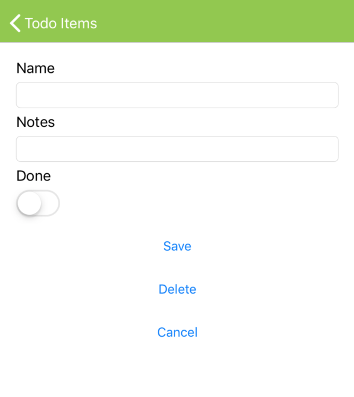

If we save the new note then click on the newly created note, we will see something similar to the following:

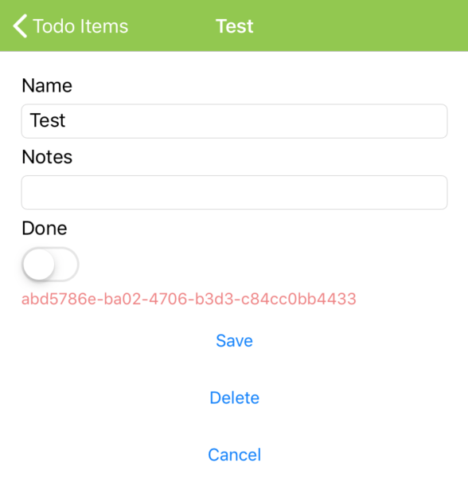

Here, we can see the ID is now a universally unique ID.

## Build a cloud service

Now that we have our app working with globally unique IDs, we can move on to storing the data in the cloud.  This is done in two steps.  First, we will create and test an ASP.NET Core based web service that provides a `todoitems` endpoint for which you can do standard CRUDL (**C**reate, **R**ead, **U**pdate, **D**elete, **L**ist) operations.  Then we will rewrite the `TodoItemDatabase` class in our app to access the new web service.

Let's make sure we have the right .NET Core runtime available.  Open a Terminal prompt and type `dotnet --info`:

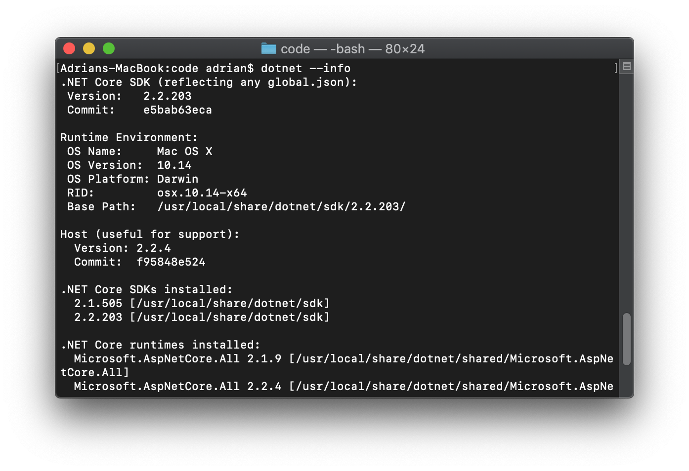

The version should be 2.2.x - it's ok to be a later patch version.  Next, open the app solution in Visual Studio for Mac and create a project:

* Right-click `Chapter1` underneath the solution, then select **Add** > **Add New Project...**.
* Under the .NET Core section, select **App**, then select **API**.  Then click **Next**.

    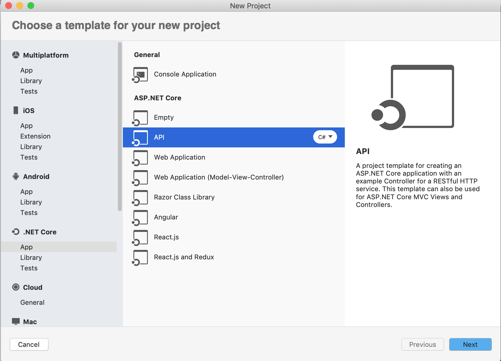

* Ensure the target framework is **.NET Core 2.2**, then click **Next**.
* Enter the project name `Todo.Backend`, then click **Create**.

    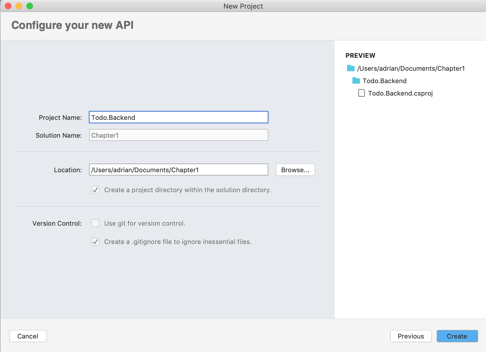

The project will now be created with a single `ValuesController` route.  This provides an `/api/values` endpoint which we will not use.  You can safely delete the `Controllers/ValuesController.cs` file.  In this tutorial, we are going to use a lot of the Visual Studio tooling to auto-generate a complete (but simple) backend service for our app. This will have the following endpoints:

* `GET /api/todoitems` will get a list of all the todo items in the database.
* `GET /api/todoitems/{id}` will get a single todo item.  The id is the user-visible unique ID.
* `POST /api/todoitems` will add a new item, returning the new item complete with all information.
* `PUT /api/todoitems/{id}` will replace the content of the old item, returning the new item.
* `DELETE /api/todoitems/{id}` will delete an existing items.

These all have a corresponding method inside the `TodoItemDatabase.cs` class within the app.

It's normal to organize code into separate concerns within an ASP.NET Core (or, for that matter, any) app.  We have two distinct concerns: `Data` will hold the `TodoItem` model class and the database context, and `Controllers` will hold the handler for the endpoint.  `Controllers` already exists, but we will need to create a folder for `Data`.  Right-click on the `Todo.Backend` project, then select **Add** > **New Folder** to add a new folder.

### Implement a database context

Before we code an endpoint controller, we need a database to talk to.  In this example, we're going to use an in-memory database.  First, set up a model in `Data/TodoItem.cs`.  Right-click the `Data` folder, then select **Add** > **New File**.  Select the **Empty Class** template and enter the name `TodoItem`.  Click **New** to create the file.

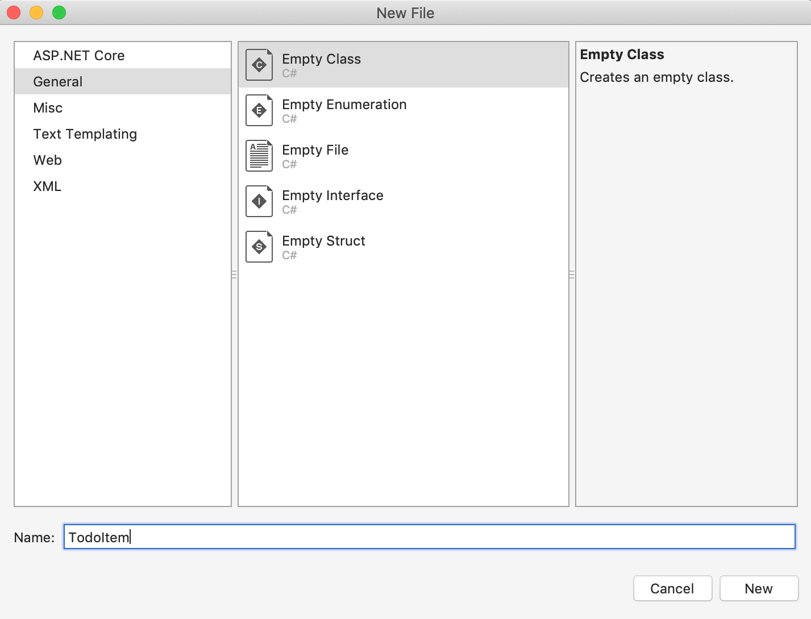

Then fill the resulting file with the following contents:

```csharp
namespace Todo.Backend.Data
{
    public class TodoItem
    {
        public string ID { get; set; }
        public string Name { get; set; }
        public string Notes { get; set; }
        public bool Done { get; set; }
    }
}
```

It looks remarkably similar to the model in the app.  That is not a mistake.  Generally, models in an app will have a significant overlap to models in the service.  However, it's not a 1-to-1 mapping.  

* There are client fields that may not be exposed.  For example, a client may have a `deleted` flag which indicates that the record has not been deleted on the service yet.  Once it is deleted, the record will be purged from the client.  Similarly, the internal ID may be required on the client as an internal record-keeper in a local cache.
* There are service fields that are not exposed.  For example, if you had a CRM and it contained all the purchases for a client, you may not want to drop them onto the client unless requested.  It's common to use a `ViewModel` to indicate the "view of the model that the client sees" and to instantiate a ViewModel from the contents of a Model for this purpose.

The database context connects the model to the database table, allowing us to perform standard CRUD type operations on the database table.  Most of the context is handled in standard libraries, so we only need to provide an initialization stub.  Create the `Data/TodoItemsContext` class with the following contents:

```csharp
using Microsoft.EntityFrameworkCore;

namespace Todo.Backend.Data
{
    public class TodoItemsContext: DbContext
    {
        public TodoItemsContext(DbContextOptions<TodoItemsContext> options) : base(options)
        {

        }

        public DbSet<TodoItem> TodoItems { get; set; }
    }
}
```

Finally, we need to register the database context with the ASP.NET Core application so that it is available to any controllers that need it.  This is done within `Startup.cs`:

```csharp hl_lines="6 7 23"
using Microsoft.AspNetCore.Builder;
using Microsoft.AspNetCore.Hosting;
using Microsoft.AspNetCore.Mvc;
using Microsoft.Extensions.Configuration;
using Microsoft.Extensions.DependencyInjection;
using Microsoft.EntityFrameworkCore;
using Todo.Backend.Data;

namespace Todo.Backend
{
    public class Startup
    {
        public Startup(IConfiguration configuration)
        {
            Configuration = configuration;
        }

        public IConfiguration Configuration { get; }

        // This method gets called by the runtime. Use this method to add services to the container.
        public void ConfigureServices(IServiceCollection services)
        {
            services.AddDbContext<TodoItemsContext> (opt => opt.UseInMemoryDatabase("TodoItems"));
            services.AddMvc().SetCompatibilityVersion(CompatibilityVersion.Version_2_2);
        }

        // Rest of the class is the same...
    }
}
```

We are using an in-memory database within this application so that we can work on the server without worrying about an actual database backend.  We'll work on integrating various databases when we discuss data more fully later in the book. 

### Create an API controller

Now that the database is hooked into the ASP.NET Core project, we can expose the database table as a REST endpoint.  The controllers are responsible for this functionality.  When we created the backend project, a `/api/values` endpoint was created, handled by the `ValuesController.cs` class.  When exposing a database table, some assistance is provided (although the tooling in Visual Studio 2019 for Windows is better here).  Create the TodoItems controller:

* Right-click the `Controllers` folder, then select **Add** > **New File...**.
* Select **ASP.NET Core** on the left-side, then scroll down to add **Web API Controller Class**.  Enter the name `TodoItemsController`, then click **New**.

    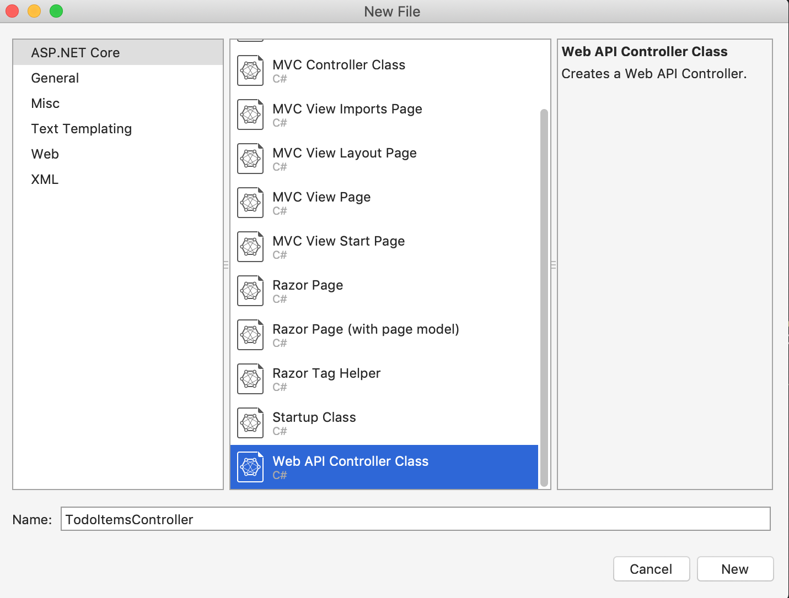

* Fill in the code as follows:

```csharp
using Microsoft.AspNetCore.Mvc;
using Microsoft.EntityFrameworkCore;
using System.Collections.Generic;
using System.Linq;
using System.Threading.Tasks;
using Todo.Backend.Data;

namespace Todo.Backend.Controllers
{
    [Route("api/[controller]")]
    [ApiController]
    public class TodoItemsController : ControllerBase
    {
        private readonly TodoItemsContext _context;

        public TodoItemsController(TodoItemsContext context)
        {
            _context = context;
        }

        // GET: api/TodoItems
        [HttpGet]
        public async Task<ActionResult<IEnumerable<TodoItem>>> GetTodoItems()
        {
            return await _context.TodoItems.ToListAsync();
        }

        // GET: api/TodoItems/5
        [HttpGet("{id}")]
        public async Task<ActionResult<TodoItem>> GetTodoItem(string id)
        {
            var todoItem = await _context.TodoItems.FindAsync(id);

            if (todoItem == null)
            {
                return NotFound();
            }

            return todoItem;
        }

        // PUT: api/TodoItems/5
        [HttpPut("{id}")]
        public async Task<IActionResult> PutTodoItem(string id, TodoItem todoItem)
        {
            if (id != todoItem.ID)
            {
                return BadRequest();
            }

            _context.Entry(todoItem).State = EntityState.Modified;

            try
            {
                await _context.SaveChangesAsync();
            }
            catch (DbUpdateConcurrencyException)
            {
                if (!TodoItemExists(id))
                {
                    return NotFound();
                }
                else
                {
                    throw;
                }
            }

            return NoContent();
        }

        // POST: api/TodoItems
        [HttpPost]
        public async Task<ActionResult<TodoItem>> PostTodoItem(TodoItem todoItem)
        {
            if (TodoItemExists(todoItem.ID))
            {
                return Conflict();
            }
            _context.TodoItems.Add(todoItem);
            await _context.SaveChangesAsync();

            return CreatedAtAction("GetTodoItem", new { id = todoItem.ID }, todoItem);
        }

        // DELETE: api/TodoItems/5
        [HttpDelete("{id}")]
        public async Task<ActionResult<TodoItem>> DeleteTodoItem(string id)
        {
            var todoItem = await _context.TodoItems.FindAsync(id);
            if (todoItem == null)
            {
                return NotFound();
            }

            _context.TodoItems.Remove(todoItem);
            await _context.SaveChangesAsync();

            return todoItem;
        }

        private bool TodoItemExists(string id)
        {
            return _context.TodoItems.Any(e => e.ID == id);
        }
    }
}
```

This is about as much code as we will write in this simple example.  It maps each REST endpoint that we want to handle onto the equivalent database operation within the database context.

### Test the API controller

Before we move to deployment, let's test the API controller.  There are several tools available to test web services.  The one I use most often is [Postman][postman].  Once Postman is downloaded and copied to your Applications folder, configure it:

* Open Postman (and close the introductory screen if it appears).
* Click **Postman** > **Preferences**.
* In the **General** tab, turn the **SSL certificate verification** off.
* Close the settings pane.

Postman has a main request/response area on the right and a history (allowing us to repeat requests we have sent in the past).  We need to know the application URL before we do any requests.  Open the `Properties/launchSettings.json` file, and you will see two sets of URLs.  One is listed under `iisSettings` and will be used when you use Visual Studio to run the application using IIS Express.  The other is used when you open a PowerShell prompt and run `dotnet run` in the project.  You can select whichever you find more convenient.  I find it better to use the IIS Express version when debugging (since my backend is running within the context of Visual Studio and I have access to all the debugger functionality within the IDE), but use `dotnet run` when I'm debugging the frontend (since running two projects at the same time within Visual Studio tends to be more complicated).

To open a terminal at the right place, right-click on the `Todo.Backend` project, then select **Tools** > **Open in Terminal**.  Type `dotnet run` to run the service.

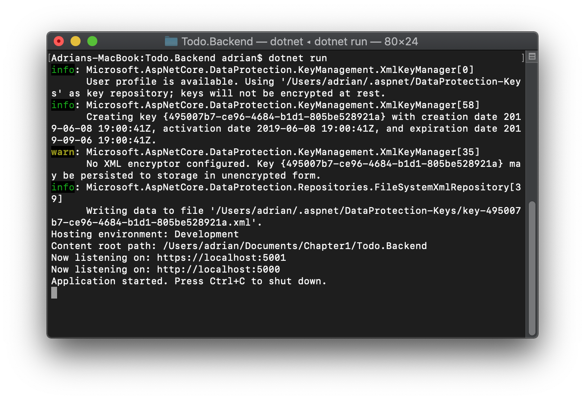

The service will listen on two URLs - a secure `https` one and an insecure `http` one.  Pick whichever you like as they both lead to the same place.  Let's do a list operation first:

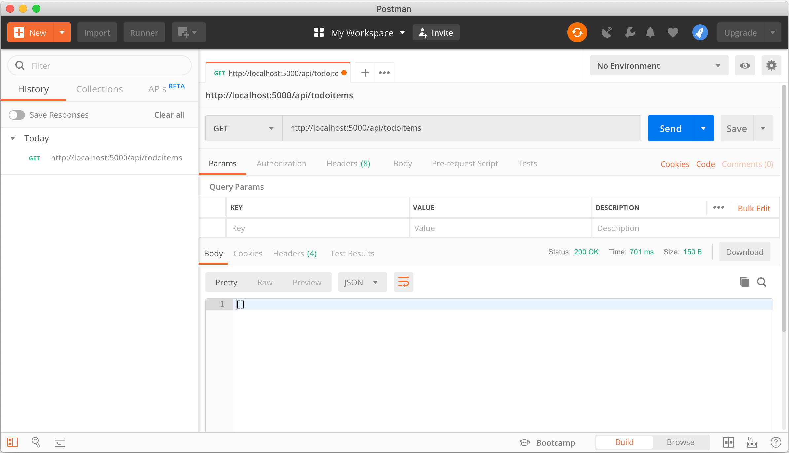

We are receiving an empty list (in JSON notation) back.  This is expected since we haven't created any items yet.  Let's create an item by using a `POST`:

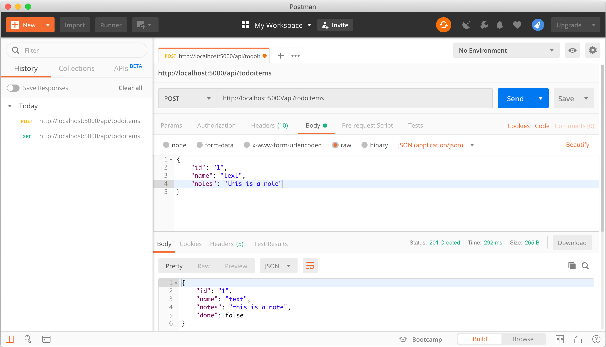

Now that we have an item in the store, we should be able to see it when we repeat the list operation:

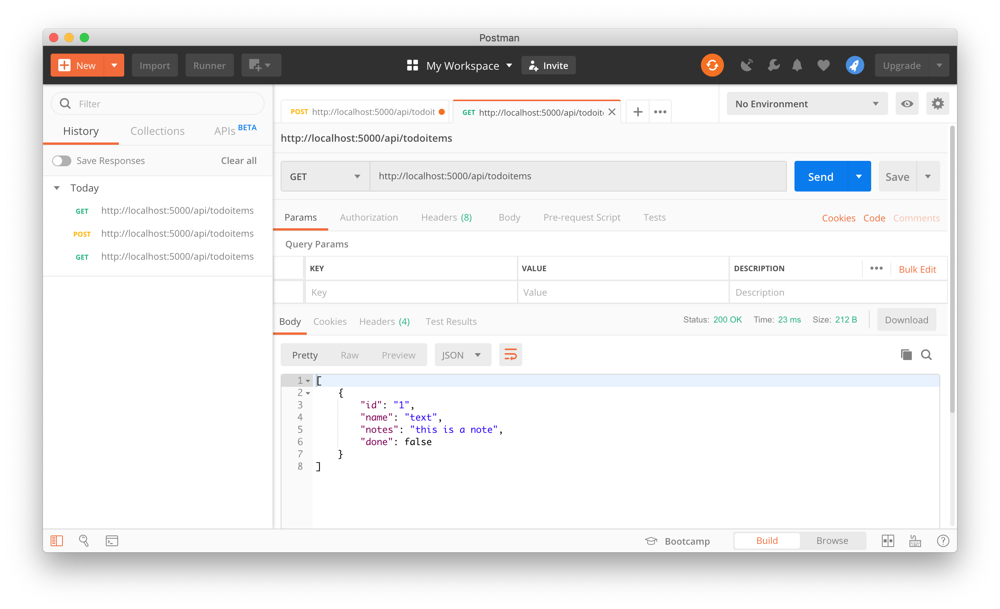

We should not be able to create a record with the same ID:

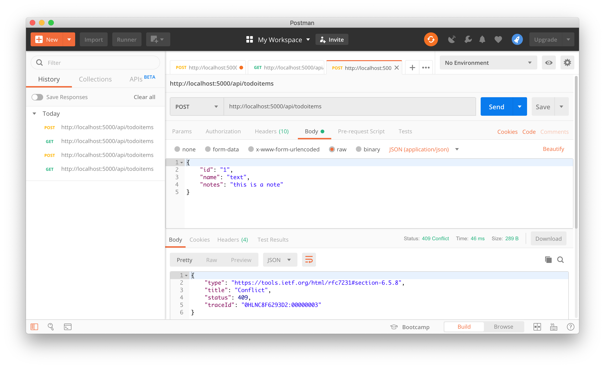

Test out the other REST commands to ensure they all work, including updating and removing a record.

### Deploy the service on Azure

We can publish the service to an Azure App Service right from Visul Studio for Mac.  Ensure you have [signed up for Azure][azure-signup] before starting.

* Right-click on the `Todo.Backend` project, then select **Publish** > **Publish to Azure...**.
* A list of your existing Azure App Service resources will be displayed.  Ignore the list and click **New**.
* In the _Create a new App Service on Azure_ window, enter:
    * A globally unique name for the service.  I tend to base mine on my name and the date.
    * Select the appropriate subscription (if you have more than one).
    * Provide a resource group name - it assists with deletion later on.
    * Provide details of a service plan.  There is a free plan available.

    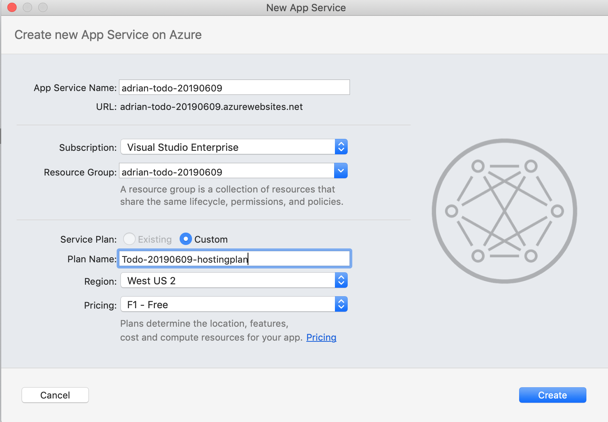

* Click **Create**.  If you see a pop-up warning that resources can take a long time to create, click **OK**.  It will take several minutes to create the resources and deploy the app to the cloud.  Once the site is deployed, a web browser pointing to your backend will pop up. Copy the URL in the web browser, as you will need it later on.  We refer to this URL as the Site URL.

We turn our attention back to our app now.  Right-click the `Todo.Android` project and select **Set as Startup Project**.  We've already isolated our changes to the `Todo.Data` namespace.  We can update our `TodoitemDatabase.cs` class to use the web service we have just deployed.  First, let's get rid of the SQLite notations in the `TodoItem.cs` model:

```csharp
namespace Todo.Data
{
    public class TodoItem
    {
        public string ID { get; set; }
        public string Name { get; set; }
        public string Notes { get; set; }
        public bool Done { get; set; }
    }
}
```

There is no longer a need for an internal ID as all our interactions happen against the cloud and are not stored on the device.  (We'll take an in-depth look at caching later in the book).  Let's turn our attention to the `TodoItemDatabase.cs` class.  For each method within our class, we need to send a request to the web service, retrieve the response and potentially deserialize the response data coming back.  To do the deserialization, we will use the popular [JSON.NET](https://www.newtonsoft.com/json):

* Right-click the `Todo` project, then select **Add** > **Add NuGet Packages...**
* Newtonsoft.Json is normally in the front page.  If it isn't, you can search for it.
* Select **Newtonsoft.Json**.
* In the right-hand panel, click **Add Package**.

You can monitor the progress of the installation in the _Package Console_ window, accessible from the bottom banner.

The `Data/TodoItemDatabase.cs` has the most changes.  In fact, aside from the signature of the class, everything about it needs to change.  Let's start with initialization:

```csharp hl_lines="12"
using Newtonsoft.Json;
using System;
using System.Collections.Generic;
using System.Net.Http;
using System.Net.Http.Headers;
using System.Threading.Tasks;

namespace Todo.Data
{
    public class TodoItemDatabase
    {
        private static readonly Uri siteUri = new Uri("https://REPLACEME.azurewebsites.net");
        private static readonly string endpoint = "api/todoitems";
        private readonly HttpClient httpClient = new HttpClient();

        #region Singleton
        private static TodoItemDatabase instance;

        public static TodoItemDatabase Instance
        {
            get
            {
                if (instance == null)
                {
                    instance = new TodoItemDatabase(siteUri);
                }
                return instance;
            }
        }
        #endregion

        private TodoItemDatabase(Uri siteUri)
        {
            httpClient.BaseAddress = siteUri;
            httpClient.DefaultRequestHeaders.Accept.Clear();
            httpClient.DefaultRequestHeaders.Accept.Add(new MediaTypeWithQualityHeaderValue("application/json"));
        }
        
        // Other methods go here
    }
}
```

You need to change line 12 (highlighted) so that your backend is referenced.  We copied this from the summary page resulting from the Publish operation earlier.  When we initialize the database connection, we set up a [HttpClient](https://docs.microsoft.com/en-us/uwp/api/Windows.Web.Http.HttpClient).  The main thing we do here (aside from setting the base URI) is to ensure the appropriate header is added.  We want data transfer to happen via JSON, so the `Accept` header must include that fact.

Once we are done with initialization, the rest of the code is straight forward on a per-method basis.  The signatures are the same as before but the guts of the code are completely different:

```csharp
public async Task<List<TodoItem>> GetAllItemsAsync()
{
    var response = await httpClient.GetAsync(endpoint);
    response.EnsureSuccessStatusCode();
    var jsonString = await response.Content.ReadAsStringAsync();
    List<TodoItem> result = JsonConvert.DeserializeObject<List<TodoItem>>(jsonString);
    return result;
}

public async Task<TodoItem> GetItemAsync(string id)
{
    var response = await httpClient.GetAsync($"{endpoint}/{id}");
    response.EnsureSuccessStatusCode();
    var jsonString = await response.Content.ReadAsStringAsync();
    TodoItem result = JsonConvert.DeserializeObject<TodoItem>(jsonString);
    return result;
}

public async Task<TodoItem> SaveItemAsync(TodoItem item)
{
    HttpResponseMessage response;
    bool usePost = false;

    if (item.ID == null)
    {
        item.ID = Guid.NewGuid().ToString();
        usePost = true;
    }

    var content = new ByteArrayContent(System.Text.Encoding.UTF8.GetBytes(JsonConvert.SerializeObject(item)));
    content.Headers.ContentType = new MediaTypeHeaderValue("application/json");

    if (usePost)
    {
        response = await httpClient.PostAsync(endpoint, content);
    }
    else
    {
        response = await httpClient.PutAsync($"{endpoint}/{item.ID}", content);
    }

    response.EnsureSuccessStatusCode();
    var jsonString = await response.Content.ReadAsStringAsync();
    TodoItem result = JsonConvert.DeserializeObject<TodoItem>(jsonString);
    return result;
}

public async Task DeleteItemAsync(TodoItem item)
{
    var response = await httpClient.DeleteAsync($"{endpoint}/{item.ID}");
    response.EnsureSuccessStatusCode();
}
```

Most of the methods are similar:

* If needed, serialize the passed-in object to JSON format.
* Send the appropriate request to the service and wait for the response.
* Ensure the response is successful.
* Deserialize the response and return to the app.

The only variance from this is the `SaveItemAsync()` method.  This needs to understand whether the data is new or not.  If it is new, then the ID will be null (since the database sets the ID).  We can use this fact to call the appropriate method on the web service (via a POST or a PUT).  This is also the only place where we have to serialize content.  We must ensure we set the appropriate HTTP content type when serializing. 

### Run the app on iOS

If you run the app on the iOS simulator, you will notice it works exactly the same way.  However, there is more of a delay in various pages actually producing content.  This is because we have increased the latency by moving the database to the cloud.

### Run the app on Android

e have, thus far, used the iOS simulator to do all of our development.  This is fairly normal when developing on a Mac as the Android emulator takes more resources to run than the iOS simulator.  Unlike on a PC, both Android and iOS environments are available on the same machine.  To run on an Android emulator:

* Right-click on the `Todo.Android` project and select **Set as Startup Project...**.
* An Android emulator will be installed for you when you install Visual Studio for Mac.  However, you can choose to create a different form factor using **Tools** > **Device Manager**. 
* If you have created another Android emulator, ensure you select the correct emulator in the top-left corner of the Visual Studio window.
* Click the Run button.

The emulator starts immediately, but it does take some time to build and deploy the Android app to the emulator.  Once it starts, you will see the following:

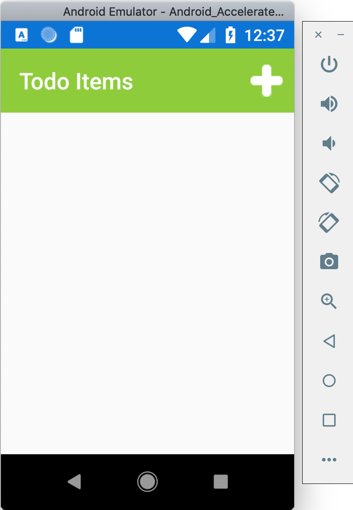

Note that the data is the same on both the iOS and Android versions.  The data comes from the cloud, so whenever you refresh the data, it will match up.  It's also good to note that all the code within this app is in a common project.  This is not normally the case, although the bulk of the code will be in the shared project.  There is usually a small amount of per-platform code, particularly if you are looking to mimic the design choices for iOS and Android.  As an example, iOS apps tend to place the "add item" gesture in the top-right within the banner.  However, Android (through Material Design) places the same gesture in the lower-right as a floating action button.

!!! tip "The final code"
    You can find the final code in the `code/Chapter1-final` folder on the [GitHub repository][github-repo].

## Delete the cloud backend

Once you are done with this tutorial, you will want to clean up the Azure resources.

* Open a web browser and browse to `https://portal.azure.com`.
* Select **Resource Groups** in the left-hand menu.  If you can't see it, you can find it in the **All services** list.
* If you don't see your resource group, ensure all your subscriptions are selected.
* Select the triple-dots to the right of your resource group, then click **Delete resource group**.

    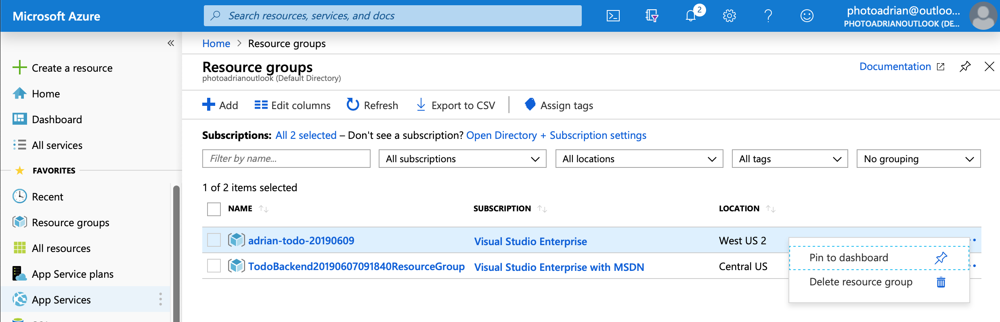

* Type the name of the resource group, then click **Delete**.

    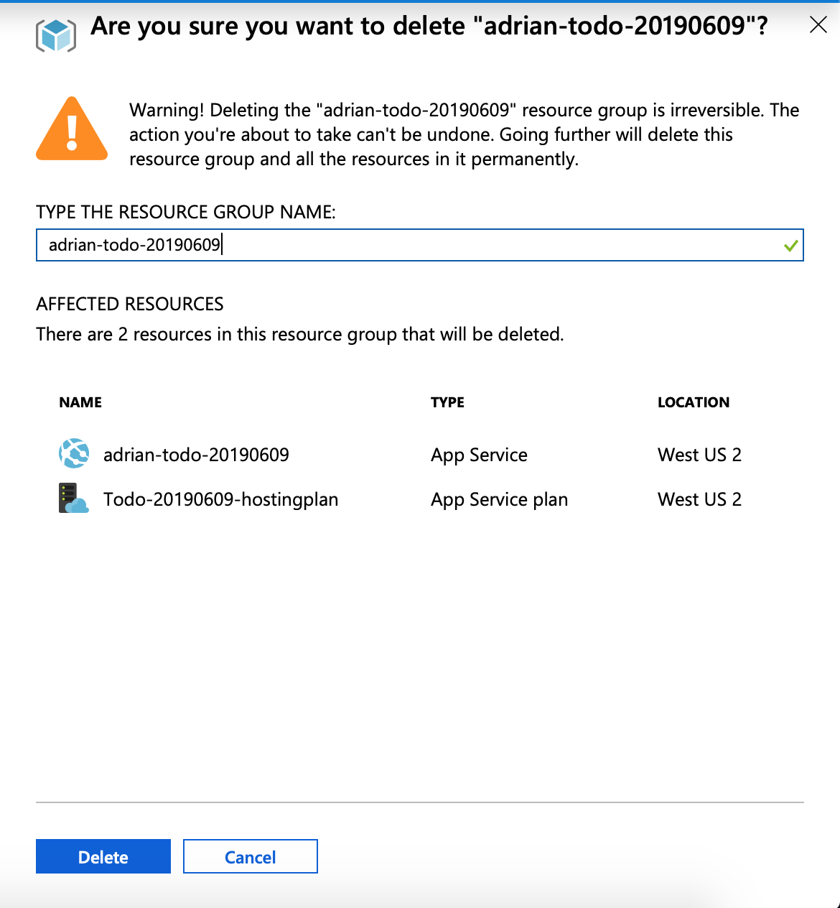

The deletion is done lazily and no further interaction is required to effect the deletion.

## What have we accomplished?

We have accomplished a lot in this short tutorial:

* We have ensured that our development environment can be used for developing mobile apps.
* We have created a web service for storing data, tested it, and deployed it to the Azure cloud.
* We have updated the app to use the cloud.
* We have generated both iOS and Android versions of our app.

It's time to move on.  Over the next several chapters, we will take an in-depth look at the common functionality that is generally required by mobile apps and how the cloud can be used to implement these features.  

We start with [deploying your mobile backend](../chapter2/index.md).

<!-- Links -->
[github-repo]: https://github.com/adrianhall/develop-mobile-apps-with-csharp-and-azure
[sample]: https://developer.xamarin.com/samples/xamarin-forms/Todo/
[postman]: https://www.getpostman.com/
[azure-signup]: https://azure.microsoft.com/en-us/free/

