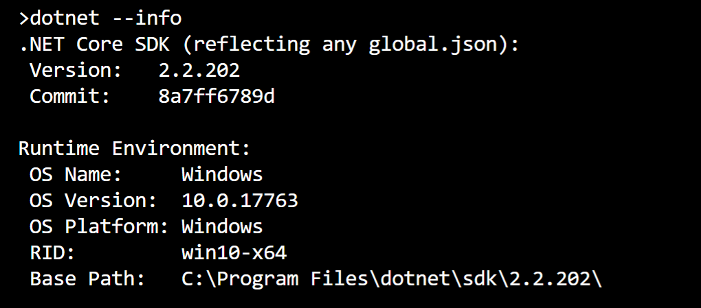
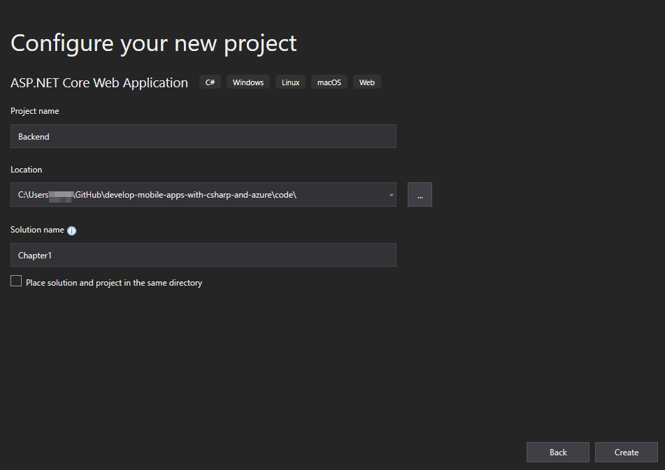
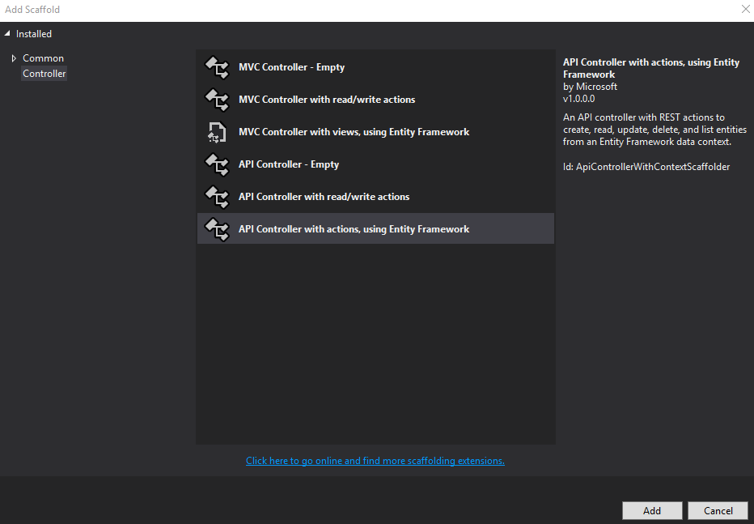
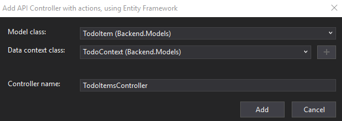
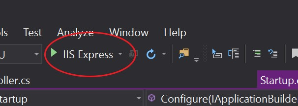
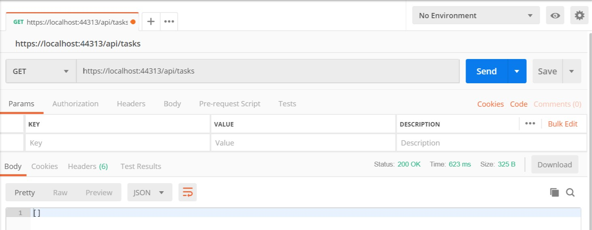
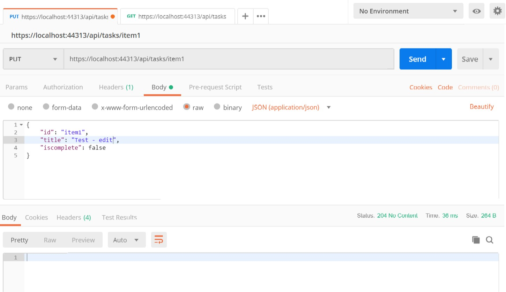

# Build a REST API on Windows

My strategy for building most mobile apps is always the same.  First, figure out what the backend needs to do and implement that, testing it thoroughly outside of a mobile context.  Then build the front end.  Some developers work on the front end first and use that to drive decisions on what to implement in the backend.  Both sides have merit and depend on your requirements.  If you are doing a backend that will only be used with your front end code, then front end first makes sense.  If, however, you are developing a backend for multiple uses - maybe multiple mobile apps, or a mobile app with a companion web app - then backend first makes more sense.

For this tutorial, I am assuming that you have installed and updated Visual Studio 2019.  I am using the freely available [Community edition][1].  In addition, you will need to install the [latest version of .NET Core][2].  I'm using version 2.2 in this tutorial.  You can find out which version of .NET Core you are targetting with the command line:



## Create a backend project

Visual Studio contains a lot of tooling and we will be using a fair amount of that tooling during this process.  Start by creating a new project:

1. From the opening screen, click **Create a new project**
2. Find and select the **ASP.NET Core Web Application** template, then click **Next**.
3. Select a new solution and project name, and pick a suitable location for the code.  Ensure the **Place solution and project in the same directory** is not checked.

   

4. Click **Create**.
5. In the **Create a new ASP.NET Core Web Application** dialog, select the **API** template and ensure **ASP.NET Core 2.2** is selected as the runtime.

   

6. Click **Create**.

This will scaffold out a complete Web API for you to run.  Of course, it doesn't do much.  It includes a sample controller (called `ValuesController.cs`) which you can delete if you like as we do not use it.

## Add a database model and context

The model describes what an individual item looks like.  The context describes what all the items look like.  First, create somewhere for the model and context to live.  By convention, this is the `Models` folder:

1. In the **Solution Explorer**, right-click the project, then select **Add** > **New Folder**.  Name the folder **Models**.
2. Right-click the Models folder, then select **Add** > **Class**.  Name the class _TodoItem_, then click **Add**.
3. Replace the code in the file with the following:

    ```csharp
    namespace Backend.Models
    {
        public class TodoItem
        {
            public string Id { get; set; }
            public string Title { get; set; }
            public bool IsComplete { get; set; }
        }
    }
    ```

4. Right-click the Models folder, then select **Add** > **Class**.  Name the class _TodoContext_ then click **Add**.
5. Replace the code in the file with the following:

    ```csharp 
    using Microsoft.EntityFrameworkCore;

    namespace Backend.Models
    {
        public class TodoContext : DbContext
        {
            public TodoContext(DbContextOptions<TodoContext> options) : base(options)
            {
            }

            public DbSet<TodoItem> TodoItems { get; set; }
        }
    }
    ```


Let's talk a little about that model.  Two of the fields are straight forward.  The `Title` and `IsComplete` fields will be directly represented within the UI of the application.  The `Id` field, however, is a string.  If you have come from a database background, you might expect this to be an auto-incrementing integer, represented by the long type.  However, this is a mobile context.  In a mobile context, multiple clients may be creating `TodoItem` objects at the same time.  The `Id` must be unique globally across all mobile clients.  Although you can use anything for the `Id`, it's common practice to use a UUID.   It is common to use JSON as the format for transferring data between mobile client and server.  JSON does not know what a UUID is, so it is represented as a string for transfer.

As a final step, let's link the database context so that it is initialized properly.  For this project, we are going to use an in-memory database.  The initialization is done during the startup of the backend, in `Startup.cs`:

```csharp hl_lines="4 7 23"
using Microsoft.AspNetCore.Builder;
using Microsoft.AspNetCore.Hosting;
using Microsoft.AspNetCore.Mvc;
using Microsoft.EntityFrameworkCore;
using Microsoft.Extensions.Configuration;
using Microsoft.Extensions.DependencyInjection;
using Backend.Models;

namespace Backend
{
    public class Startup
    {
        public Startup(IConfiguration configuration)
        {
            Configuration = configuration;
        }

        public IConfiguration Configuration { get; }

        // This method gets called by the runtime. Use this method to add services to the container.
        public void ConfigureServices(IServiceCollection services)
        {
            services.AddDbContext<TodoContext>(opt => opt.UseInMemoryDatabase("TodoList"));
            services.AddMvc().SetCompatibilityVersion(CompatibilityVersion.Version_2_2);
        }

        // This method gets called by the runtime. Use this method to configure the HTTP request pipeline.
        public void Configure(IApplicationBuilder app, IHostingEnvironment env)
        {
            if (env.IsDevelopment())
            {
                app.UseDeveloperExceptionPage();
            }
            else
            {
                // The default HSTS value is 30 days. You may want to change this for production scenarios, see https://aka.ms/aspnetcore-hsts.
                app.UseHsts();
            }

            app.UseHttpsRedirection();
            app.UseMvc();
        }
    }
}
```

If you have discovered the [ASP.NET Core tutorial][4], then this should be familiar to you.  Just about every single ASP.NET Core web API project starts the same way.

## Add an API controller

The next step is to add some HTTP methods that can be used to access the data:

1. Right-click the _Controllers_ folder, click **Add** > **Controller...**.
2. Select **API Controller with actions, using Entity Framework**:

   

3. Click **Add**.
4. Fill in the presented form as follows:
    * Model class: **TodoItem (Backend.Models)**
    * Data context class: **TodoContext (Backend.Models)**
    * Controller name: **TodoItemsController**

   

5. Click **Add**.

As a developer, I feel guilty for a second for using scaffolding.  However, these scaffolded classes save time with boiler-plate code that I can start modifying immediately.  Sometimes (like this instance), the code does everything I need straight away.  You should, however, take the time to understand what code the scaffolding is doing for you.

## Test your work!

Before we talk about the front end, let's talk about testing.  In an ideal world, we would add a test project, write unit tests for all our classes, then add some integration tests to ensure our backend worked properly.  We would then run those before every single check-in.  I strongly urge you to [learn how to write those tests][5].  However, this is a very basic backend.  Instead of the comprehensive testing capabilities I suggest, let's ensure we do a few [smoke tests][6] before starting on the front end.

Start by installing [Postman][7].

!!! info
    Postman is a test tool for web-based applications.  It allows you to operate at the lowest HTTP level of communication, so you can see what the server responds when you send it specific requests.

Before we get started, go back to your Visual Studio project and click on the start button:



This will launch a browser with the URL of your backend.  Make a note of the base URL.  It will look like `https://localhost:44313`.  The port number will change.

!!! info
    You can also find the SSL port number by looking in `Properties/launchSettings.json` within the solution explorer.  It's labelled `sslPort`.

Minimize the browser since you won't be using it.  Instead, start Postman.  

!!! tip
    Configure SSL certificate verification when you first install Postman.  To do this, go to **Settings** > **General**.  Turn off the **SSL certificate verification** switch, then close the Settings pane.

Go to `https://localhost:44313/api/todoitems`.  You should receive an empty JSON array as a response, which makes sense.  We have not created any tasks yet.  



Let's create a task:

1. Select **POST** as the method.
2. Click **Body**.
3. Select **raw** and **JSON (application/json)**.
4. Enter the following JSON into the body box:

    ```json
    {
        "id": "item1",
        "title": "Test",
        "iscomplete": false
    }
    ```

5. Click **Send**.

You should see a `201 Created` status and the updated item:


If you repeat the `GET` request (which you can do by clicking on the item in the history and selecting **SEND**), then you will see the new item:


You can add additional items in a similar way.  Just ensure that you change the id of each one.  

> What happens when you submit a record with a duplicate ID?  You get a `500 Internal Server Error` and a bunch of HTML.  There are definitely improvements that can be made to the default error handling within the controller.

If you wish to update a record, you will need to post to the unique ID.  Try changing a record by using `PUT /api/todoitems/item1`:



We don't get any content back - just a success code.  If, however, we repeat the `GET /api/todoitems` request, we will see the updated data.

## Move on to the front end

Before we move on, let's do a quick recap:

* We created an ASP.NET Core Web API project.
* We created our model and hooked it to an in-memory database.
* We scaffolded a Web API to store and retrieve those models.
* We performed some smoke tests to assure ourselves the web API is working.

In the [next section], we will create a cross-platform mobile app that works on Android and iOS to use this mobile backend.


<!-- Link references -->
[1]: https://visualstudio.microsoft.com/vs/community/
[2]: https://dotnet.microsoft.com/download/dotnet-core/2.2
[3]: https://en.wikipedia.org/wiki/Universally_unique_identifier
[4]: https://docs.microsoft.com/en-us/aspnet/core/tutorials/first-web-api?view=aspnetcore-2.2&tabs=visual-studio
[5]: https://docs.microsoft.com/en-us/dotnet/core/testing/
[6]: http://softwaretestingfundamentals.com/smoke-testing/
[7]: https://www.getpostman.com

[next section]: ./windows-frontend.md