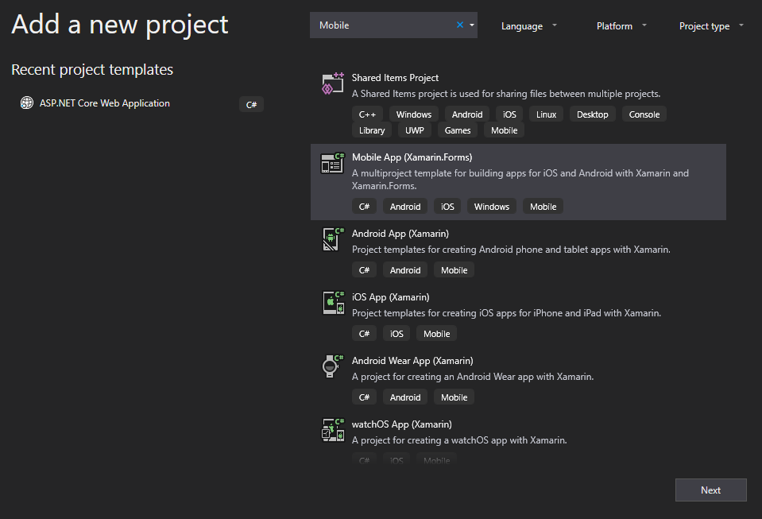
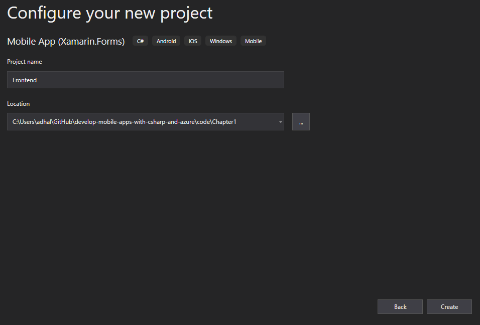
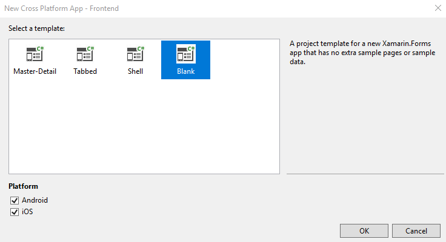
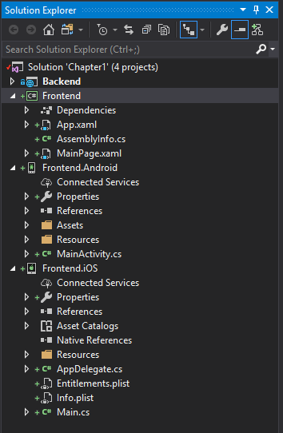
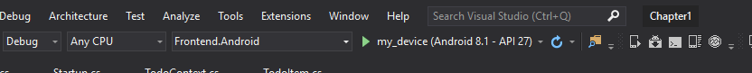

# Build a Mobile App on Windows

!!! tip "Enable Android Emulator on Hyper-V"
    Before getting started with development on the front end, you may want to set up an Android emulator.  This requires [setting up Hyper-V on your Windows system][1].  Since this will likely require a reboot of your system, it's best to configure Hyper-V ahead of time.

Now that the mobile backend is created, we can move to the client side of things.  If you have previously closed your project, re-open the project in Visual Studio now.  The first step is to add a new project to the solution that will represent our mobile app.

> **One solution or two?**  Code organization is important and it generates a lot of opinions.  Some people like to keep the backend separate from the frontend code (two solutions), while others like to keep everything together (one solution).  There are pros and cons for each method, which you will need to discover for yourself.  For the purposes of code organization within this book, I always keep the backend with the frontend code in one solution.  You can find solutions for all the projects within this book on the [Github project](https://github.com/adrianhall/develop-mobile-apps-with-csharp-and-azure).

1. In the solution explorer, right-click the solution and select **Add** > **New Project...**.
2. In the search box, enter _Mobile_, then press Enter.  Select the **Mobile App (Xamarin.Forms)** project template, then click **Next**.

    


3. Give the project a good name (like _Frontend_), then click **Create**.

    

4. In the **New Cross Platform App** window, select **Blank** and then click **OK**
    * Select **Blank**.
    * Ensure **Shared Code** is selected as the code sharing strategy.
    * Click **OK**.

    

Visual Studio will now scaffold three projects: a shared project where your business logic is stored, plus a platform-specific project for each platform you selected (in this case, iOS and Android).  



Visual Studio allows you to build iOS applications directly from Visual Studio using a Mac.  I've got a Mac Mini under my desk for this purpose. We'll work on setting up the mac and compiling the iOS application later.  For now, let's continue with just the Android app.  Before you begin, set the **Frontend.Android** project as the startup project (right-click on the project and select **Set as StartUp Project**).  Then click the **Android Emulator** button to start an emulator.  If this is the first time you have created an Android app with Visual Studio, it will walk you through creating an emulated device.  Click **Start** to start the emulator you just created.  

!!! tip "Keep the emulator running"
    While you are developing your app, keep the emulator running.  You will skip the device startup delay (which can be considerable) when you do this.

Now go back to Visual Studio.  The run button will now be displayed as the device you have started:



Click the run button to start your app.  The app will be compiled, built into an APK, signed, and deployed to your emulated device.  Eventually, the app will display a nice screen with "Welcome to Xamarin Forms!" on it.  This shows that your build and deployment environment for development work is working.  Click the **stop** button within Visual Studio to shut the app down.

## Design your app

The application we are going to build together is a simple task list.  The mobile client will have three screens - an entry screen, a task list, and a task details page.  I have mocked these pages up using [MockingBot][2].

!!! tip
    Mocking your screens before you start coding is a great habit to get into.  There are some great tools available including free tools like [MockingBot][3].  Doing mockups before you start coding is a good way to prevent wasted time later on.


!!! tip 
    If you are using iOS, then you may want to remove the back button as the style guides suggest you don't need one.  Other platforms will need it though, so it's best to start with the least common denominator.

My ideas for this app include:

* Tapping on a task title in the task list will bring up the details page.
* Toggling the completed link in the task list will set (or clear) the completed flag.
* Tapping the spinner will initiate a network refresh.

Now that the client screens are planned out, we can move onto coding.

## Build the common library

There are generally two parts to any cloud-connected app.  The first is the connection to the cloud, and the second is the UI that users of the app will interact with.  I like to put as much as possible in the common library.  Xamarin.Forms apps can share up to 90% of their code, which saves valuable time.  Let's start with the cloud service.

I use interfaces for almost everything.  An interface allows me to abstract the concrete implementation of something so that I can mock it for testing purposes later on.  This isolates the code changes to just the concrete implementation - anything else within the app will use the interface.  Consider an interface as a contract between the concrete implementation and the rest of your app.  In this case, I want two different interfaces:

* `ICloudServiceClient` represents the connection to the Azure Cloud.
* `IDataTable<T>` represents the CRUDL operations on a specific table.

The `ICloudServiceClient` is the first one and it is fairly simple:

```csharp
namespace Frontend.Services
{
    public interface ICloudServiceClient
    {
        IDataTable<T> GetTable<T>() where T : TableData;
    }
}
```

Any operation that deals with the Azure cloud service will be represented here.  In this case, we have one operation - dealing with a table.  That returns `IDataTable<T>`:

```csharp
using System.Collections.Generic;
using System.Threading.Tasks;

namespace Frontend.Services
{
    public interface IDataTable<T> where T : TableData
    {
        Task<T> CreateItemAsync(T item);
        Task<T> ReadItemAsync(string id);
        Task<T> UpdateItemAsync(T item);
        Task DeleteItemAsync(T item);
        Task<ICollection<T>> ReadAllItemsAsync();
    }
}
```

This is a generic that takes the model of the data.  The model must conform to the `TableData` shape:

```csharp
namespace Frontend.Services
{
    public abstract class TableData
    {
        public string Id { get; set; }
    }
}
```

Taken together, our cloud service is a collection of tables, where each table allows me to perform CRUDL operations.  The model for the data within each table must have a string `Id` field.  The model actually looks like this:

```csharp
using Frontend.Services;

namespace Frontend.Models
{
    public class TodoItem : TableData
    {
        public string Title { get; set; }
        public bool IsComplete { get; set; }
    }
}
```

Note that this matches what we wrote in the backend, but the `Id` field is moved to the `TableData` class.  It is especially important that the model name matches the controller name in the backend.  If the model in the client is named `X`, then you should have a controller called `XsController` that listens on `/api/xs` over HTTP.

!!! tip Share your models, but be careful
    You can share your models between the frontend and backend code.  However, you must be careful.  All the classes necessary to implement the models must be placed in a shared project.  In addition, you need to make sure that the data is completely duplicated between the frontend and backend.  It is normal to have "extras" in the backend.  For example, you may have an extra deleted flag in the backend that is not exposed in the frontend code.

## Build a RESTful Client

The next step is to build the concrete implementations of the `ICloudServiceClient` and `IDataTable<T>` interfaces such that it will consume the RESTful web service back end we built earlier.  There are several libraries that we can use to consume a RESTful endpoint, but I tend towards using the basic [`HttpClient`](https://docs.microsoft.com/en-us/aspnet/web-api/overview/advanced/calling-a-web-api-from-a-net-client) library that is provided by Microsoft.  Let's start with taking a look at the `AzureCloudServiceClient` class:

```csharp
using System;

namespace Frontend.Services
{
    public class AzureCloudServiceClient : ICloudServiceClient
    {
        protected Uri baseUri = new Uri("https://localhost:44398");

        public IDataTable<T> GetTable<T>() where T : TableData
        {
            var tableName = typeof(T).Name.ToLowerInvariant();
            return new RESTDataTable<T>(baseUri, $"api/{tableName}s");
        }
    }
}
```

There are a couple of notes about this implementation:

* This is where I store the endpoint to my API.
* I get the name of the table from the model.  Thus, if I pass in `TodoItem` as the model, then `tableName` is `todoitem`, and the path is `api/todoitems`.

I use a pretty standard REST client implementation for the `RESTDataTable` class:

```csharp
using Newtonsoft.Json;
using System;
using System.Collections.Generic;
using System.Net.Http;
using System.Net.Http.Headers;
using System.Text;
using System.Threading.Tasks;

namespace Frontend.Services
{
    class RESTDataTable<T> : IDataTable<T> where T : TableData
    {
        private HttpClient client = new HttpClient();
        private string tablePath;

        public RESTDataTable(Uri endpoint, string path) {
            client.BaseAddress = endpoint;
            client.DefaultRequestHeaders.Accept.Clear();
            client.DefaultRequestHeaders.Accept.Add(new MediaTypeWithQualityHeaderValue("application/json"));
            this.tablePath = path;
        }

        public async Task<T> CreateItemAsync(T item)
        {
            var content = new StringContent(JsonConvert.SerializeObject(item), Encoding.UTF8);
            var response = await client.PostAsync(tablePath, content);
            response.EnsureSuccessStatusCode();
            return JsonConvert.DeserializeObject<T>(await response.Content.ReadAsStringAsync());
        }

        public async Task DeleteItemAsync(T item)
        {
            var response = await client.DeleteAsync($"{tablePath}/{item.Id}");
            response.EnsureSuccessStatusCode();
        }

        public async Task<ICollection<T>> ReadAllItemsAsync()
        {
            var response = await client.GetAsync(tablePath);
            response.EnsureSuccessStatusCode();
            return JsonConvert.DeserializeObject<List<T>>(await response.Content.ReadAsStringAsync());
        }

        public async Task<T> ReadItemAsync(string id)
        {
            var response = await client.GetAsync($"{tablePath}/{id}");
            response.EnsureSuccessStatusCode();
            return JsonConvert.DeserializeObject<T>(await response.Content.ReadAsStringAsync());
        }

        public async Task<T> UpdateItemAsync(T item)
        {
            var content = new StringContent(JsonConvert.SerializeObject(item), Encoding.UTF8);
            var response = await client.PutAsync($"{tablePath}/{item.Id}", content);
            response.EnsureSuccessStatusCode();
            return JsonConvert.DeserializeObject<T>(await response.Content.ReadAsStringAsync());
        }
    }
}
```

A few notes about this class as well:

* I am using `HttpClient`, which is the C# standard way of communicating with HTTP APIs.
* Each CRUDL method takes the same form - create any post body you need, call the right client method, ensure it's successful (or throw an exception) and then deserialize what comes back from the server.
* I'm using [Newtonsoft.Json](https://www.newtonsoft.com/json) - a fairly standard JSON serialization library to do the work of converting between the model and the JSON representation needed for the wire protocol.

!!! tip Add NuGet Packages to all front end projects
    You may find that, after building, you will see `Newtonsoft.Json` is not available within the Android or iOS projects.  When adding new libraries, you generally need to ensure that you add the NuGet reference to all front end projects for it to work properly.  You can easily do this by right-clicking on the solution, then selecting **Manage NuGet Packages for Solution...**

It is normal to develop network clients as singletons.  Generally, the client will be doing more than what we are doing here.  This may include caching and database access.  The `HttpClient` object is a session that shares configuration options and TCP connections.  It will help reuse TCP connections, which will, in general, lead to better performance.  This is especially true in a mobile context where the device is resource constrained.  My implementation is not a singleton, but we can make it so by either implementing the [Singleton pattern](https://www.c-sharpcorner.com/UploadFile/8911c4/singleton-design-pattern-in-C-Sharp/).  In Xamarin, we have an alternative.  We can instantiate the client in the `Application` method (located in the `App.xaml.cs` file), which is instantiated as a singleton class as well:

```csharp hl_lines="8"
using Frontend.Services;
using Xamarin.Forms;

namespace Frontend
{
    public partial class App : Application
    {
        public static ICloudServiceClient cloudClient = new AzureCloudServiceClient();

        public App()
        {
            InitializeComponent();
            MainPage = new MainPage();
        }
    }
}
```

## Build the UI

Earlier, I showed the mockup for the UI.  It included three pages - an entry page, a list page, and a detail page.  Each page has three elements - a XAML definition file, a (simple) code-behind file and a view model.

!!! info
    This book is not inteded to introduce you to everything that there is to know about Xamarin and UI programming with XAML.  If you wish an introduction to the topi, I recommend reading the excellent book by Charles Petzold: [Creating Mobile Apps with Xamarin Form](https://docs.microsoft.com/en-us/xamarin/xamarin-forms/creating-mobile-apps-xamarin-forms/).

I use MVVM (or Model-View-ViewModel) as a framework for UI development in Xamarin-based applications.  It is a clean pattern that is well documented.  In MVVM, this is a 1:1 correlation between the view and view-model, 2-way communication between the view and the view-model, and properties within the view-model are bound directly to UI elements.  View-models expost an `INotifyPropertyChanged` event to tell the UI that something within the view-model has changed, allowing the UI to react to the change.

We must implement the `INotifyPropertyChanged` interface.  To do that, I use a `BaseViewModel` class that implements the interface.  Aside from the interface implementation, there are some common properties that are needed for every page.  For example, every page needs a title and an indicator of network activity.  All view-models will inherit from this base:

```csharp
using System;
using System.Collections.Generic;
using System.ComponentModel;

namespace Frontend.ViewModels
{
    public class BaseViewModel : INotifyPropertyChanged
    {
        public event PropertyChangedEventHandler PropertyChanged;
        private string propTitle = string.Empty;
        private bool propIsBusy = false;

        public string Title
        {
            get { return propTitle; }
            set { SetProperty(ref propTitle, value, "Title"); }
        }

        public bool IsBusy
        {
            get { return propIsBusy; }
            set { SetProperty(ref propIsBusy, value, "IsBusy"); }
        }

        protected void SetProperty<T>(ref T store, T value, string propName, Action onChanged = null)
        {
            if (EqualityComparer<T>.Default.Equals(store, value)) return;
            store = value;
            if (onChanged != null)
                onChanged();
            OnPropertyChanged(propName);
        }

        public void OnPropertyChanged(string propName)
        {
            if (PropertyChanged == null) return;
            PropertyChanged(this, new PropertyChangedEventArgs(propName));
        }
    }
}
```

This is a fairly common `INotifyPropertyChanged` interface implementation pattern. Each property that we want to expose is a standard property, but the set operation is replaced by the `SetProperty()` call. The `SetProperty()` call deals with the notification; calling the event emitter if the property has changed value. We only need two properties on the `BaseViewModel`: the title and the network indicator.

I tend to write my apps in two stages. I concentrate on the functionality of the app in the first stage. There is no fancy graphics, custom UI widgets, or anything else to clutter the thinking. The page is all about the functionality of the various interactions. Once I have the functionality working, I work on the styling of the page. We won't be doing any styling work in the demonstration apps that we write during the course of this book.

The `EntryPage` has just one thing to do. It provides a button that enters the app. When we cover authentication later on, we'll use this to log in to the backend. If you are looking at the perfect app, this is a great place to put the introductory screen.  First, create a `Pages` folder in the shared frontend project to hold the pages of the application. Then right-Click the `Pages` folder in the solution explorer and choose **Add** -> **New Item...**. In the Add New Item dialog, pick **Visual C# Items** -> **Xamarin.Forms** -> **Content Page**. Name the new page `EntryPage.xaml`. This will create two files - `EntryPage.xaml` and `EntryPage.xaml.cs`. Let's center a button on the page and wire it up with a command. Here is the `Pages\EntryPage.xaml` file:

```xml
<?xml version="1.0" encoding="utf-8" ?>
<ContentPage
    x:Class="Frontend.Pages.EntryPage"
    xmlns="http://xamarin.com/schemas/2014/forms"
    xmlns:x="http://schemas.microsoft.com/winfx/2009/xaml"
    Title="{Binding Title}">
    <ContentPage.Content>
        <StackLayout
            HorizontalOptions="Center"
            Orientation="Vertical"
            VerticalOptions="Center">
            <Button
                BackgroundColor="Teal"
                BorderRadius="10"
                Command="{Binding LoginCommand}"
                Text="Login"
                TextColor="White" />
        </StackLayout>
    </ContentPage.Content>
</ContentPage>
```

There are a couple of interesting things to note here. The `StackLayout` element is our layout element. It occupies the entire screen (since it is a direct child of the content page) and the options just center whatever the contents are. The only contents are a button. There are two bindings. These are bound from the view-model. We've already seen the `Title` property - this is a text field that specifies the title of the page. The other binding is a login command. When the button is tapped, the login command will be run. We'll get onto that in the view-model later.

The other part of the XAML is the code-behind file. Because we are moving all of the non-UI code into a view-model, the code-behind file is trivial:

```csharp
using Frontend.ViewModels;
using Xamarin.Forms;
using Xamarin.Forms.Xaml;

namespace Frontend.Pages
{
    [XamlCompilation(XamlCompilationOptions.Compile)]
    public partial class EntryPage : ContentPage
    {
        public EntryPage()
        {
            InitializeComponent();
            BindingContext = new EntryPageViewModel();
        }
    }
}
```

This is a recipe that will be repeated over and over again for the code-behind when you are using a XAML-based project with MVVM. We initialize the UI, then bind all the bindings to a new instantiation of the view model.  Talking of which, the view-model needs just to handle the login click. Note that the location or namespace is `Frontend.ViewModels`. Here is the code for `ViewModels\EntryPageViewModel.cs`:

```csharp
using System;
using System.Diagnostics;
using System.Threading.Tasks;
using Xamarin.Forms;

namespace Frontend.ViewModels
{
    public class EntryPageViewModel : BaseViewModel
    {
        public EntryPageViewModel() => Title = "Task List";

        Command loginCmd;
        public Command LoginCommand => loginCmd ?? (loginCmd = new Command(async () => await ExecuteLoginCommand().ConfigureAwait(false)));

        async Task ExecuteLoginCommand()
        {
            if (IsBusy) return;
            IsBusy = true;

            try
            {
                Application.Current.MainPage = new NavigationPage(new Pages.TaskList());
            }
            catch (Exception ex)
            {
                Debug.WriteLine($"[Login] Error = {ex.Message}");
            }
            finally
            {
                IsBusy = false;
            }
        }
    }
}
```

This is a fairly simple view-model but there are some patterns here that are worth explaining. Firstly, note the way we create the `LoginCommand` property. This is the property that is bound to the `Command` parameter in the `Button` of our view. This recipe is the method of invoking a UI action asynchronously. It isn't important now, but we will use this technique repeatedly as our UI actions kick off network activity.

The second is the pattern for the `ExecuteLoginCommand` method. Firstly, I ensure nothing else is happening by checking the `IsBusy` flag. If nothing is happening, I set the `IsBusy` flag. Then I do what I need to do in a try/catch block. If an exception is thrown, I deal with it. Most of the time this involves displaying an error condition. There are several cross-platform dialog packages to choose from or you can roll your own. That is not covered here. We just write a debug log statement so we can see the result in the debug log. Once everything is done, we clear the `IsBusy` flag.

The only thing we are doing now is swapping out our main page for a new main page. This is where we will attach authentication later on.  The next page is the task list page, which is in `Pages/TaskList.xaml`.  Create it the same way as the entry page.  Here is the XAML for the page:

```xml
<?xml version="1.0" encoding="utf-8" ?>
<ContentPage
    x:Class="Frontend.Pages.TaskList"
    xmlns="http://xamarin.com/schemas/2014/forms"
    xmlns:x="http://schemas.microsoft.com/winfx/2009/xaml"
    Title="{Binding Title}">
    <ContentPage.Content>
        <StackLayout>
            <ListView
                BackgroundColor="#7F7F7F"
                CachingStrategy="RecycleElement"
                IsPullToRefreshEnabled="True"
                IsRefreshing="{Binding IsBusy, Mode=OneWay}"
                ItemsSource="{Binding Items}"
                RefreshCommand="{Binding RefreshCommand}"
                RowHeight="50"
                SelectedItem="{Binding SelectedItem, Mode=TwoWay}">
                <ListView.ItemTemplate>
                    <DataTemplate>
                        <ViewCell>
                            <StackLayout
                                Padding="10"
                                HorizontalOptions="FillAndExpand"
                                Orientation="Horizontal"
                                VerticalOptions="CenterAndExpand">
                                <Label
                                    HorizontalOptions="FillAndExpand"
                                    Text="{Binding Text}"
                                    TextColor="#272832" />
                                <Switch IsToggled="{Binding Complete, Mode=OneWay}" />
                            </StackLayout>
                        </ViewCell>
                    </DataTemplate>
                </ListView.ItemTemplate>
            </ListView>
            <StackLayout HorizontalOptions="Center" Orientation="Horizontal">
                <Button
                    BackgroundColor="Teal"
                    Command="{Binding AddNewItemCommand}"
                    Text="Add New Item"
                    TextColor="White" />
            </StackLayout>
        </StackLayout>
    </ContentPage.Content>
</ContentPage>
```

Note that some bindings here are one-way. This means that the value in the view-model drives the value in the UI. There is nothing within the UI that you can do to alter the state of the underlying property. Some bindings are two-way. Doing something in the UI (for example, toggling the switch) alters the underlying property.

This view is a little more complex. It can be split into two parts - the list at the top of the page and the button area at the bottom of the page. The list area uses a template to help with the display of each item.  The `ListView` object has a "pull-to-refresh" option that I will wire up so that when pulled (a standard gesture on mobile devices to indicate a refresh is requested), it calls the `RefreshCommand`. It also has an indicator that I have wired up to the `IsBusy` indicator.

The code behind in `Pages\TaskList.xaml.cs`:

```csharp
using Frontend.ViewModels;
using Xamarin.Forms;
using Xamarin.Forms.Xaml;

namespace Frontend.Pages
{
    [XamlCompilation(XamlCompilationOptions.Compile)]
    public partial class TaskList : ContentPage
    {
        public TaskList()
        {
            InitializeComponent();
            BindingContext = new TaskListViewModel();
        }
    }
}
```

there is also a view-model that goes with the view:

```csharp
using Frontend.Models;
using System;
using System.Collections.Generic;
using System.Diagnostics;
using System.Text;
using System.Threading.Tasks;
using Xamarin.Forms;

namespace Frontend.ViewModels
{
    class TaskListViewModel : BaseViewModel
    {
        public TaskListViewModel()
        {
            Title = "Task List";
            RefreshList();
        }

        ObservableCollection<TodoItem> items = new ObservableCollection<TodoItem>();
        public ObservableCollection<TodoItem> Items
        {
            get { return items;  }
            set { SetProperty(ref items, value, "Items");  }
        }

        TodoItem selectedItem;
        public TodoItem SelectedItem
        {
            get { return selectedItem; }
            set { SetProperty(ref selectedItem, value, "SelectedItem"); }
        }

        Command refreshCmd;
        public Command RefreshCommand => refreshCmd ?? (refreshCmd = new Command(async () => await ExecuteRefreshCommand()));

        async Task ExecuteRefreshCommand()
        {
            if (IsBusy) return;
            IsBusy = true;

            try
            {
                var table = App.cloudClient.GetTable<TodoItem>();
                var list = await table.ReadAllItemsAsync();
                Items.Clear();
                foreach (var item in list)
                {
                    Items.Add(item);
                }
            }
            catch (Exception ex)
            {
                Debug.WriteLine($"[Refresh] Error = {ex.Message}");
            }
            finally
            {
                IsBusy = false;
            }
        }

        Command addNewCmd;
        public Command AddNewItemCommand => addNewCmd ?? (addNewCmd = new Command(async () => await ExecuteAddNewItemCommand()));

        async Task ExecuteAddNewItemCommand()
        {
            if (IsBusy)
                return;
            IsBusy = true;

            try
            {
                await Application.Current.MainPage.Navigation.PushAsync(new Pages.TaskDetail());
            }
            catch (Exception ex)
            {
                Debug.WriteLine($"[TaskList] Error in AddNewItem: {ex.Message}");
            }
            finally
            {
                IsBusy = false;
            }
        }

        async Task RefreshList()
        {
            await ExecuteRefreshCommand();
            MessagingCenter.Subscribe<TaskDetailViewModel>(this, "ItemsChanged", async (sender) =>
            {
                await ExecuteRefreshCommand();
            });
        }
    }
}
```

This is a combination of the patterns we have seen earlier. The Add New Item and Refresh commands should be fairly normal patterns now. We navigate to the detail page (more on that later) in the case of selecting an item (which occurs when the UI sets the `SelectedItem` property through a two-way binding) and when the user clicks on the Add New Item button. When the Refresh button is clicked (or when the user opens the view for the first time), the list is refreshed. It is fairly common to use an `ObservableCollection` or another class that uses the `ICollectionChanged` event handler for the list storage. Doing so allows the UI to react to changes in the items.

Note the use of the `ICloudTable` interface here. We are using the `ReadAllItemsAsync()` method to get a list of items, then we copy the items we received into the `ObservableCollection`.

Finally, there is the TaskDetail page. This is defined in the `Pages\TaskDetail.xaml` file:

```xml
<?xml version="1.0" encoding="utf-8" ?>
<ContentPage xmlns="http://xamarin.com/schemas/2014/forms"
             xmlns:x="http://schemas.microsoft.com/winfx/2009/xaml"
             x:Class="Frontend.Pages.TaskDetail"
             Title="{Binding Title}">
    <ContentPage.Content>
        <StackLayout Padding="10" Spacing="10">
            <Label Text="What should I be doing?"/>
            <Entry Text="{Binding Item.Text}"/>
            <Label Text="Completed?"/>
            <Switch IsToggled="{Binding Item.Complete}"/>
            <StackLayout VerticalOptions="CenterAndExpand"/>
            <StackLayout Orientation="Vertical" VerticalOptions="End">
                <StackLayout HorizontalOptions="Center" Orientation="Horizontal">
                    <Button BackgroundColor="#A6E55E"
                  Command="{Binding SaveCommand}"
                  Text="Save" TextColor="White"/>
                    <Button BackgroundColor="Red"
                  Command="{Binding DeleteCommand}"
                  Text="Delete" TextColor="White"/>
                </StackLayout>
            </StackLayout>
        </StackLayout>
    </ContentPage.Content>
</ContentPage>
```

This page is a simple form with just two buttons that need to have commands wired up. However, this page is used for both the "Add New Item" gesture and the "Edit Item" gesture. As a result of this, we need to handle the passing of the item to be edited. This is done in the `Pages\TaskDetail.xaml.cs` code-behind file:

```csharp hl_lines="14"
using Frontend.Models;
using Frontend.ViewModels;
using Xamarin.Forms;
using Xamarin.Forms.Xaml;

namespace Frontend.Pages
{
    [XamlCompilation(XamlCompilationOptions.Compile)]
    public partial class TaskDetail : ContentPage
    {
        public TaskDetail(TodoItem item = null)
        {
            InitializeComponent();
            BindingContext = new TaskDetailViewModel(item);
        }
    }
}
```
The item that is passed in from the `TaskList` page is used to create a specific view-model for that item. The view-model is similarly configured to use that item:

```csharp
using Frontend.Models;
using Frontend.Services;
using System;
using System.Diagnostics;
using System.Threading.Tasks;
using Xamarin.Forms;

namespace Frontend.ViewModels
{
    class TaskDetailViewModel : BaseViewModel
    {
        IDataTable<TodoItem> table = App.cloudClient.GetTable<TodoItem>();

        public TaskDetailViewModel(TodoItem item = null)
        {
            Item = (item != null) ? item : new TodoItem { Title = "New Item", IsComplete = false };
            Title = Item.Title;
        }

        public TodoItem Item { get; set; }

        Command cmdSave;
        public Command SaveCommand => cmdSave ?? (cmdSave = new Command(async () => await ExecuteSaveCommand()));

        async Task ExecuteSaveCommand()
        {
            if (IsBusy)
                return;
            IsBusy = true;

            try
            {
                if (Item.Id == null)
                {
                    TodoItem createdItem = await table.CreateItemAsync(Item);
                    Item.Id = createdItem.Id;
                    Title = Item.Title;
                }
                else
                {
                    await table.UpdateItemAsync(Item);
                }
                MessagingCenter.Send<TaskDetailViewModel>(this, "ItemsChanged");
                await Application.Current.MainPage.Navigation.PopAsync();
            }
            catch (Exception ex)
            {
                Debug.WriteLine($"[TaskDetail] Save error: {ex.Message}");
            }
            finally
            {
                IsBusy = false;
            }
        }

        Command cmdDelete;
        public Command DeleteCommand => cmdDelete ?? (cmdDelete = new Command(async () => await ExecuteDeleteCommand()));

        async Task ExecuteDeleteCommand()
        {
            if (IsBusy)
                return;
            IsBusy = true;

            try
            {
                if (Item.Id != null)
                {
                    await table.DeleteItemAsync(Item);
                }
                MessagingCenter.Send<TaskDetailViewModel>(this, "ItemsChanged");
                await Application.Current.MainPage.Navigation.PopAsync();
            }
            catch (Exception ex)
            {
                Debug.WriteLine($"[TaskDetail] Save error: {ex.Message}");
            }
            finally
            {
                IsBusy = false;
            }
        }
    }
}
```

The save command uses the `ICloudTable` interface again - this time doing either `CreateItemAsync()` or `UpdateItemAsync()` to create or update the item. On creation, copy the returned item Id into the Item object so that future writes will work. The delete command, as you would expect, deletes the item with the `DeleteItemAsync()` method.  The final thing to note from our views is that I am using the `MessagingCenter` to communicate between the `TaskDetail` and `TaskList` views. If I change the item in the `TaskDetail` list, then I want to update the list in the `TaskList` view.

Note that all the code we have added to the solution thus far is in the common `TaskList` project. Nothing is required for this simple example in a platform specific project. That isn't normal, as we shall see in later chapters.

## Build the Android Client


[1]: https://docs.microsoft.com/en-us/xamarin/android/get-started/installation/android-emulator/hardware-acceleration?tabs=vswin&pivots=windows#hyper-v
[2]: https://mockingbot.com/app/RQe0vlW0Hs8SchvHQ6d2W8995XNe8jK#screen=s8BD92432F11467855027824
[3]: https://mockingbot.com/

