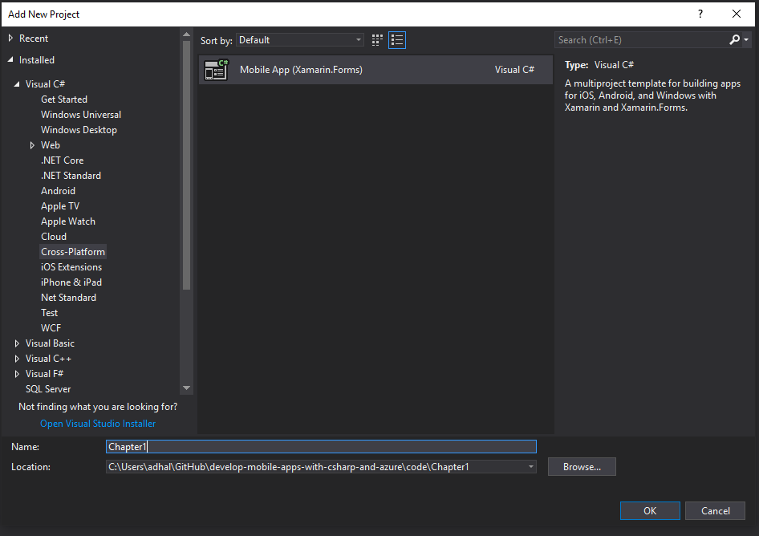
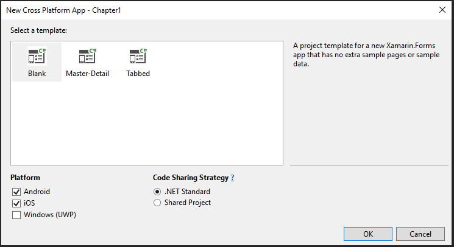
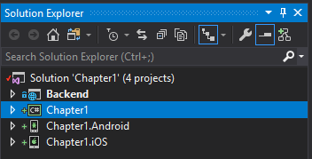

# Build a Mobile App on Windows

Now that the mobile backend is created, we can move to the client side of things.  If you have previously closed your project, re-open the project in Visual Studio now.  The first step is to add a new project to the solution that will represent our mobile app.

> **One solution or two?**  Code organization is important and it generates a lot of opinions.  Some people like to keep the backend separate from the frontend code (two solutions), while others like to keep everything together (one solution).  There are pros and cons for each method, which you will need to discover for yourself.  For this book, I always keep the backend with the frontend code in one solution.

1. In the solution explorer, right-click the solution and select **Add** > **New Project...**.
2. Select **Visual C#** > **Cross-Platform** > **Mobile App (Xamarin.Forms)**.
3. Give the project a name, then click **OK**.

    

4. In the **New Cross Platform App** window:
    * Select **Blank**.
    * Uncheck **Windows (UWP)**.
    * Ensure **Shared Code** is selected as the code sharing strategy.
    * Click **OK**.

    

Visual Studio will now scaffold three projects: a shared project where your business logic is stored, plus a platform-specific project for each platform you selected (in this case, iOS and Android).

!!! info "Code Sharing Strategies"
    The latest versions of Xamarin.Forms and Visual Studio provide two different code sharing strategies - **.NET Standard** and **Shared Code**.  Most of the time, you will want to compile with _.NET Standard_  in mind as this provides the maximal compatibility and force you to keep platform-specific code in the platform-specific projects.  However, sometimes, it is impossible to avoid including platform-specific code in the shared project.  In this case, you will want to select _Shared Code_.

Xamarin does allow us to build iOS applications directly from Visual Studio using a Mac.  I use a properly configured Mac Mini for this functionality.  We'll work on setting up the mac and compiling the iOS application later.  For now, let's continue with just the Android app.

Before I get started with any project (and after scaffolding), I always look in NuGet (right-click on the solution and select **Manage NuGet Packages for solution...**) for updated packages.  Xamarin.Forms and the Android support libraries are updated frequently and you may need to update them.  Once updated, you should always build your app to ensure compatibility:

1. Right-click your Android specific project and select **Set as StartUp Project**.
2. Right-click your Android specific project and select **Rebuild**.

