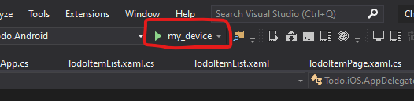
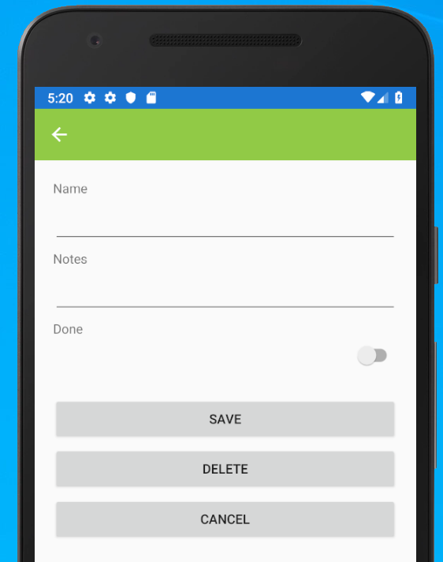
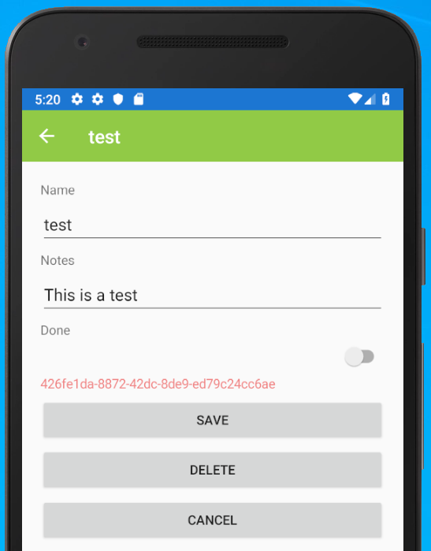

# Build a Todo app with Xamarin.Forms

Let's start by ensuring that your environment is up to par.  In the [GitHub repository for this book][github-repo], there is a `code` folder with all the code for the book.  

* Clone or Download the [GitHub repository][github-repo].
* Open the `code/Chapter1` folder, then double-click the `Chapter1.sln` file to open the solution in Visual Studio 2019.
* If you have not already created a virtual Android device:
    * Open the Android Device Manager (**Tools** > **Android** > **Android Device Manager**)
    * Click **New**
    * Give the device a name, then select the following:
        * Base Device: **Nexus 5X**
        * Processor: **x86**
        * OS: **Oreo 8.1 - API 27**
        * Google APIs should be checked
    * Click **Create**.  The device will be created.
* Open the Android Device Manager if it isn't already open and click **Start** next to your virtual Android device.
* Wait for the Android device to start, then close the Android Device Manager.

!!! tip "Hyper-V or HAXM"
    Visual Studio 2019 supports either Hyper-V or HAXM as a virtualization environment.  However, you can't run both.  You must choose one and ensure that the other is not installed.  If you get errors about the Windows Hypervisor environment, this is generally the problem.  Remove one of the offending virtualization environments to fix it.  This will reuqire a reboot.

To run the application, select your device from the run drop-down, then click start:



I recommend becoming familiar with the code in the `Todo` project, where the majority of the code lives.  Pay particular attention to the `Todo.Data` namespace as this contains all the code necessary to communicate with the database.  It is these classes we will be adjusting for the cloud.

## Prepare for a move to the cloud

The application as designed is a fairly standard implementation with a local database.  However, there is one major gotcha with the code.  It uses an auto-incrementing numeric integer as a unique ID.  This is normal whena single application is creating and accessing data records, but it is not suitable for an app that accesses data in the cloud in a potentially concurrent manner.  The problem is one of concurrency.  Let's say you have just produced a great task list app with such an ID that we have.  Two users are now using the app.  Both users have downloaded the data from the cloud and are up to record 5.  Now both users create a record.  Each record will be numbered 6.  What happens when the record gets updated?  Since the ID is the primary key for the database, it has to be unique within that database.  Which one "wins"?  The answer is "it depends on who writes first".  The creation of the second record will likely fail.

The first job we must do, then, is convert our app to use something that is globally unique across all users of the app.  For this, I recommend the usage of a [universally unique ID](https://en.wikipedia.org/wiki/Universally_unique_identifier) as the primary key of the database.  My first step is to adjust the app so that the ID is not referenced anywhere except within the database code.  This consists of three things:

1. Adjust the model to have an internal ID and a user-visible ID.
2. Adjust the database client to only allow the use of a user-visible ID.  It should also auto-generate the user-visible ID when necessary.
3. Adjust all the places that use the database client to ensure that only the user-visible ID is provided.

Let's take a look at the code for each of these:

### Update the TodoItem model

The first step is to separate the internal ID from the user-visible one:

```csharp
using SQLite;

namespace Todo.Data
{
    public class TodoItem
    {
        [PrimaryKey,AutoIncrement]
        public int internalID { get; set; }
        public string ID { get; set; }
        public string Name { get; set; }
        public string Notes { get; set; }
        public bool Done { get; set; }
    }
}
```

The `internalID` is only used by the database.  It should not be used anywhere else.  The `ID` has been updated to be a string.

### Update the TodoItemDatabase client

The usage of the internal ID is inherent in the TodoItemDatabase client, so we need to update three routines there:

* `GetItemAsync()` takes the internal ID.  It needs to be adjusted to take the user-visible ID.
* `SaveItemAsync()` returns the internal ID.  It needs to be adjusted to return the new item.
* `DeleteItemAsync()` also returns the internal ID, but that is not used by anything.

Here is the new code:

```csharp
public Task<TodoItem> GetItemAsync(string id)
{
    return database.Table<TodoItem>().Where(i => i.ID == id).FirstOrDefaultAsync();
}

public async Task<TodoItem> SaveItemAsync(TodoItem item)
{
    if (item.internalID != 0) {
        await database.UpdateAsync(item);
    }
    else
    {
        item.ID = Guid.NewGuid().ToString();
        int internalID = await database.InsertAsync(item);
        item.internalID = internalID;
    }
    return item;
}

public async Task DeleteItemAsync(TodoItem item)
{
    await database.DeleteAsync(item);
}
```

In addition, the data format of the database has changed.  In a more challenging app, we would version the database, then migrate the data to the new database if the old database exists.  For this example, we can rename the database to something new:

```csharp
private static readonly string dbPath = Path.Combine(
    Environment.GetFolderPath(Environment.SpecialFolder.LocalApplicationData), 
    "todoitems2.db3"
);
```

This will wipe out any tasks you have already created.

### Update the rest of the app

You should go through each page within your app to ensure that any changes that you have made to the database client are reflected within the usage of the same.  In our case, there are no changes that are required.  However, you should consider your app carefully.  We will talk more about this when we discuss data connectivity later in the book.

### Run the updated app

When you run the updated app, you will note a couple of changes.  First, when you create a new task, you will see the following:



Note that there is no number below the Done indicator.  This is the place where the ID used to be displayed.  When adding an item, there is no ID until you click on Save. If you save a new note then click on the newly created note, you will see something similar to the following:



Here, you can see the ID is now a universally unique ID.

## Build a cloud service


