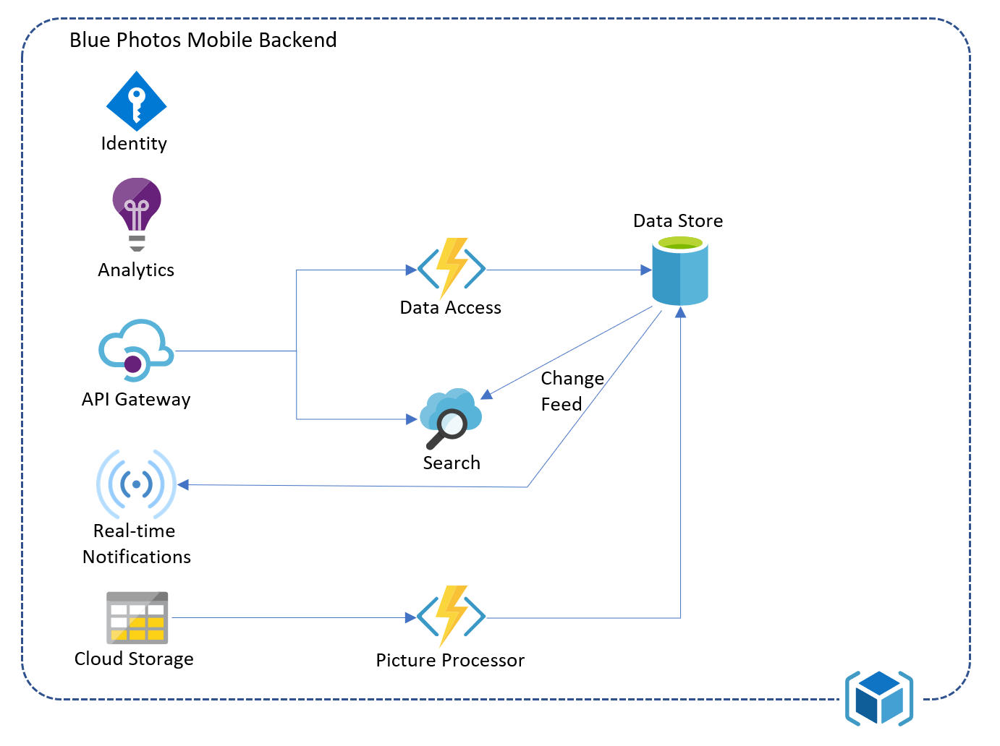

# A Sample Cloud-First Mobile App

Developing mobile apps can be overwhelming and complex.  However, we can break it down into manageable chunks and tackle each one separately.  For most of the rest of the book, we will be creating an app from the ground up.  The mobile app I've chosen for this is a typical personalized photos feed.  With this app, the end-user should be able to do the following:

* Take photos.
* View photos.
* Delete photos.
* Organize photos into albums.
* View all the photos in an album.
* Search for photos.
* Share photos with friends.
* Share photos to social media.

The end-user will do this in the context of an authenticated session on either Android or iOS.  They will have to authenticate with an online provider (such as Apple, Google, or Facebook) before they can use the app.  In addition, the cloud backend will enable automatic recognition via a tagging mechanism, allowing the user to easily search for photos of the same person, or for photos containing specific tags.  Finally, I want to have updates happen in real-time and be cached on the phone so that I am never waiting for the network.

## Architecture

When thinking about the architecture, I always start with the same process.  Firstly, let's look at some core requirements:

* I expect this app to go viral, with millions of users in the first week.  I'm not willing to pay for this though, so a serverless technology stack seems appropriate.
* I need offline capabilities for the database, and caching for the raw photos.

Let's take a first stab at the architecture based on these requirements and what we know so far:

There is a lot of room for expansion here, so let's fill it in.  Behind my API gateway will be a data service (backed by some sort of data store), and we will want some automated processing of images as they are uploaded, plus real-time notifications when image data is updated:

Let's take a look at the elements:

* The **Identity** sub-system is used to authenticate users.  Other parts of the system will use this to ensure that the authentication being passed by the mobile app is valid.
* The **Analytics** sub-system will be used to track users activities.  This allows us to validate usage and make product decisions on new features.
* The **API Gateway** enforces protections at an API level.  It is used to prevent common attacks like DDoS and injection by enforcing the API contract.
* The **Real-time Notifications** sub-system is an active channel back to the mobile app to allow the backend to inform the mobile app that a change has been made.
* The **Data Access** sub-system implements a REST interface to the **Data Store**, which hold the meta-data for the photos and albums.
* The **Search** sub-system provides a fast search capability across the photos in the system.
* The **Cloud Storage** sub-system holds the raw photos.
* The **Picture Processor** sub-system analysez uploaded photos and adds meta-data into the database based on the uploaded photo.

I've deliberately left the details of each sub-system vague.  During the following chapters, I will take each sub-system and look at the options available and how to integrate those options into the app.  When we are done, you will have a complete mobile app and backend.

We'll wrap up the book by looking at other considerations in producing production-quality mobile apps.

First, on to [analytics](../chapter3/index.md).

