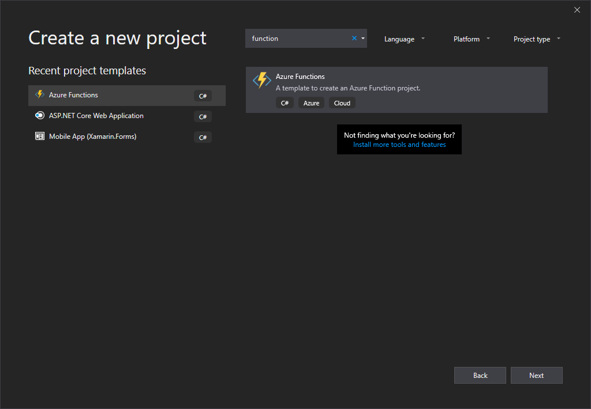
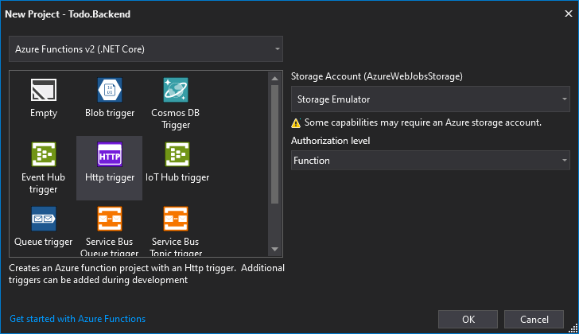
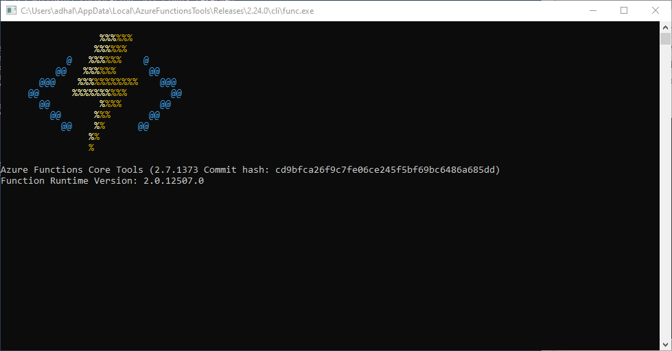
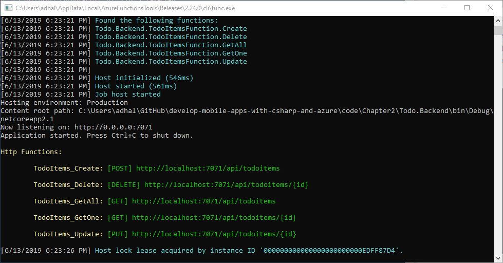
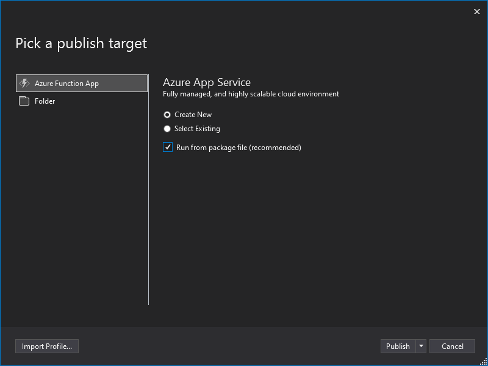
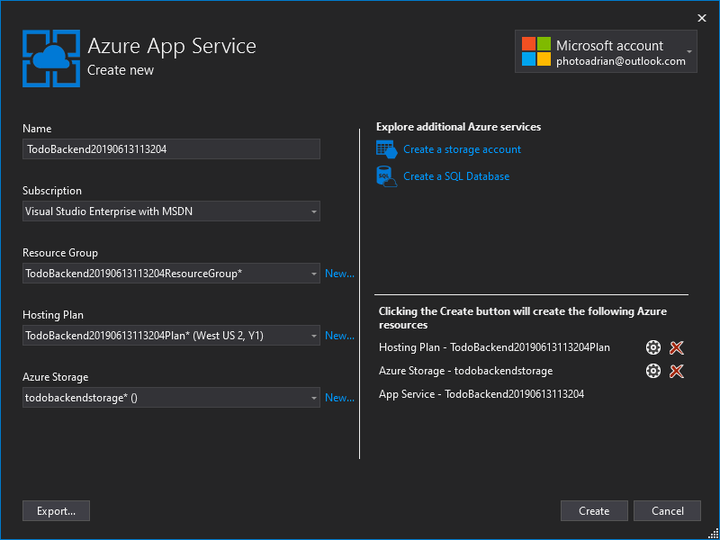
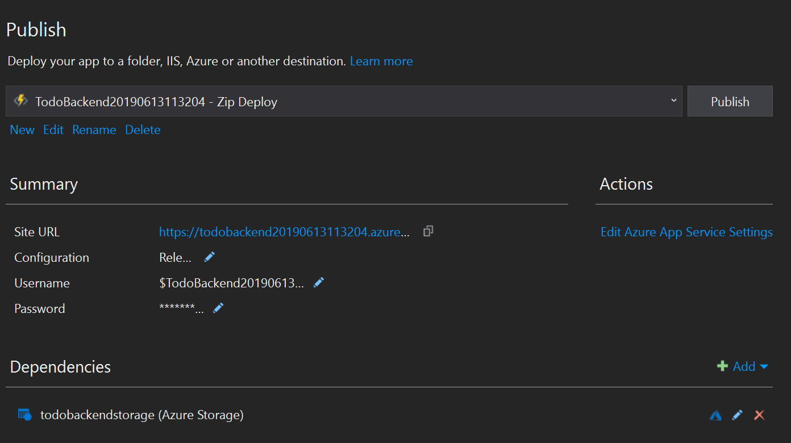
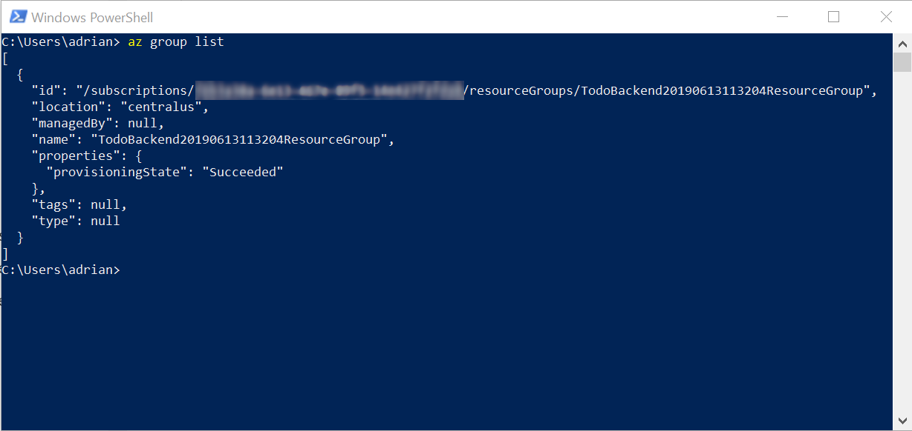

# Implement REST in Azure Functions

For this section, we will be using Visual Studio 2019 on a Windows PC.  The aim is to implement the same REST backend we used in Chapter 1, but to implement using Azure Functions.  Azure Functions is a serverless technology that provides massive scalability, but adjusts the programming model so that you concentrate on your application code, not the infrastructure around it.  In this case, we are going to write five functions - one for each operation within our API.

## Create a Visual Studio project

Before we begin, we need to create a new project.  

1. From the start page, click **Create a new project**.
2. Enter _function_ in the search box, then select the **Azure Functions** template.  Click **Next**.

    

3. Name the solution `Chapter2` and the project `Todo.Backend`, then click **Create**.
4. Select **Http trigger**, then click **OK**.

    

Your Functions app will now be created.

## Create a database and model

When we were developing the ASP.NET Core application, we had to create a model - `TodoItem.cs` - and a database context to handle the connectivity to the in-memory database.  We still have to do this, but we don't have any scaffolding provided by ASP.NET Core to handle the in-memory database for us.  First, the `TodoItem.cs` file is almost exactly the same:

```csharp
using System;

namespace Todo.Backend
{
    public class TodoItem
    {
        public string ID { get; set; } = Guid.NewGuid().ToString();
        public string Name { get; set; }
        public string Notes { get; set; }
        public bool Done { get; set; }
    }
}
```

Since we always have to have an ID, we create a suitable ID during construction.  It can be overridden by the incoming request.  Now for the database.  Since my intent is to replace the database at some future date with an implementation that uses a real database, I'm writing this as a singleton that uses asynchronous methods.  In this way, I can easily update it for network communication later on.

!!! tip "Use async patterns"
    You should get in the habit of using async patterns whenever I/O is likely to happen.  Using async up front makes refactoring later much easier.

The database is a simple dictionary (or key-value store) in this case.  The ID is the key and the complete record is the value.

```csharp
using System;
using System.Collections.Generic;
using System.Threading.Tasks;

namespace Todo.Backend
{
    public class TodoItemsDatabase
    {
        #region Singleton
        private static TodoItemsDatabase instance;

        public static TodoItemsDatabase Instance
        {
            get
            {
                if (instance == null)
                {
                    instance = new TodoItemsDatabase();
                }
                return instance;
            }
        }
        #endregion

        #region Implementation
        private IDictionary<string,TodoItem> items;

        private TodoItemsDatabase()
        {
            items = new Dictionary<string, TodoItem>();
        }

        public async Task<List<TodoItem>> GetAllItemsAsync()
        {
            return new List<TodoItem>(items.Values);
        }

        public async Task<TodoItem> GetItemAsync(string id)
        {
            return items[id];
        }

        public async Task<TodoItem> SaveItemAsync(TodoItem item)
        {
            if (item.ID == null)
            {
                item.ID = Guid.NewGuid().ToString();
            }
            if (items.ContainsKey(item.ID))
            {
                items[item.ID] = item;
            } else
            {
                items.Add(item.ID, item);
            }
            return items[item.ID];
        }

        public async Task DeleteItemAsync(string id)
        {
            items.Remove(id);
        }
        #endregion
    }
}
```

You will see green squiggly lines under each method name.  This is notifying you that you are using async code, but not using await in the method.  

## Write functions for each REST method

An Azure Function has a specific form.  First, it is always `static`.  I also make mine `async` so that I can use async methods during execution.  For each one, I log the entry, get a reference to the database, and then do the operation.  Let's look at just the `Get` operation to get all items:

```csharp
using System.IO;
using System.Threading.Tasks;
using Microsoft.AspNetCore.Mvc;
using Microsoft.Azure.WebJobs;
using Microsoft.Azure.WebJobs.Extensions.Http;
using Microsoft.AspNetCore.Http;
using Microsoft.Extensions.Logging;
using Newtonsoft.Json;

namespace Todo.Backend
{
    public static class TodoItemsFunction
    {
        [FunctionName("TodoItems_GetAll")]
        public static async Task<IActionResult> GetAll(
            [HttpTrigger(AuthorizationLevel.Function, "get", Route = "todoitems")] HttpRequest req,
            ILogger log)
        {
            log.LogInformation($"Processing HTTP request {req.Method} {req.Path}");
            var db = TodoItemsDatabase.Instance;

            return new OkObjectResult(await db.GetAllItemsAsync());
        }

        // Other functions here
    }
}
```

Note that the amount of code that needs to be written is small.  You can split functions over many files, but I like to group all the operations for a specific use within a single file.  Since all my functions are dealing with the `api/todoitems` REST API, I'm going to place them all in one file.

Some notes for this form:

* All functions have a `FunctionName` decorator.  The function name chosen must be unique within the application.
* The `HttpTrigger` decorator provides the authorization level, method, and route.  
* Logging is important!

You can now run the application locally.  Just press **F5** to start the application.  This will kick off the Azure Functions local runtime in a new console window.



Once it is ready, you will see the list of endpoints it is listening on.  Press the stop button within Visual Studio, and let's implement the rest of the application:

```csharp
        [FunctionName("TodoItems_GetOne")]
        public static async Task<IActionResult> GetOne(
            [HttpTrigger(AuthorizationLevel.Function, "get", Route = "todoitems/{id}")] HttpRequest req,
            ILogger log,
            string id)
        {
            log.LogInformation($"Processing HTTP request {req.Method} {req.Path}");
            var db = TodoItemsDatabase.Instance;
            var item = await db.GetItemAsync(id);
            if (item == null)
            {
                return new NotFoundResult();
            }
            return new OkObjectResult(item);
        }

        [FunctionName("TodoItems_Create")]
        public static async Task<IActionResult> Create(
            [HttpTrigger(AuthorizationLevel.Function, "post", Route = "todoitems")] HttpRequest req,
            ILogger log)
        {
            log.LogInformation($"Processing HTTP request {req.Method} {req.Path}");
            var db = TodoItemsDatabase.Instance;

            string requestBody = await new StreamReader(req.Body).ReadToEndAsync();
            TodoItem item = JsonConvert.DeserializeObject<TodoItem>(requestBody);
            var result = await db.SaveItemAsync(item);
            return new OkObjectResult(result);
        }

        [FunctionName("TodoItems_Update")]
        public static async Task<IActionResult> Update(
            [HttpTrigger(AuthorizationLevel.Function, "put", Route = "todoitems/{id}")] HttpRequest req,
            ILogger log,
            string id)
        {
            log.LogInformation($"Processing HTTP request {req.Method} {req.Path}");
            var db = TodoItemsDatabase.Instance;
            var item = await db.GetItemAsync(id);
            if (item == null)
            {
                return new NotFoundResult();
            }

            string requestBody = await new StreamReader(req.Body).ReadToEndAsync();
            TodoItem request = JsonConvert.DeserializeObject<TodoItem>(requestBody);
            if (request.ID != id)
            {
                return new BadRequestResult();
            }
            var result = await db.SaveItemAsync(request);
            return new OkObjectResult(result);
        }

        [FunctionName("TodoItems_Delete")]
        public static async Task<IActionResult> Delete(
            [HttpTrigger(AuthorizationLevel.Function, "delete", Route = "todoitems/{id}")] HttpRequest req,
            ILogger log,
            string id)
        {
            log.LogInformation($"Processing HTTP request {req.Method} {req.Path}");
            var db = TodoItemsDatabase.Instance;
            var item = await db.GetItemAsync(id);
            if (item == null)
            {
                return new NotFoundResult();
            }
            await db.DeleteItemAsync(id);
            return new OkObjectResult(item);
        }
```

The only thing to note for these additional methods is how to specify an argument on the URI.  You specify an argument (the id in our case) the same as you would when specifying routing decorators within an ASP.NET Core application.  

## Test locally

Let's press **F5** again to take a look at the results.  Here is the console window:



You can now use [Postman][postman] to execute the same queries as we used in [Chapter 1](../chapter1/windows-intro.md##test-the-api-controller).

## Publish to Azure

Just like we did in Chapter 1, we can publish our Azure Functions app directly from Visual Studio.

1. Right-click the `Todo.Backend` project, then select **Publish...**.
2. Select **Run from package file**, ensure **Create New** is selected, then click **Publish**.

    

3. Take a look at the following items and verify that they are correct:

    * Subscription should match the subscription you want to deploy into.  I use my Visual Studio Enterprise subscription.
    * Create a new Hosting plan with the appropriate region and the size set to "Consumption".

    

4. Click **Create**.

Note that Azure Functions always requires a miniscule amount of storage to store the functions.  This is normally a billable service.  Deployment will take a few minutes.  Once deployment is complete, you will see a similar screen to the one you saw when deploying in Chapter 1.  



You can use the `Site URL` field to connect to this backend.  Just insert this URL into the `Todo` project we developed in Chapter 1.

## Cleaning up

You can clean up the Azure Functions app just like any other service - delete the resource group.  This can be done via the portal, via PowerShell, or via the Cloud Explorer within Visual Studio.  Since you will likely be adding and removing resources frequently, let's learn how to login to Azure on the command line and remove the appropriate resource group.

First, [install the Azure CLI](https://docs.microsoft.com/en-us/cli/azure/install-azure-cli?view=azure-cli-latest).  There are options for both Windows and MacOS.

Once you have downloaded and installed the package, open up a command line.  I use PowerShell for my command line, but I use the Azure CLI rather than the PowerShell cmdlets.  This is because I switch between a Mac and PC.  The commands I run are the same on both systems if I use the Azure CLI.  

Let's start by authenticating with the Azure CLI.  All the Azure CLI commands are in the `az` command.  Type:

```bash
az login
```

If you are on Windows or Mac, a browser window will pop up and you will log in to the Azure Portal.  Once you have logged in, the `az login` command will return with the details of your subscriptions in JSON format.  You don't need this, but it signifies that your command worked.  

Next, let's list the resource groups that are available:

```bash
az group list
```

This will give you something like the following:



Note the name field.  You will need this in the next command:

```bash
az group delete -n "<name>" -y
```

This takes some time - as expected.  However, it doesn't take as much time as using the portal.  The portal is lazy about how it kicks off deletes, so they tend to take longer through the portal than through the command line.  The PowerShell cmdlets use the same backend interface, so there is no
difference between the time PowerShell takes and the time the Azure CLI takes.

Now that we've cleaned up, take a look at the [app we will be writing in the rest of the book](app.md).

<!-- Links -->
[postman]: https://getpostman.com