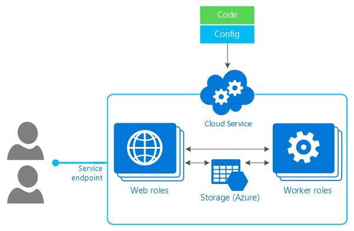

# Deployment

When you have finished your mobile backend, you will want to deploy it to the cloud to run it.  So why are we considering deployment first, before we even start touching code?  Deployment matters because how you intend to deploy your code changes the way you develop your backend.  Let's first take a look at some of the considerations you need to think about when you think about a mobile backend, and then look at the options available to you in the light of those considerations.  

## What to consider

When considering deployment options, here is what you need to consider:

* Security, particularly underlying operating system patches
* Availability of your mobile backend
* Scalability of your mobile backend
* The failure model

Let's take each of these in turn.

### Security

Every single system on the Internet is built in the same way.  You have the physical layer - a computer with memory and local disk, connected to the network and some sort of the network storage.  On top of this is a virtualization layer, followed by the operating system, any critical services you need to run the service you really care about, and then your application.

How much of this do you want to manage?  You care about it all functioning, of course.  But how much do you really want to deal with?  If you are like me, the answer is "as little as possible and ideally just my application".  You want the rest of it to "just work".  Of course, that may be asking a lot and there is always a trade off between how much control you have over the environment and how much management you must do.

So, how does this matter when it comes to security?  Every day, many security patches come out - for the operating system, web servers, database services, and so on.  The more of the stack you control, the more you have to care about security.  However, security patching does not add to your product.  It takes away from time you could be developing new features or fixing bugs in your application code.

One option is to delegate as much as possible to the cloud provider.  However, doing this comes with its own set of drawbacks.  You no longer have control over when and which security patches are applied.  How much you care about this is, of course, dependent on how much you want to manage.

### Availability

Some services run all the time, and thus are available all the time.  You can architect a cloud service with rolling deployments so that there is no single time when the service is not available.  Other services run on demand.  There is almost always a startup cost associated with spinning up a service so that it is ready to answer queries.  The most notable startup cost is the amount of time it takes to connect to the database.  This is passed on to your users in the form of application latency.

The flip side of availability is cost.  In the cloud, you are billed for every second your backend is running, irrespective of whether it is handling requests or not.  If your service is available all the time, you are paying for that availability all the time.  If your service starts and stops on demand, then you pay less money to run the service, but have a greater risk of latency issues.

If you architect your application well (using deferred authentication and local caching), then you can alleviate most of the latency issues.  However, you should understand what, if any, concerns you may have when using on demand vs. always on services.

### Scalability

How busy will your service be?  That's an impossible question to answer.  Sometimes, you know that your app will run from 8am-6pm during the week and be accessed by only the employees of your company.  This is the profile of a typical enterprise application.  Other times, you are writing a consumer application and hope that your app will be successful - leading to millions of users.   How do you determine the right scaling options for your app?  If your app is successful but you haven't planned for enough resources, your service will suffer latency and failed connections.  If your app is not successful and you had planned for capacity to support many more users, you are paying extra money for the service to be idle.

### Failure model

What happens when a node in your service goes down?  A few users will get failed requests, which may pop up annoying alerts that the user can't do anything about.  What about if a country connection goes down?  How about if a user moves between WiFi and LTE coverage?  What about if they live in Africa and don't even have access to GPRS speeds?  In short, how do you deal with two failure modes: a failure to connect to the cloud and a speed (or latency) issue? 

The answers to these questions drive the expectations of the service and the expectations of the users.  You have to plan for failure.  Quite how you do that will drive how you think about your backend service.

## Deployment Options

There are multiple ways to do everything in the cloud, and how you architect your mobile backend is no different.  However, there are ways you can make your life more difficult.  For example, you could decide to just use the most basic facilities provided by Azure - virtual machines, networking,
and storage - and do everything yourself.  This gives you maximum control - you get to choose which
operating system, orchestrator, scale units, network firewalls, and hosting platform you want.  However, you also have to manage all that, so you are also responsible for the security, availability, and scalability of the solution.  You don't get any help from the cloud provider in that respect.  It's definitely not recommended given that Azure has some awesome facilities that ease the management pain.

Let's look at three options you could use:

### Containers

The first type of mobile backend that we will consider is a containerized mobile backend.  Containers are a lightweight alternative to virtual machines.  You encapsulate the application within a runtime that is then run  by a container service - Docker on your development machine and an orchestrator like [Azure Kubernetes Service][aks] or [Service Fabric][service-fabric] within the Azure Cloud.  The good news about this (over a virtual machine) is that you can automate the build of a container through a continuous integration process (like [Azure DevOps][azure-devops]).  This allows you to ensure the application you are testing locally is actually the same application that you are deploying remotely, since the application is isolated from your development environment through the container encapsulation.  

You still have to make some decisions and manage the environment.  Specifically, your Docker image will be based on a standard Docker image.  When that standard Docker image is updated, you will need to rebuild, test, and deploy a new application.  It's a lot less work than a virtual machine, and the use of standard images means you only have to monitor one place for security updates.  You also have to deal with scaling decisions - how big a processor and memory does each container get, and when do you scale up or down?

### Azure App Service

If you don't like the idea of publishing a container and the necessary infrastructure needed to run containers in the cloud and on your development system, you may want to consider Azure App Service.  This service allows you to run a web application (like our ASP.NET Core application from Chapter 1) within a controlled environment.  Azure engineers take care of all the security patching and associated maintenance of the underlying system.  You get to decide how big the virtual environment is (in terms of CPU and memory), plus rules on when to scale up and down.  Once set up, the environment can be deployed automatically based on a source code repository, has multiple slots for handling multiple environments (to implement dev-test-production environments, or for A-B testing, for example), and has a host of other features, including the ability to attach a debugger to an in-cloud instance and integrate identity services within the app.

The major problem with Azure App Service, Containers, and Virtual Machines is that you are paying for "idle time".  This is not a problem on a major mobile app which will have usage all the time.  However, for development and for lower usage or enterprise mobile apps, you won't want to pay for idle time, which can add up.  Take, for example, a typical US-based employee mobile app.  It is likely to be used from 8am on the east coast of the US until 5pm on the west coast - about 11 hours.  If your mobile backend is running on any of these technologies, over 50% of the time will be idle, resulting in a bill that is 100% bigger than it could be.  

### Azure Functions

There are two problems that have been covered above:

* Paying for idle time
* Scalability for viral apps

These two competing issues are at the core of what Azure Functions solves.  With Azure Functions, a small piece of code is executed whenever it is triggered by an event.  An event could be a HTTP request (and this is the most common scenario within a mobile backend), but it could just as easily be a completed upload of a photo, or a timer has triggered to initiate a batch job.  Since the Azure Function is not triggered (or paid for) until it is used, you never pay for idle time.  You also have options for scalability.  With a consumption plan, you scale as your app scales, paying for compute resources when your app is running.

There are three down sides to using Azure Functions (two of which you can work around).  The first issue is that you must architect your mobile backend with Azure Functions in mind.  Your mobile backend is no longer an ASP.NET Core application - it's an Azure Functions app, which its own method of doing things. We'll get into what this means more later on.  The second issue is that Azure Functions are limited in the amount of time that they can execute.  This is normally a good thing - a HTTP trigger that executes for more than 10 seconds will cause timeouts to your users.  Sometimes, however, the function will take longer.  In this case, you should use either a [Durable Function][durable-function-pattern] or a Premium Plan (described below).

The third issue is a common serverless issue - cold start.  The Azure Functions runtime does not start up your app until the first request.  It will then keep the app around for a little while before shutting it down again.  Once it is shut down, the start up process needs to be gone through again.  Similarly, when the Azure Functions runtime automatically scales your app to a new instance, the cold start process must be gone through again.  This cold start process might be small (and we try to architect applications so that it is small).  However, it can also be significant.  Imagine an ASP.NET Core application that connects to a SQL database with a persistent connection.  The start-up process is significant.

To get around these latter problems, Azure Functions has a premium plan.  This provides for perpetually warm instances to avoid any cold start along with more predictable pricing, and a function can execute for a potentially unlimited amount of time, making it ideal for batch jobs.  Instead of billing per execution, you are billed for the number of core seconds across all instances.  This also allows you to reserve instances (at a fixed monthly cost).  

Let's take a look at what a typical Azure Functions based application looks like by [transitioning our REST backend from Chapter 1 to Azure Functions](./functions.md).

## What do I use?

This is a great question.  When I am pressed into building a mobile backend, generally an architecture presents itself.  When I have flexibility, I use the following rules:

1.  Use as many managed services that I can to minimize the code I have to write.
2.  Use Azure Functions for batch jobs or behind the scenes processing jobs.
3.  Deploy a container on Azure App Service for the data interface to the mobile app.

The services that I use directly from the mobile app include Azure Active Directory (and AAD B2C) and Azure Storage, covering identity and file storage respectively.  I would only use a service directly if I can manage the access to it easily through identity services like Azure Active Directory.  Cosmos and SQL Azure are the basic building blocks for databases (covering both NoSQL and SQL services).  I generally access these services through an intermediate web service that I write and deploy on Azure App Service.

## Next steps

* Investigate how to [write a REST backend using Azure Functions](./functions.md)
* Take a look at the [app we will be writing in the rest of the book](./app.md)

<!-- Links -->
[docker-intro]: https://docs.docker.com/v17.09/engine/examples/dotnetcore/
[aks]: https://azure.microsoft.com/en-us/services/kubernetes-service/
[service-fabric]: https://azure.microsoft.com/en-us/services/service-fabric/
[azure-devops]: https://visualstudio.microsoft.com/team-services/
[durable-function-pattern]: https://docs.microsoft.com/en-us/azure/azure-functions/durable/durable-functions-concepts#async-http