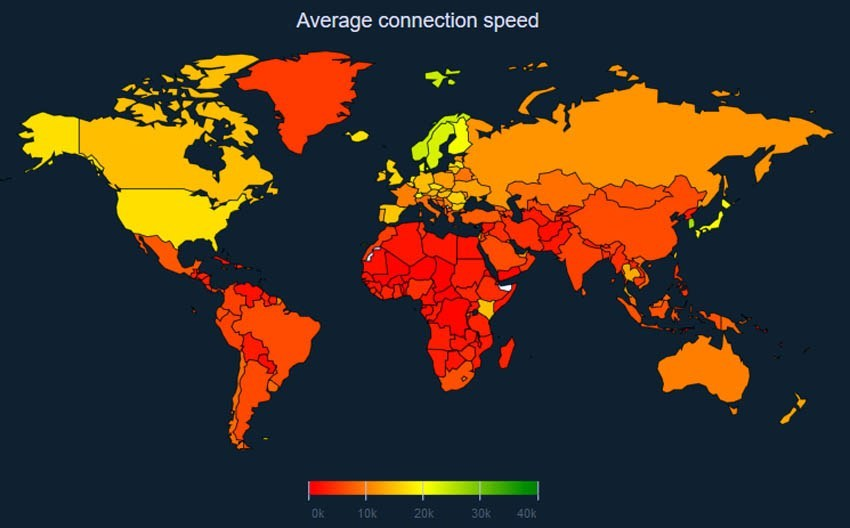

# Analytics and Telemetry

Whenever I see a mobile app, inevitably it is sending information to an analytics service to the cloud.  This can take many forms, and we will look at two of them today, but we start with why this is a good idea (and why it is a bad idea).

## Analytics is good

So, why do we collect analytics and telemetry data anyway?  There are three broad camps for mobile apps:

1. Consumer apps
2. Business to consumer apps
3. Enterprise (employee) apps

Let's think about each of these in turn, starting with the consumer apps as these are potentially the easiest to think about.  After all, if you are developing a mobile app, the likelihood is that you have a smart phone and you have a bunch of consumer apps on it.  These are games, social media apps, mapping apps, and information apps.  They will generally be supported via advertising (or you may pay a fee for them).  

If this is your app, why would you gather telemetry?  You need to know things about your users:

* What keeps a user coming back to the app?
* How many people are using your app?
* When you introduce a feature, is it used?
* How many ads are shown to the user?

More specifically, you will use this data for multiple reasons:

* To drive future improvements in the app
* To drive revenue for your app
* To contact your users, driving them back to your app

When it comes to business-to-consumer (or B2C) apps, you have even more reason to understand what your users do.  B2C apps tend to involve shopping or a specific relationship with a vendor, like a bank.  In this case, in addition to the information about the app we explored in the consumer apps, you want to understand

* What did the user view?  What was their journey through the app?
* What did the user do instead of a business function (like a sale)

Again, this is mostly to drive revenue.  However, you may also want to make the mobile app an integral part of the customer journey - informing them of new sales that they want to take part in.   You also want to inform them when deliveries happen, statements are due, and other transactional information.

Finally, the enterprise app ALSO needs telemetry.  Enterprise apps are generally a little harder to use due to time constraints on design, and the user may not be able to do everything that he or she needs to do to fulfill the job to be done.  You need to track:

* Where are they using the app?
* When are they using the app?
* Where are they having difficulty?
* Where is the app having problems?

This is all driven by telemetry within the app.

## Analytics is bad

Obtaining telemetry and sending it to the Azure cloud to be analyzed is not without cost.  For your users, it uses network bandwidth.  Depending on the amount of telemetry you are sending back, this may be considerable, and can turn into a problem in areas of the world with lower average bandwidth availability or where bandwidth is chargeable. 

However, there are costs to you as well.  You have to ingest all that data, then store it somewhere, and finally look at it.  This doesn't come for free (although you may not be paying for it with money).

Telemetry and analytics also has a bad reputation as a privacy problem for your users.  In some parts of the world, you have to give your users notice that you are gathering data about them and give them the option to opt out.  To do this, you will have to add additional code to your app for this.

## Options for Analytics on Azure

There are two basic ways you can record telemetry within Azure:

1. Visual Studio App Center
2. Azure Monitor
3. Azure Monitor with Backend-only telemetry

We'll take a look at each of these, but let's do a basic comparison.

### Visual Studio App Center

Visual Studio App Center is a build and run mobile tool center, and is definitely something you should spend some time becoming familiar with.  For analytics, it allows you to have a one-liner in your app that records telemetry.  Once you have data flowing into your project within Visual Studio App Center, you can log in and view the analytics, segment your users and send them notifications.  Visual Studio App Center also has crash analytics, allowing you to detect and record application crashes easily.

**Use this if** your interest is primarily marketing.  This is a great option when you want to link analytics to push notifications, which is what consumer and B2C mobile apps tend to want.  You can still do transactional push notifications without this, and the analytics are pretty basic (compared to what you can do with access to the raw data).

**Don't use this if** you need to correlate telemetry between back end and front end.  It only records the front end telemetry and does nothing for your back end, leaving you wondering if a particular request was a problem or not.

**Cost**: Free, with some caveats about the number of push notifications you can send and the number of endpoints you can send to.

### Azure Monitor

Azure Monitor is more attuned to the "break/fix" cycle.  Azure Monitor is not explicitly for monitoring mobile apps, so you have to do all the sending of data by hand.  It will allow you to send whatever events you want, and has in-built alarms, dashboards, and workbooks, with access to powerful analytics tools like PowerBI.

**Use this if** your interest is primarily technical.  This is a great option if you want to link what is happening on the front end of your application with what is happening on the back end of the application.  There is no linkage to push notifications natively, so you will end up doing the linkage yourself in code.  However, there is also no limit to what you can do, so it's a lot more flexible than Visual Studio App Center.

**Don't use this if** you don't like complexity and just want something to "work".  This doesn't just work.  It's a fair bit of work to get even basic telemetry into a dashboard that does half the things that Visual Studio App Center does. 

**Cost**: Charged per GB, with a free allotment.  See their [pricing page](https://azure.microsoft.com/en-us/pricing/details/monitor/) for more information.

### Backend-only Telemetry

If you are really only interested in how the mobile app affects your backend, then you can alter the
`User-Agent` for each request that you send to the backend and record those as telemetry.  This still provides a rich set of data.  However, the data is not enough to see what is going on with the mobile app itself.

If you want even more data, then you can store data points internally to the mobile app between calls.  When you do an API call to your backend service, you can bundle this up into an encoded data block and send it along with your request in a telemetry header.  Your mobile backend will then gather this data and send it to the telemetry store for processing.

**Use this if** your mobile app is operating in areas of the world with restrictions on bandwidth usage because of cost or availability.  It's not worth capturing telemetry if it causes your users aggravation.

**Cost**: Charged per GB, with a free allotment, since you are still using Azure Monitor for this.

## Next Steps

In our app, let's [integrate Visual Studio App Center](vsac.md) for both telemetry and crash analytics from beginning to end.
