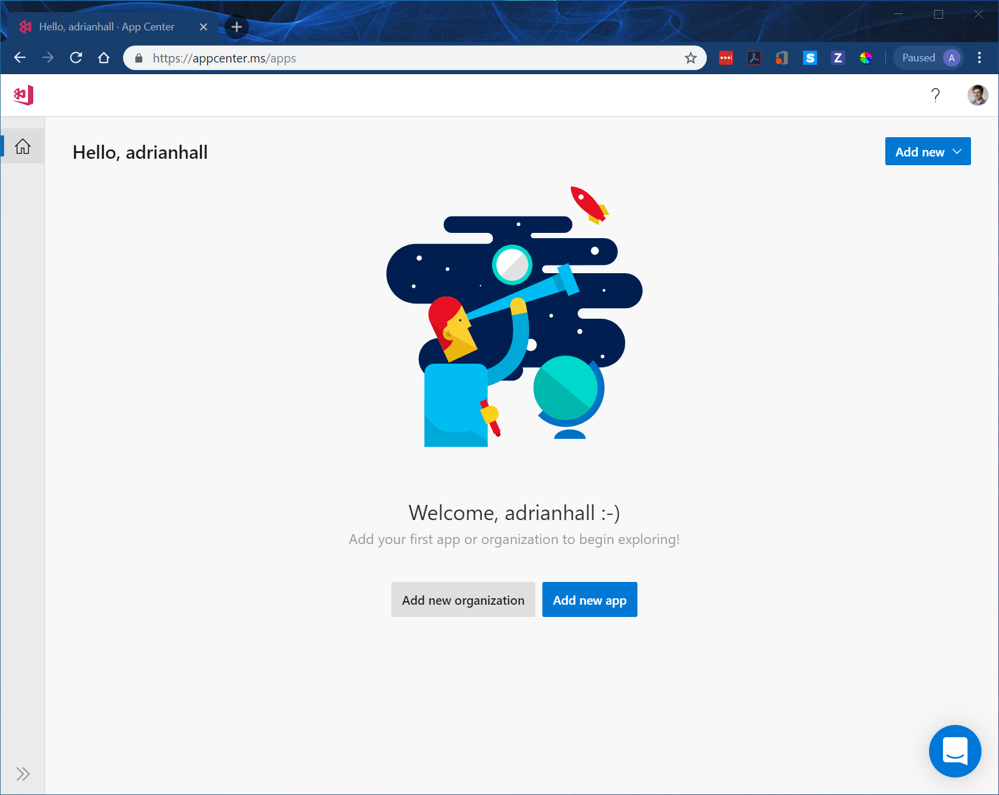
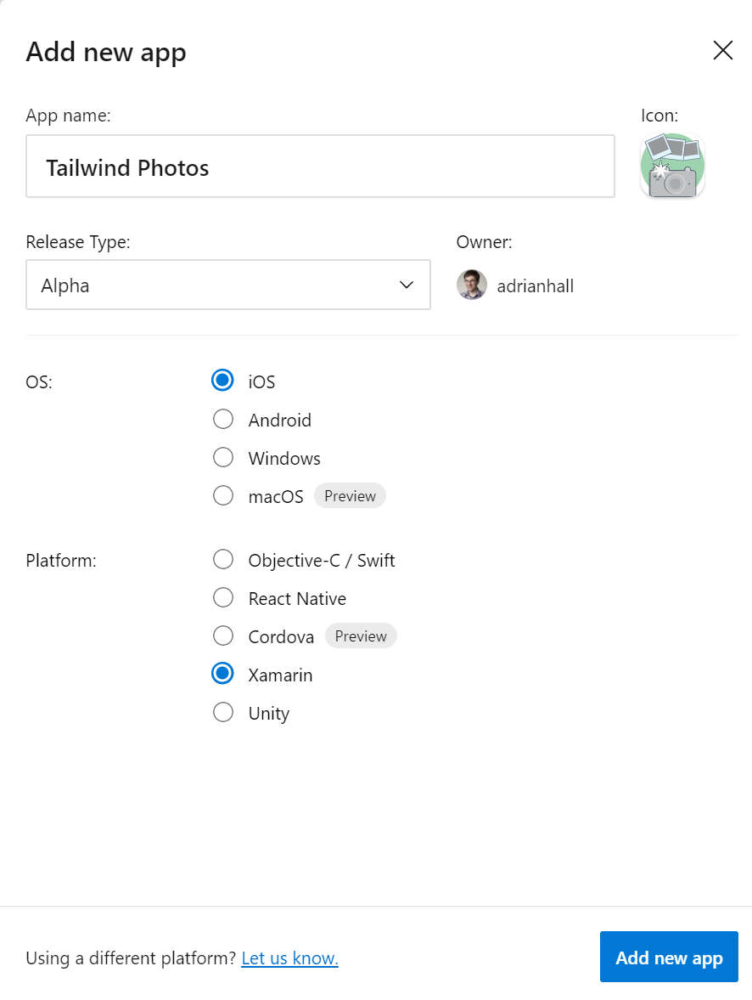
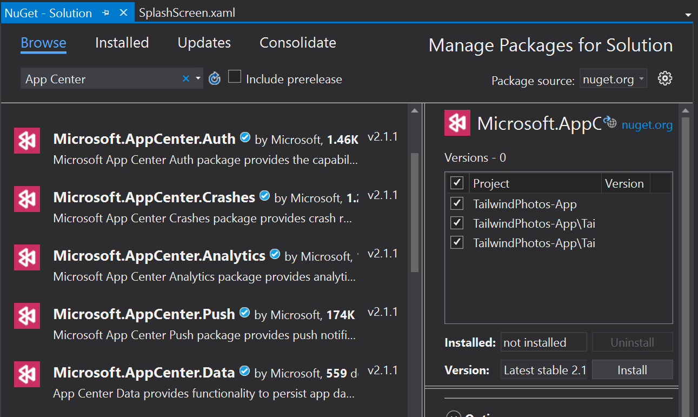
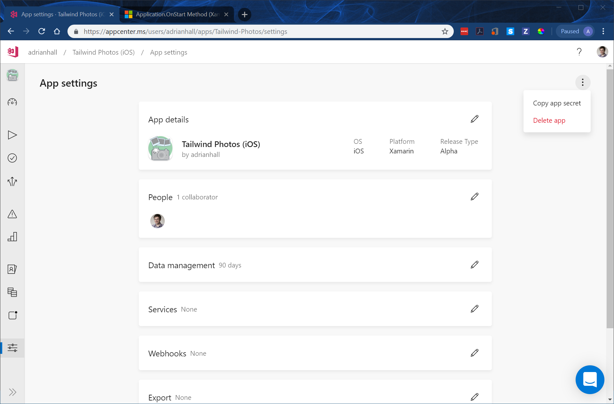
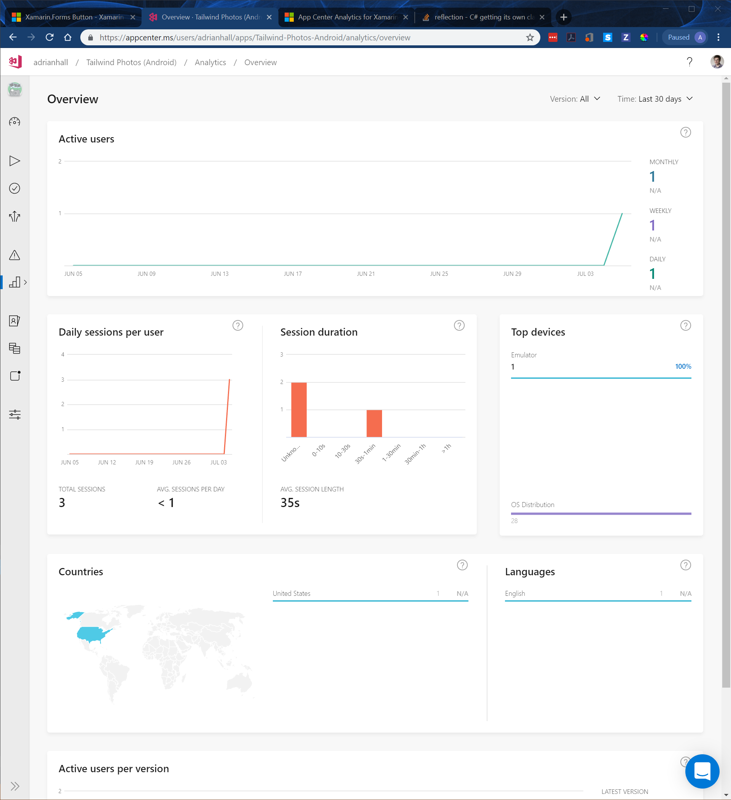
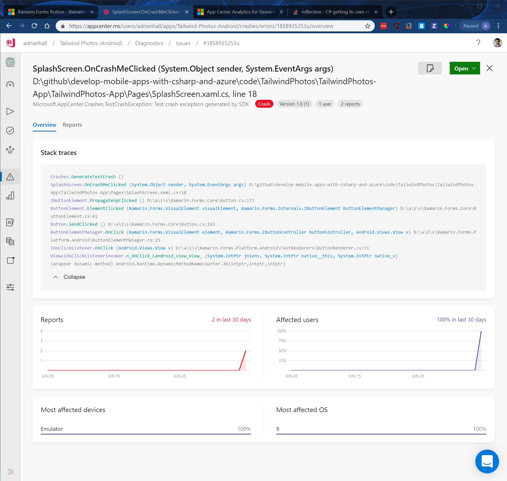

# Visual Studio App Center

Visual Studio App Center is not a part of the Azure portal.  Rather, it is a completely separate site that dedicates itself to the requirements of modern client app developers.  It's also [free](https://visualstudio.microsoft.com/app-center/pricing/) to get started and there are generous limits on the services within the free tier.  

Visual Studio App Center allows the mobile app developer to:

* Build in the cloud (even iOS apps without a Mac).
* Automate UI testing on thousands of real devices.
* Distribute your apps to beta testers ahead of app store submission.
* Do analytics, crash reporting, and push notifications.

It is this latter feature that we will leverage in this section.  We will explore the rest of the feature set later on.

## Create an account

To get started, [create a Visual Studio App Center account](https://appcenter.ms/signup).  I use my GitHub ID for this, but you can use anything - including the same account you registered with Azure.  This is a fairly basic GitHub sign-up.  You log into GitHub, then authorize `VSAppCenter` to access your GitHub information before being redirected back to Visual Studio App Center.  From that point on, you can access VSAC using [their front door](https://appcenter.ms).

## Create a new app

Since this is your first app, you can just click on the **Add new app** button:



From there, you can give your project a name, upload an icon, select a release stage (they call it release type but it's something like "Alpha", "Beta", or "Production), and finally an OS and Platform.  Ensure you select **Xamarin** for the platform.



Now click **Add new app** again.

!!! info "What about building different versions of the same app?"
    The short version is you can't.  You need to create two distinct apps within Visual Studio App Center - one for iOS and one for Android.  

Create another new app for the other OS.  You should have one app for iOS and one app for Android at the end.

## Integrate the SDK

The next page will show you what you need to do for Xamarin and Xamarin.Forms.  You need to switch to the Xamarin.Forms tab to get those instructions, but I've repeated them below.  

* Switch back to your Visual Studio project.
* Right-click the solution, then select **Manage NuGet Packages for Solution**.
* Click the **Browse** tab.
* Enter **App Center** in the search box.
* Select the **Microsoft.AppCenter.Analytics** package.  This is called **App Center Analytics** if using Visual Studio for Mac.
* Select all the projects, then click **Install**.

    

* After the installation is complete, repeat the installation steps for the **Microsoft.AppCenter.Crashes** package.  This is called **App Center Crashes** if using Visual Studio for Mac.

Change the `App.cs` file in the shared project to the following:

```csharp
using Xamarin.Forms;
using Microsoft.AppCenter;
using Microsoft.AppCenter.Analytics;
using Microsoft.AppCenter.Crashes;
using Tailwind.Photos.Pages;

namespace Tailwind.Photos
{
    public class App : Application
    {
        private readonly string iosAppId     = "{your-ios-app-id}";
        private readonly string androidAppId = "{your-android-app-id}";

        public App()
        {
            MainPage = new NavigationPage(new SplashScreen());
        }

        protected override void OnStart()
        {
            AppCenter.Start(
                $"ios={iosAppId};android={androidAppId}",
                typeof(Analytics), typeof(Crashes)
            );
        }
    }
}
```

You will need to get both your iOS and Android App ID.  Go into each app within VSAC.  For each app, go to **App settings** (which is the lowest icon in the left hand bar), then click on the triple-dot in the upper-right corner, then select **Copy app secret**.



You can then use **Ctrl-V** to paste the app ID into your code.

!!! tip "Use your SVG Icons on Visual Studio App Center"
    When you click on the upload button to upload an icon, you will note that it doesn't show SVG files.  However, it does support upload of SVG files.  You just have to change the file selector to "All Files" to show them.

## Run the app

Run either the Android or iOS version of the app in an emulator.  When the splash screen comes up, log into Visual Studio App Center.  You will see the event within a few minutes on the **Analytics** section of VSAC.



The analytics graphs are not very interesting right now, but they will be once you get beta testers onto your app.  You will be able to see:

* How many users you have.
* Where they are coming from.
* What devices they are using.
* How long they stay on your app.
* What versions of your app they are using.

This allows you to target specific customers with push notifications for marketing plus make informed data-driven decisions on product enhancements.

## Crash Analytics

If your app crashes, then you should restart the app.  On restart, the crash will be uploaded to Visual Studio App Center and will appear in the **Diagnostics** section.  You can also track errors and generate test crashes to see what these look like.

!!! tip "Always send a `TrackError` when you see an unexpected exception"
    It's normal in production code to ensure that your users never see something unexpected.  We plan for failure and will just retry the request.  However, you should use `Crashes.TrackError()` whenever you see something you don't expect, even if you are ignoring it.  This allows you to see problems early even if your users don't see the effects.

The [TailwindPhotos project for this chapter](https://github.com/adrianhall/develop-mobile-apps-with-csharp-and-azure/tree/tailwinds-2019-ch3) contains a "Crash Me" button that does this for you.  You will see the following:


Each distinct crash has an ID and similar crashes are grouped together, allowing you to see what are the most common crashes.  Clicking on the crash allows you to see details of the crash:



From here, you can mark the annotate the crash with more information, ignore the crash or close the crash when you have fixed it.

!!! tip "Symbolication"
    iOS crash reports show the stack traces for all running threads of your app at the time a crash occurred. The stack traces only contain memory addresses and don’t show class names, methods, file names, and line numbers that are needed to read and understand the crashes.  To get these memory addresses translated you need to upload a `dSYM` package to App Center, which contains all information required for symbolication.  Visual Studio produces the [dSYM file](https://docs.microsoft.com/en-us/xamarin/ios/troubleshooting/questions/symbolicate-ios-crash) for you to upload.

## Adding more events

If you want to understand other things about your app, you can add additional custom events.  I tend to add a custom event for every page in the app that is viewed.  To do this, I place an event tracker in the `OnAppearing()` or `OnDisappearing()` method.  I also do lifecycle recording in `OnSleep()` and `OnResume()`.  For instance, in `App.cs`, add the following:

```csharp
protected override void OnSleep()
{
    base.OnSleep();
    Analytics.TrackEvent("LIFECYCLE", new Dictionary<string, string> {
        { "Event", "Sleep" }
    });
}

protected override void OnResume()
{
    base.OnResume();
    Analytics.TrackEvent("LIFECYCLE", new Dictionary<string, string>
    {
        { "Event", "Resume" }
    });
}
```

Then, in each `ContentPage`, add the following:

```csharp
protected override void OnAppearing()
{
    base.OnAppearing();
    Analytics.TrackEvent("PAGE", new Dictionary<string, string>
    {
        { "Event", "Appear" },
        { "Page", this.GetType().Name }
    });
}

protected override void OnDisappearing()
{
    base.OnDisappearing();
    Analytics.TrackEvent("PAGE", new Dictionary<string, string>
    {
        { "Event", "Disappear" },
        { "Page", this.GetType().Name }
    });
}
```

This will record the entry and exit for the app and each page within the app.  It will also enable the "Session Length" graph within Analytics.

## Next steps

We won't cover backend analytics as we have a lot of backend work to do, and will cover analytics of your backend as we develop back end code.

Your next step is to move on to [authentication](../chapter4/index.md)


