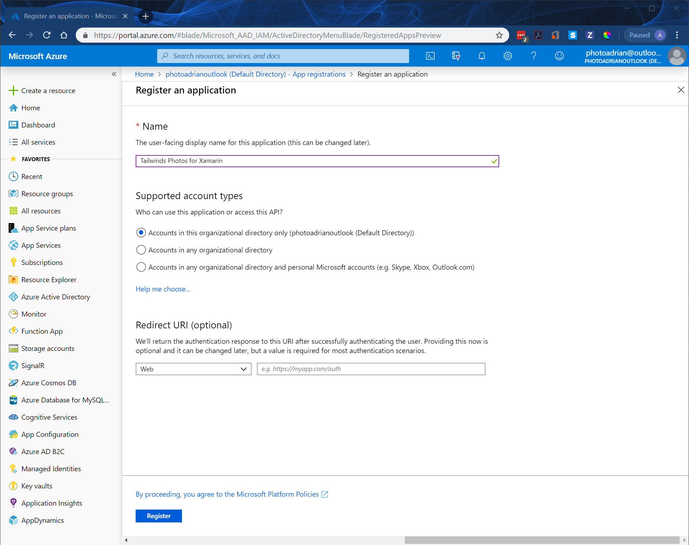
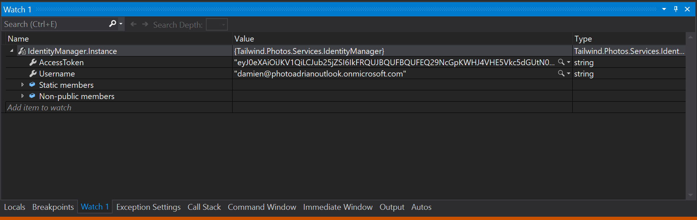
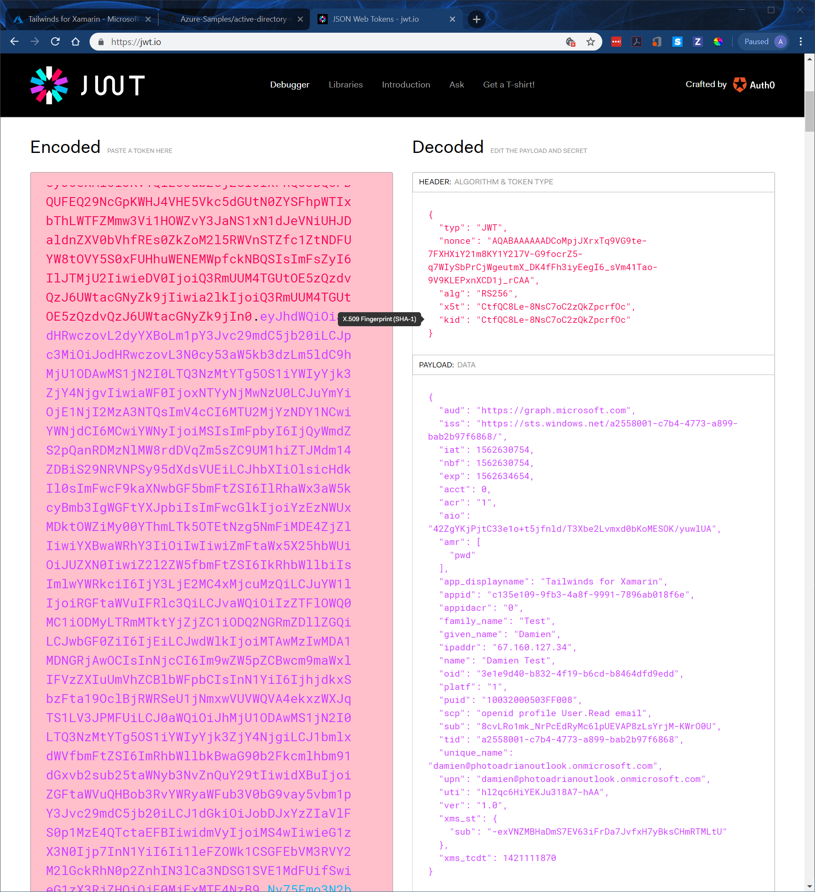

# Integrating with Azure Active Directory

Every single Azure account has an Azure Active Directory pre-configured.  This normally holds one account - the one you use to access the Azure Portal.  However, it can be used for other things.  In this walk-through, we are going to:

* Add a user to the existing Azure AD domain.
* Add an app registration to the domain.
* Write some code in our mobile app to sign us in.
* Take a look at the access token.

## Create a new user

Let's start on the Azure Portal.

* Select **All services**, then search for and select **Azure Active Directory**.
* Note your domain on the **Overview** screen.  Mine is `photoadrianoutlook.onmicrosoft.com`.
* Click **Users**.
* Click **New user**.
* Enter the following:
  * Name: "Damien Test"
  * User name: "damien@photoadrianoutlook.onmicrosoft.com"
  * Groups: Select "Users"
* Click **Create**.

Replace the domain in the user name field with your own domain.  This will create a user account that you can use to test your authentication test.  Click **Show password** to show the temporary password that is assigned.

## Create an app registration

Now, let's create an app registration for our mobile app:

* Go back to the Overview of your Azure Active Directory.
* Click **App registrations**.
* Click **New registration**.
* Enter a friendly name (like `Tailwind Photos for Xamarin`).
* Click **Register**.

    

* Click **Add a Redirect URI**.
* For type, select **Public client (mobile & desktop)**.
* For Redirect URI, enter `msal-tailwind-photos://auth`.
* Click **Save**.

The redirect URI must be globally unique and follow the form given.  The Azure Active Directory team suggests using `msal{ClientID}://auth` as the redirect URI.  I prefer something a little more readable.  

At this point, you need to make a record of three things:

1. The Application (client) ID.
2. The Directory (tenant) ID.
3. The Redirect URI you just configured.

These are all available in the application registration overview.  

## Integrate into the mobile app

Integration can be a little tricky because iOS and Android treat web views differently.  The UI for authentication is presented in a web view.  We need to ensure that the platform (Android or iOS) transfers control to the MSAL code once authentication is complete.  This happens when Azure Active Directory redirects back to the redirect URI.

So:

* Application opens up a web view and connects to Azure Active Directory.
* User authenticates with Azure Active Directory.
* When complete, Azure Active Directory redirects back to the redirect URI.
* The application traps that URL and continues with the authentication process.
* Control is returned back to our app.

To start, add `Microsoft.Identity.Client` v4.1.0 to all the projects from NuGet.  (We've added NuGet packages a few times now so I won't be mentioning how to do this from now on).

### Android project changes

Let's start with Android:

* Open the `Properties/AndroidManifest.xml` file (in the Android project).
* Adjust the `<application>` node in the XML as follows:

    ```xml hl_lines="4 5 6 7 8 9 10 11 12 13"
    <?xml version="1.0" encoding="utf-8"?>
    <manifest xmlns:android="http://schemas.android.com/apk/res/android" android:versionCode="1" android:versionName="1.0" package="com.companyname.TailwindPhotos_App">
        <uses-sdk android:minSdkVersion="21" android:targetSdkVersion="28" />
        <application android:label="TailwindPhotos_App.Android">
            <activity android:name="microsoft.identity.client.BrowserTabActivity">
                <intent-filter>
                <action android:name="android.intent.action.VIEW"/>
                <category android:name="android.intent.category.DEFAULT"/>
                <category android:name="android.intent.category.BROWSABLE"/>
                <data android:scheme="msal-tailwinds-photos" android:host="auth"/>  
                </intent-filter>
            </activity>
        </application>
        <uses-permission android:name="android.permission.ACCESS_NETWORK_STATE" />
    </manifest>
    ```

    Ensure the label remains the same, but everything within the `<application>` node can be copied.  The `android:scheme` element must match your redirect URI (everything before the colon).

* Open `MainActivity.cs`.
* Add the following method to the `MainActivity` class:

    ```csharp
    protected override void OnActivityResult(int requestCode, Result resultCode, Intent data)
    {
        base.OnActivityResult(requestCode, resultCode, data);
        AuthenticationContinuationHelper.SetAuthenticationContinuationEventArgs(requestCode, resultCode, data);
    }
    ```

* Adjust the `LoadApplication()` call in `OnCreate()` as follows:

    ```csharp
    LoadApplication(new App(this));
    ```

### iOS project changes

In the iOS project, things are a little different:

* Right-click the `Info.plist` file, select **Open With...**, then select **Generic PList Editor**.
* Add the following to the `<dict>` node inside the `<plist>`:

    ```xml
        <key>CFBundleURLTypes</key>
        <array>
        <dict>
            <key>CFBundleTypeRole</key>
            <string>Editor</string>
            <key>CFBundleURLName</key>
            <string>com.companyname.TailwindPhotos_App</string>
            <key>CFBundleURLSchemes</key>
            <array>
            <string>msal-tailwinds-photo</string>
            </array>
        </dict>
        </array>
    ```

    The `CFBundleURLName` is the same as the `CFBundleIdentifier` value within the same file.  Replace `msal-tailwinds-photo` with the scheme for your redirect URI.

### Common project changes

First, let's write a wrapper class called `IdentityManager` that will handle the abstraction of Azure Active Directory for us:

```csharp
using Microsoft.AppCenter.Crashes;
using Microsoft.Identity.Client;
using System;
using System.Linq;
using System.Threading.Tasks;

namespace Tailwind.Photos.Services
{
    public class IdentityManager
    {
        /// <summary>
        /// The ClientID is the Application ID found in the portal (https://go.microsoft.com/fwlink/?linkid=2083908).
        /// </summary>
        private readonly string ClientID = "c135e109-9fb3-4a8f-9991-7896ab018f6e";

        /// <summary>
        /// The TenantID is for the directory and found in the portal as well.
        /// </summary>
        private readonly string TenantID = "a2558001-c7b4-4773-a899-bab2b97f6868";

        /// <summary>
        /// The redirect URI - this must be registered within the Azure Portal
        /// </summary>
        private readonly string RedirectUri = "msal-tailwinds-photos://auth";

        /// <summary>
        /// The level of access that we are requesting.
        /// </summary>
        private readonly string[] Scopes = { "User.Read" };

        /// <summary>
        /// Lazy initializer for the identity manager (do not touch)
        /// </summary>
        private static readonly Lazy<IdentityManager> lazy
            = new Lazy<IdentityManager>(() => new IdentityManager());

        private static IPublicClientApplication idp = null;
        public static object ParentWindow { get; set; }

        /// <summary>
        /// Obtain a reference to the identity manager.
        /// </summary>
        public static IdentityManager Instance
        {
            get { return lazy.Value; }
        }

        private IdentityManager()
        {
            idp = PublicClientApplicationBuilder
                .Create(ClientID)
                .WithRedirectUri(RedirectUri)
                .WithTenantId(TenantID)
                .Build();
        }

        public string AccessToken
        {
            get;
            private set;
        }

        public string Username
        {
            get;
            private set;
        }

        public async Task<Boolean> Signin(object sender = null)
        {
            try
            {
                var currentAccounts = await idp.GetAccountsAsync();
                var account = currentAccounts.FirstOrDefault();
                var result = await idp.AcquireTokenSilent(Scopes, account).ExecuteAsync();
                AccessToken = result.AccessToken;
                Username = result.Account.Username;
                return true;
            }
            catch (MsalUiRequiredException)
            {
                // Ignore this error - it's used to fall-through
            }

            // If we can silently acquire the token, then this is never reached.
            // If we get here, we need to pop up a UI
            try
            {
                var window = (sender == null) ? IdentityManager.ParentWindow : sender;
                var uiResult = await idp
                    .AcquireTokenInteractive(Scopes)
                    .WithParentActivityOrWindow(window)
                    .ExecuteAsync();
                AccessToken = uiResult.AccessToken;
                Username = uiResult.Account.Username;
                return true;
            }
            catch (Exception ex)
            {
                Crashes.TrackError(ex);
                return false;
            }
        }

        public async void Signout()
        {
            try
            {
                var accounts = await idp.GetAccountsAsync();
                while (accounts.Any())
                {
                    await idp.RemoveAsync(accounts.FirstOrDefault());
                    accounts = await idp.GetAccountsAsync();
                }
                AccessToken = null;
                Username = null;
            }
            catch (Exception ex)
            {
                Crashes.TrackError(ex);
            }
        }
    }
}
```

At 125 lines, this is the longest piece of code we have written.  However, it's still readable.  We have two methods - `Signin()` and `Signout()`.  These methods do the work of communicating with Azure Active Directory for us.  They will present the right UI and store the access token and user name for later use for us.  I've encoded the three elements from our app registration right in this class.

!!! tip "Use a central Settings class"
    In a real app, these values will be placed in a configuration class, and may be loaded from a centralized configuration service.  You should definitely take this concept into the software design process.

Azure Active Directory allows three methods to determine who can log in:

* Only those users in MY directory.
* Only those users in ANY directory.
* Any user in any supported directory, including outlook.com.

In the constructor, we specify the tenant ID of _MY directory_.  This is only required in the first option.  You don't need to specify the tenant ID if your application is multi-tenant aware.

We also need to pass in the parent window for Android.  This is a reference to the `MainActivity` class.  We've already passed in this value when creating the app, but we need to adjust the `App.cs` class to accept it:

```csharp
public class App : Application
{
    // other things here.

    public App(object parent = null)
    {
        IdentityManager.ParentWindow = parent;
        MainPage = new NavigationPage(new SplashScreen());
    }

    // other things here.
}
```

This will now be picked up by the identity manager and used appropriately.

Finally, we need to be able to initiate the authentication.  Most enterprise applications force authentication (so you can't use the app without authentication).  Most social apps provide optional authentication.  How you initiate the authentication process is up to you.  In this case, I'm going to add a button to my splash screen:

```xml
<!-- Place this anywhere inside the Grid element -->
<StackLayout Grid.Row="5" Grid.Column="2" HorizontalOptions="Center" VerticalOptions="Center">
    <Button Text="Sign In" Clicked="OnLoginClicked"/>
</StackLayout>
```

Add the following code to the code-behind file:

```csharp
async void OnLoginClicked(object sender, EventArgs args)
{
    Analytics.TrackEvent("Click", new Dictionary<string, string>
    {
        { "Event", "Login" },
        { "Page", this.GetType().Name }
    });
    var success = await IdentityManager.Instance.Signin();
    if (success)
    {
        Analytics.TrackEvent("Login", new Dictionary<string, string>
        {
            { "Username", IdentityManager.Instance.Username }
        });
        Debug.WriteLine($"Username = {IdentityManager.Instance.Username}");
    }
}
```

## Run the app

We've done all the code, so all that is left is to run the app.  Before you run the app, put a breakpoint on the `Debug.WriteLine()` statement.

At the splash screen, click the **Sign In** button at the bottom.  A web view will open.  You can sign in as the user you created at the top of the page.  The first time through, it will ask you to change your password and to validate that the app is authorized to access your information.  

Your break point will then be hit.  You've succesfully authenticated to Azure Active Directory.

!!! info "Simplified login flow"
    Once you have been through the login flow once, the username will be remembered and you just have to press the username - skipping a laborious re-entry of data.  If the token is still valid, it won't even pop up a login screen at all!

## Decode the access token

Switch to the window labelled `Watch 1`.  Enter `IdentityManager.Instance` in the `Add item to watch` field.  This allows you to view the contents of the identity manager object:



You can see you have access to the username and an encoded access token.  Click on the little down-arrow to the right-hand side of the value, then select **Text Visualizer**.  You can now see the complete value.  Copy the entire value.

Go to [jwt.io](https://jwt.io) and paste the value in the **Encoded** box.  The right hand side will fill in with the information:



You can see a lot of information in there, but I want to draw your attention to two fields:

* `sub` is the "subject".  This is a secure string that uniquely identifies this user.  
* `upn` is the users email address - the thing they logged in as.

When storing data unique to this user, always store it with the `sub` as a key.  Most of the time, you will want data to be private.  However, if you need to look up the users subject from their email address, you need to store that separately.  You cannot get the subject to UPN mapping from Azure Active Directory.

## Next Steps

Now that we've looked at enterprise authentication, we will switch our attention to [social authentication](b2c.md).
