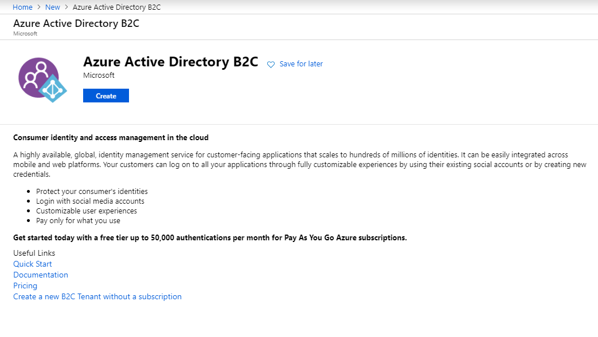
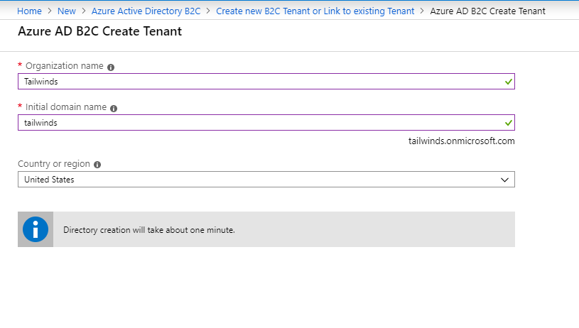
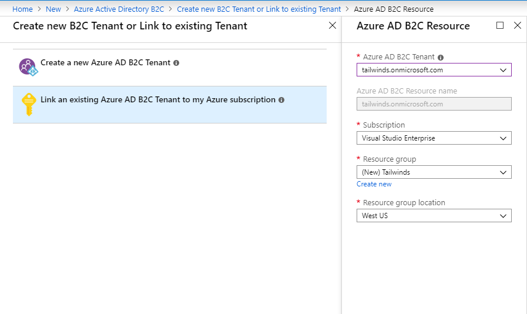
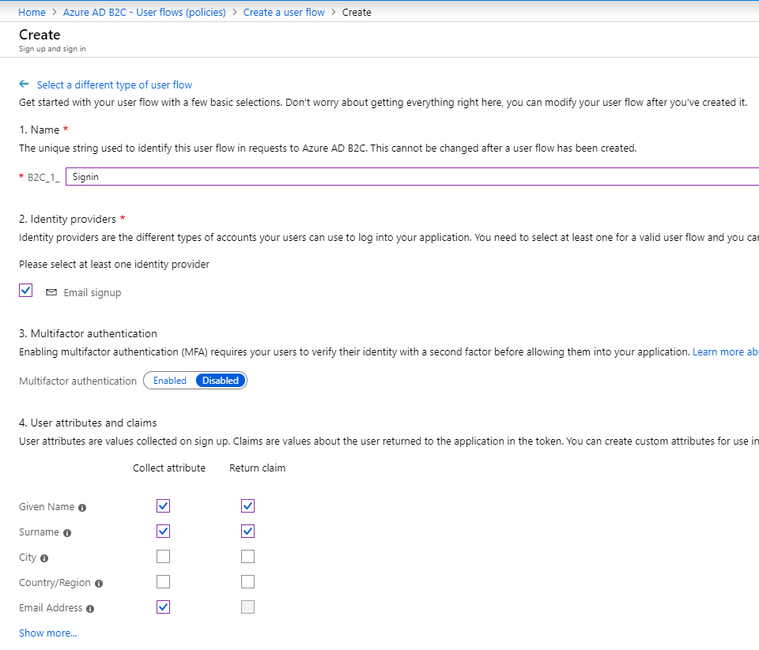
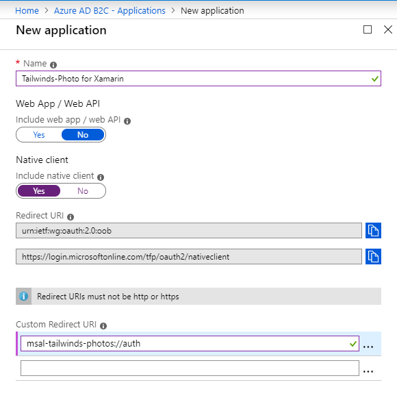

# Sign up and Sign in with Azure Active Directory B2C

Most of the apps that I create are not designed around enteprise requirements.  They don't have an IT department that adds user accounts for everyone.  I distribute my apps to the world, and they are used by people I don't even know.  For these situations, Azure Active Directory won't work.  However, Azure has another service that uses the same library.  [Azure Active Directory B2C](https://azure.microsoft.com/en-us/services/active-directory-b2c/) is designed for these situations.  We can use it to provide a self-service sign-up and password-reset facility.

## Create a B2C Tenant

Before we even think about integrating our app, we need to create a tenant.  You saw the Azure Active Directory tenant that is central to your Azure permissions in [the last section](aad.md).  We could leverage the tenant without creating a new one.  There isn't a default B2C tenant for us to leverage.  Aside from creating the tenant, we also need to create user flows that allow a user to sign up and reset their password.  Start on the Azure portal. 

Most Azure subscriptions only have one directory.  It's generally called the _Default Directory_.  You can see the directory by clicking on your account in the top right corner of the Azure portal, then select **Switch directory**.  If your account is part of an enterprise, you may have additional directories listed.  Make sure you are on your default directory (the one containing your subscription) before you begin.

To create the new tenant:

1. Click **Create a resource** in the top-left corner of the Azure portal.
2. Enter **B2C** in the search box.  Azure Active Directory B2C will be the first match.  Select it!
3. Click **Create**

    

4. Choose **Create a new Azure AD B2C Tenant**.
5. Enter the form information, then click **Create**.  Note that the initial domain name must be globally unique, so it is checked when you type.  Make sure you have a green tick before continuing.

    

6. The tenant takes a while to create.  Once complete, click **Create a resource**, enter **B2C**, then select **Create** again.  This gets you back to the "Link an existing Azure AD B2C Tenant" page.
7. Click **Link an existing Azure AD B2C Tenant to my Azure subscription**.
8. Select the tenant you just created.  Under **Resource group**, click **Create new**, then enter a name for the resource group and click **OK**.
9. Pick a suitable location for your resource group, then click **Create**.

    

10. Refresh your browser.

!!! info "What is a resource group?"
    Many applications are comprised of multiple services that need to be managed together.  Resource groups do this for you.  When you delete a resource group, all the resources within the resource group are also deleted.  This makes managing your cloud account when developing really easy.  It also allows you to see what an application is costing you in the cloud, among other things.

Click your account in the top-right corner now, then select **Switch directory**.  You will see your newly created B2C tenant in the list of directories.  Select the B2C directory you just created so we can continue working on it.  Next, let's create a sign-up and sign-in flow:

1. Click **All services** > **Identity** > **Azure AD B2C**.  (You may want to mark this as a favorite to come back to it easily).
2. Click **User flows (policies)**, then click **New user flow**.
3. On the **Recommended** tab, select the **Sign up and sign in** user flow.
4. Give the user flow a name (for example, _B2C_1_Signin_).
5. Select the **Email signup** in the **Identity providers**.
6. Select the **Given Name**, **Surname** and **Email Address** claims in **User attributes and claims**.

    

7. Click **Create**.

## Create an App Registration

Now that we have configured a user sign-up and sign-in page, we need to integrate it into our app.  Fortunately, we are going to use the same code that [we used to integrate with Azure Active Directory](aad.md#ch4-aad-mobile), with a few tweaks.  The first step, though, is to create an app registration:

1. In your Azure AD B2C tenant, click **Applications**, then **Add**.
2. Enter a name for your app, and set **Native client** to **Yes**.
3. Enter `msal-tailwinds-photo://auth` (or whatever you used before) as the **Custom Redirect URI**.

    

4. Click **Create**.

You should now have four pieces of information:

* The tenant: `tailwinds.onmicrosoft.com`
* The application ID (available on the **Applications** page after you create the native application)
* The sign-up flow: `B2C_1_Signin`
* The redirect URI: `msal-tailwind-photos://auth`

Record these in the `IdentityManager.cs` file (replacing the `ClientID`, `TenantID`, and `Scopes` in the process):

```csharp
private readonly string Tenant = "tailwinds.onmicrosoft.com";
private readonly string ApplicationId = "cbd3e5fb-b1c2-496e-b276-08b58de76c2a";
private readonly string UserFlow = "B2C_1_Signin";
private readonly string RedirectUri = "msal-tailwinds-photos://auth";

private readonly string Authority = $"https://login.onmicrosoft.com/tfp/{Tenant}/{UserFlow}";
private readonly string[] Scopes = { "openid" };
```

We calculate the authority field, which is used extensively in the sign-in process, based on the tenant and user flow.  For the majority of accounts, the Authority is based on `login.onmicrosoft.com`.  However, this may not be correct for you, especially if you intend to alter the branding away from Microsoft branding or are using a previously created B2C tenant.  Take a look at [the documentation](https://docs.microsoft.com/en-us/azure/active-directory-b2c/b2clogin) for more information on this topic.  Let's continue with adjusting the `IdentityManager.cs` class to use Azure AD B2C:

```csharp
private IdentityManager()
{
    idp = PublicClientApplicationBuilder
        .Create(ApplicationId)
        .WithB2CAuthority(Authority)
        .WithIosKeychainSecurityGroup("com.microsoft.adalcache")
        .WithRedirectUri(RedirectUri)
        .Build();
}

private async Task<IAccount> GetAccountByPolicy(string policy)
{
    var accounts = await idp.GetAccountsAsync();
    foreach (var account in accounts)
    {
        string userIdentifier = account.HomeAccountId.ObjectId.Split('.')[0];
        if (userIdentifier.EndsWith(policy.ToLower())) return account;
    }
    return null;
}
```

The constructor has changed to include our settings.  I've also added a private async method to return the account that was used with a specific policy (or user flow).  We'll use this when signing in:

```csharp
public async Task<Boolean> Signin(object sender = null)
{
    try
    {
        var account = await GetAccountByPolicy(UserFlow);
        var result = await idp.AcquireTokenSilent(Scopes, account)
            .WithB2CAuthority(Authority)
            .ExecuteAsync();
        AccessToken = result.AccessToken;
        Username = result.Account.Username;
        return true;
    }
    catch (MsalUiRequiredException)
    {
        // Ignore this error - it's used to fall-through
    }

    // If we can silently acquire the token, then this is never reached.
    // If we get here, we need to pop up a UI
    try
    {
        var window = (sender == null) ? IdentityManager.ParentWindow : sender;
        var account = await GetAccountByPolicy(UserFlow);
        var uiResult = await idp
            .AcquireTokenInteractive(Scopes)
            .WithAccount(account)
            .WithParentActivityOrWindow(window)
            .ExecuteAsync();
        AccessToken = uiResult.AccessToken;
        Username = uiResult.Account.Username;
        return true;
    }
    catch (Exception ex)
    {
        Crashes.TrackError(ex);
        return false;
    }
}
```

As with the Azure AD version of this method, we try to get the token silently.  If that works, the user won't even be prompted for credentials.  If, however, we need to prompt the user, we will.  This brings up the same views and will prompt the user to sign up or sign in.

