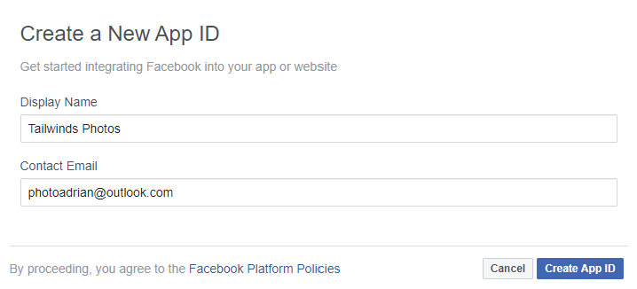
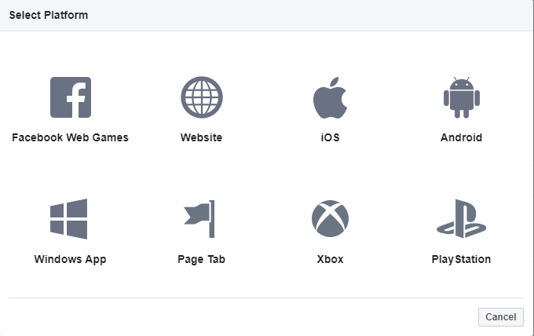
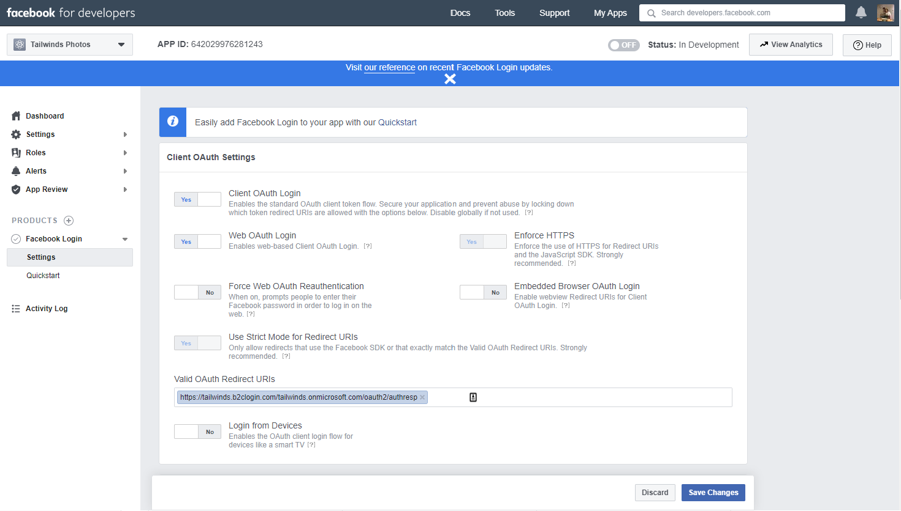
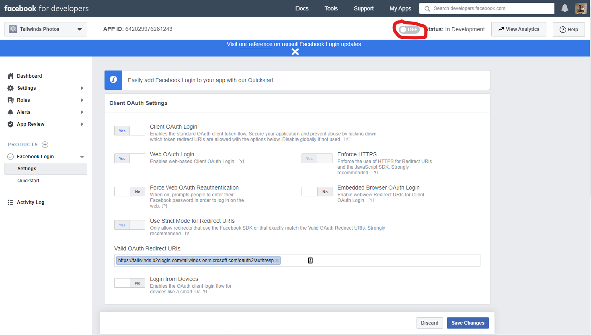
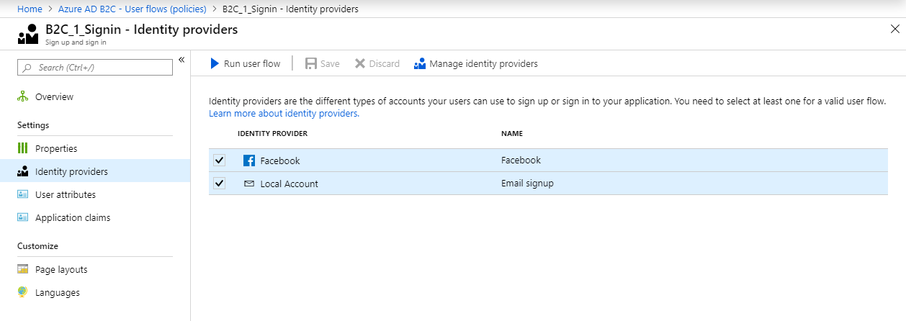
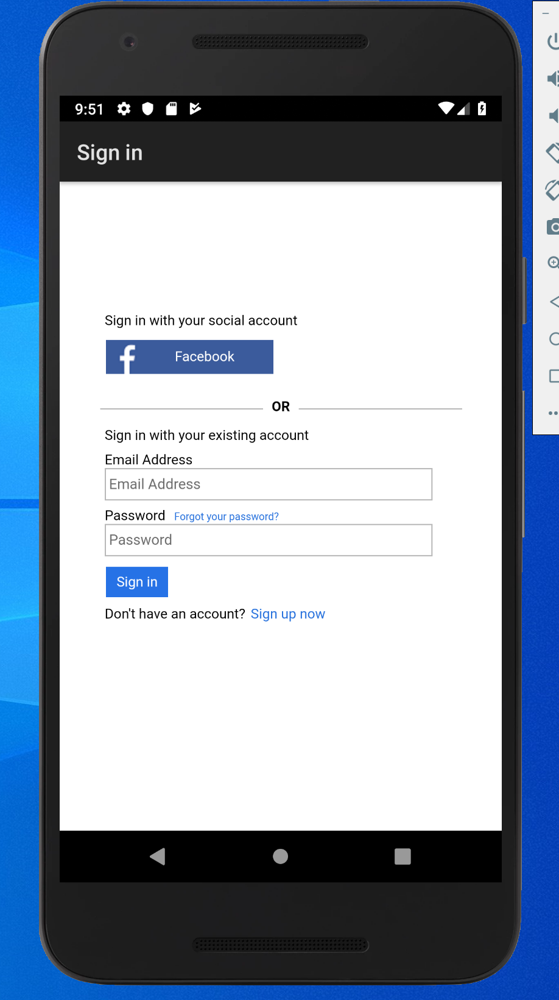
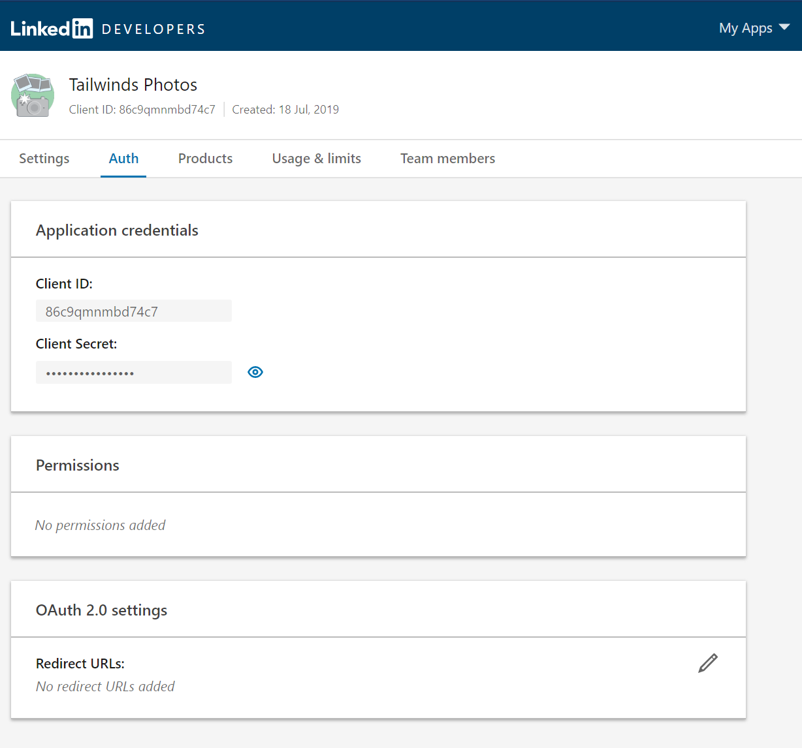
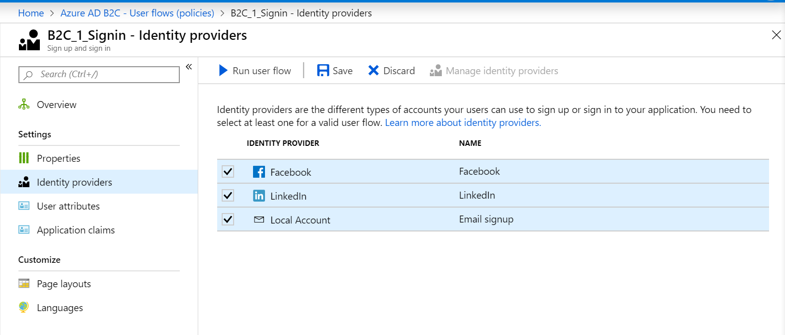
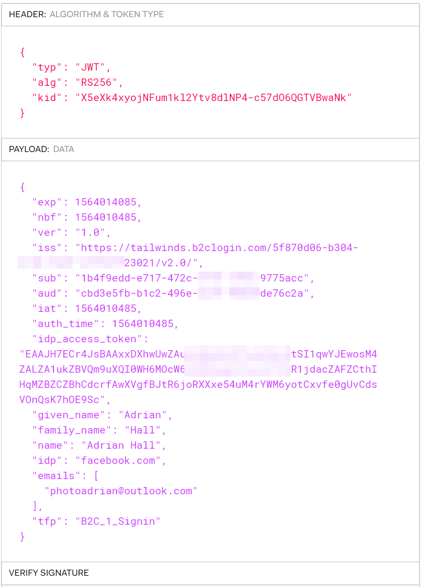

# Integrating social providers

One of the major security improvements you can make to your app is to delegate authentication to a trusted third party.  Instead of a new username and password to remember, the user uses one of their existing logins to authenticate to your app.  Social providers such as Facebook, Amazon, and Google are ubiquitous in this arena.  Linking to social providers also gives you the ability to use those social providers.  For example, you may want to automatically allow Facebook friends to view your photos, or post a photo to the Facebook news feed.

Ultimately, the social provider is using [OpenID Connect](https://openid.net/connect/) to do the authentication and obtain an ID token for the social provider.  This ID token is an assertion of who you are.  You can then pass that token to your service to get an access token for your resources.  In this section, we will look at the process of integrating two distinct social providers - Facebook and LinkedIn.  Facebook is perhaps the most widely used authentication mechanism on the planet, so it is a natural fit for most social apps.  LinkedIn is another widely used platform for professional connections, so it would be more appropriate for work experience-based apps.

!!! info "Websites change"
    The instructions provided here were correct at the time of writing.  However, websites can and do change - frequently.  I've given the basic outline of what needs to happen.  If the actual instructions or screen shots are different, drop me a note.

## Integrating Facebook authentication

The process of integrating with a social provider is a three-step process:

1. Sign up and configure a new app on the social provider.
2. Register the social provider in Azure AD B2C as an identity provider.
3. Update the sign-in/sign-up flow to use the new identity provider.

Once completed, there is no source code changes in the app itself.  Everything is configured in the backend.

### Create a Facebook application

To create a Facebook application, you need a Facebook account and you need to register that Facebook account as a developer account.  If you are one of the dozen or so people in the world that doesn't have a Facebook account, create one on [the Facebook site](https://www.facebook.com).  If needed, register for a Facebook developer account by signing in to [Facebook for developers](https://developers.facebook.com/) with your Facebook account.

!!! tip "Create a Facebook for developers identity
    You don't have to use your personal account for your development activities, and many people don't.  Register a new email address for your developer account (using one of the many email providers out there), then use that to register a new Facebook account.  If you are a commercial app developer, this also allows you to maintain a presence on Facebook separate from your personal activities.

Now, let's create a Facebook app:

1. Sign in to [Facebook for developers](https://developers.facebook.com).
2. Select **My Apps** > **Create App**.
3. Enter a **Display Name**.  Your contact email should be set up already.

    

4. Click **Create App ID**.  This may require an online security check.
5. Select **Settings** > **Basic** from the left-hand menu.
6. Choose a **Category**.  
7. As needed, fill in other information, such as the privacy policy URL.  If this will be a "real app" (and not one for your own education), then you will also need to provide GDPR contact information and verify your business.

    !!! tip "Provider a Privacy Policy URL"
        You must provide a privacy policy URL before taking your app live.  This can be any
        URL.  An example URL: [https://account.microsoft.com/account/privacy](https://account.microsoft.com/account/privacy)

8. At the bottom of the page, click **Add Platform**.
9. On the **Select Platform** page, click **Website**.

    

10. In the **Site URL** box, enter `https://tenant-name.b2clogin.com/`.  Replace `tenant-name` with the name of your Azure AD B2C tenant.
11. Click **Save Changes**.
12. Click **Dashboard** in the left-hand menu.
13. Scroll down until you see **Add a Product** heading.  Click **Set up** on the **Facebook Login** panel.
14. Select **Facebook Login** > **Settings** in the left-hand menu.
15. In the **Valid OAuth Redirect URIs** box, enter `https://tenant-name.b2clogin.com/tenant-name.onmicrosoft.com/oauth2/authresp`.  Replace `tenant-name` with the name of your Azure AD B2C tenant.

    

16. Click **Save Changes**.
17. Click the **OFF** slider in the top menu bar to enable your app.

    

Facebook will ask you if you are sure and then make your app live.

Before leaving the Facebook site, make a note of two values from the **Settings** > **Basic** page:

* The App ID
* The App Secret (click the **Show** button)

You will need these in the next step.

### Register Facebook with Azure AD B2C

The next step is to tell Azure AD B2C about the app you have just created on the Facebook side.  This is called "registering a new identity provider".  First off, sign in to the [Azure portal](https://portal.azure.com) and select the Azure AD B2C tenant if required.  You can do this by clicking on your account in the top-right corner, then selecting **Switch directory** if needed.

Now, let's configure Azure AD B2C:

* Select **All services** > **Azure AD B2C**.  (Use search for this!)
* Select **Identity providers**.
* Click **Add**.
* Enter `Facebook` as the name.
* Click **Identity provider type** > **Facebook**, then **OK**.
* Click **Set up this identity provider**.
* Enter the App ID in the **Client ID** box, and the App Secret in the **Client Secret** box.
* Click **OK**.
* Click **Create**.

### Update the sign-in flow

Now that Azure AD B2C knows about your Facebook app, you can configure your user flow to use the identity provider:

* Select **User flows (policies)**.
* Select the `B2C_1_Signin` user flow.
* Click **Identity providers**.  There are two links with this name, but they both go to the same place.
* Ensure the check-box next to **Facebook** is checked, then click **Save**.



Before you continue, you may need to access the Facebook Graph or get other information in the claims that the social provider gave back.  To do this:

* Select **User flows (policies)**.
* Select th `B2C_1_Signin` user flow.
* Select **Application claims**.
* Check the **Identity Provider Access Token** box.
* Click **Save**.


We'll use this later on to access the name and email address of the user.

You can now run your mobile app and sign in.  This time through, you will see a Facebook login button in addition to the username and password login.



## Integrating LinkedIn authentication

As with Facebook integration, the process of integrating with LinkedIn is a three-step process:

1. Sign up and configure a new app on the social provider.
2. Register the social provider in Azure AD B2C as an identity provider.
3. Update the sign-in/sign-up flow to use the new identity provider.

Start by logging in to your [LinkedIn account](https://www.linkedin.com).  If you don't have a LinkedIn account, create one.

### Create a LinkedIn application

Now that you are signed in:

1. Open the [LinkedIn Developers](https://www.developer.linkedin.com/) website.
2. Click **My Apps** (in the top bar) > **Create app**.
3. Enter the following information:
    * App Name
    * Company Name (you may need to create a new company page)
    * Privacy policy URL
    * Business email
    * Application Logo (it must be square, 100x100 pixels, and a PNG format)
4. Agree to the LinkedIn API Terms of Use, then click **Create app**.
5. Click on the **Auth** tab.  
6. Make a note of the **Client ID** and **Client Secret** values.  Click on the eyeball icon to see the client secret.

    

7. Click the edit icon next to **OAuth 2.0 settings** > **Redirect URLs**.
8. Click **Add redirect URL**.
9. Enter `https://tenant-name.b2clogin.com/tenant-name.onmicrosoft.com/oauth2/authresp`.  Replace `tenant-name` with the name of your Azure AD B2C tenant.
10. Click **Update**.

### Register Facebook with Azure AD B2C

The next step is to tell Azure AD B2C about the app you have just created on the LinkedIn side.  Sign in to the [Azure portal](https://portal.azure.com) and select the Azure AD B2C tenant if required.  You can do this by clicking on your account in the top-right corner, then selecting **Switch directory** if needed.

Now, let's configure Azure AD B2C:

* Select **All services** > **Azure AD B2C**.  (Use search for this!)
* Select **Identity providers**.
* Click **Add**.
* Enter `LinkedIn` as the name.
* Click **Identity provider type** > **LinkedIn**, then **OK**.
* Click **Set up this identity provider**.
* Fill in the form from the values you noted on the LinkedIn site.
* Click **OK**.
* Click **Create**.

### Update the sign-in flow

Now that Azure AD B2C knows about your LinkedIn app, you can configure your user flow to use the identity provider:

* Select **User flows (policies)**.
* Select the `B2C_1_Signin` user flow.
* Click **Identity providers**.  There are two links with this name, but they both go to the same place.
* Ensure the check-box next to **LinkedIn** is checked, then click **Save**.



If you didn't do it during the Facebook configuration, you should also configure the sign-in flow to return the identity provider access token. To do this:

* Select **User flows (policies)**.
* Select th `B2C_1_Signin` user flow.
* Select **Application claims**.
* Check the **Identity Provider Access Token** box.
* Click **Save**.

We'll use this later on to access the name and email address of the user.

You can now run your mobile app and sign in.  This time through, you will see a LinkedIn login button in addition to the username and password login.  You will be able to log in via LinkedIn now.

## Decoding the provider token

Azure Active Directory B2C returns a token to you with a number of claims in it.  One of those claims (assuming you have configured AAD B2C as suggested) is the identity provider claim.  On the profile page, I want to print some information from the profile.  This involves decoding the [JSON Web Token](https://en.wikipedia.org/wiki/JSON_Web_Token) (or JWT) to get at the information.

First off, let's look at what a typical JWT looks like when decoded by copying it into [jwt.io](https://jwt.io):



> I've fuzzed some important information for security reasons.  You should always strive to protect security information.

The encoded version is in the `LastAuthenticationResult.IdToken` field.  To decode it, we need to use the `System.IdentityModel.Tokens.Jwt` package, which can be installed from NuGet.  Start with creating a model called `AuthenticatedUser.cs` as follows:

```csharp
using System.IdentityModel.Tokens.Jwt;
using System.Linq;

namespace Tailwind.Photos.Services
{
    public class AuthenticatedUser
    {
        public AuthenticatedUser(string token)
        {
            var decoded = new JwtSecurityToken(token);
            Name = decoded.Claims.First(c => c.Type == "name").Value;
            Email = decoded.Claims.First(c => c.Type == "emails").Value;
            AccessToken = decoded.Claims.First(c => c.Type == "idp_access_token").Value;
            var p = decoded.Claims.First(c => c.Type == "idp").Value;
            if (p == "facebook.com") {
                Authenticator = Provider.Facebook;
            } else if (p == "linkedin.com") {
                Authenticator = Provider.LinkedIn;
            } else {
                Authenticator = Provider.Username;
            }
        }

        public string Name { get; private set; }
        public string Email { get; private set; }
        public string AccessToken { get; private set; }
        public Provider Authenticator { get; private set; }

        public enum Provider
        {
            Username,
            Facebook,
            LinkedIn
        };
    }
}
```

The main work happens in the constructor.  The information from the JWT is decoded into the series of claims.  We place them into properties for easy access.  The provider is parsed.  It's normally a domain name if you are using a social provider, so we map the provider domain to an enum.  If the provider domain is not recognized, then we just assume it's a username/password.  

> It's important to match the exact name of the claims.  If you are unsure, use `FirstOrDefault()` instead and handle the default case.

You can easily wire this up into the `IdentityManager`.  Wherever you set the `LastAuthenticatedResult`, also set the AuthenticatedUser property:

```csharp
LastAuthenticationResult = uiResult;
AuthenticatedUser = new AuthenticatedUser(uiResult.IdToken);
IsAuthenticated = true;
```

There are two places in my code where this is needed.  A couple of points here:

1. I can use the `Authenticator` and `AccessToken` to do graph queries on behalf of the user, if the social provider allows it.  Use the `Authenticator` to access the right social provider SDK and the `AccessToken` as the authentication.  You can use the [Plugin.FacebookClient](https://www.nuget.org/packages/Plugin.FacebookClient) package to do Facebook graph queries, for example.
2. There is another field (called `sub`) that is extremely useful.  This is the ID of the user according to Azure Active Directory B2C and does not change.  This means it can be used as a primary key within databases, for instance.

We can easily add this to our `ProfilePage.xaml` page by creating a couple of `Label` fields, then setting them in the constructor (after the `InitializeComponent()` call):

```csharp
public ProfilePage()
{
    InitializeComponent();

    var authUser = IdentityManager.Instance.AuthenticatedUser;
    nameField.Text = authUser.Name;
    emailField.Text = authUser.Email;
}
```

Of course, in any reasonable app, you would use data binding for this.

!!! tip "Use whatever social providers you want!"
    Azure AD B2C supports a number of social providers, including Amazon, GitHub, Goggle, Microsoft, QQ, Twitter, WeChat, and Weibo, with more being added all the time.  In addition, and OpenID Connect provider can be configured.   Let your users pick the authentication system they want to use; don't decide for them.
