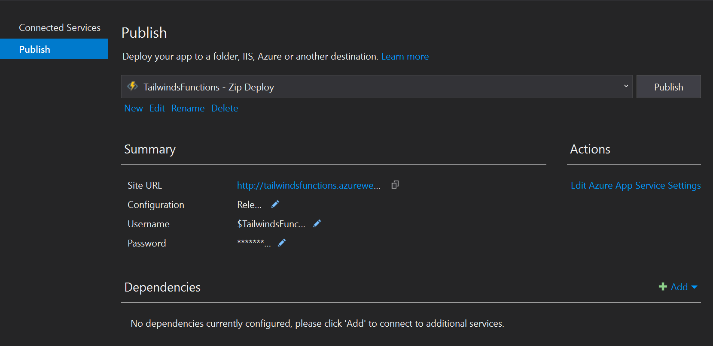

# RESTful services

REST, or [Representational State Transfer](https://www.restapitutorial.com/lessons/whatisrest.html) is a mechanism for providing a common API for communication.  It has several constraints, including the fact that it must be stateless (each request from client to server must contain all the information necessary to understand the request), and potentially cacheable (we inform the client if the result is cacheable.  If it is, then the client can reuse it).  It was first proposed by [Roy Fielding](https://www.ics.uci.edu/~fielding/pubs/dissertation/rest_arch_style.htm) and has since taken over as the predominent programming model for client-server applications.  In fact, both OData and GraphQL are technically REST interfaces.

From a coding perspective, RESTful transfer is generally split into three parts:

* A web API - in .NET, this will be an ASP.NET Core web API.
* A service object used on the client to communicate to the web API.
* A client object used on the client  to abstract service concepts away.

Although many developers choose to collapse the service object and client object into a single piece of code, I prefer to leave them separate.  The service object has a 1:1 correspondance with the web API.  Web APIs can be described in [Swagger](https://swagger.io/).  This data file allows you to generate the service object and stub out the web API using code generation.  This is important in larger systems as it significantly reduces the amount of code you have to maintain.  You just regenerate the source code when the Swagger file changes.  The client object, however, is inevitably hand written and it is this object that the rest of your application interacts with.  The client object deals with unified authentication and caching.

## Building an authenticated RESTful web API

We built a simple web API back in Chapter 1 when we were looking at the basic app.  However, it had many deficiencies, most notable of which was anyone could access it with no limits.  In this section, I'm going to take a look at what is required to create a simple data service with authentication.  I want my app to have a facility to "invite a user".  The app user will enter an email address.  The app will send the request (via a HTTP POST request) to the backend, and then the backend will send an invite message via email to the user.  

Let's start by thinking how we want to deploy the service.  There are two basic options:

1) As a serverless function, using [Azure Functions](https://azure.microsoft.com/en-us/services/functions/).
2) As an [ASP.NET Core](https://docs.microsoft.com/en-us/aspnet/core/?view=aspnetcore-2.2) application packaged within a Container.  You can deploy that container through [Azure App Service](https://azure.microsoft.com/en-us/services/app-service/), [Azure Kubernetes Service](https://azure.microsoft.com/en-us/services/kubernetes-service/), or [Service Fabric](https://azure.microsoft.com/en-us/services/service-fabric/).

It's a major decision since picking one determines the programming model that you want to use.  In more complex apps, there is also an architecture component.  Azure Functions can only run for a certain amount of time, but they are "infinitely" scaleable (in that you don't need to do anything to increase scaling).  If you choose a container service, you can test locally much more easily but you have to think about boilerplate code that you have to maintain, the runtime (which is always improving, but needs testing), and scaling the solution (which depends on where you run the application).

In this particular case, I'm going to opt for a serverless approach.  The application will consist of a single Azure Function that does all the work necessary.  In terms of the work:

* First, check the authentication of the request.
* If the authentication is good, then extract the email address and name from the token.
* Then look at the request and decode the email address that we need to send the message to.
* Finally, send the message!

For this piece of functionality, I'm going to use [SendGrid](https://www.sendgrid.com) to send emails.  You can configure it directly from the Azure portal and it comes with a free tier (for up to 25,000 emails per month).

### Configure Azure resources

The initial step is to configure the Sendgrid resource so that the Azure Function we write will be able to access it.  Sendgrid uses API keys to secure access to their service, so our process is to create the Sendgrid resource, then grab the API key for later.

1. Sign in to the [Azure portal](https://portal.azure.com).  Make sure your default directory is selected (especially important if this is the first thing you have done after the authentication chapter!).
2. Go to **Resource groups**, then select the resource group for your app resources.  Mine is called `Tailwinds`.
3. Click **+ Add** to add a resource.
4. Search for `SendGrid` - there is only one with that name.
5. Select `SendGrid`, then click **Create**.

    

6. Fill in the form, ensuring that you select **Use existing** for the resource group (select your existing resource group).
7. Click **Pricing tier** > **Configure required settings**, then select the **F1 Free** tier.

    

8. Make sure you fill in the contact information and legal terms.
9. Click **Create**.

As with all resources, it will take a little bit of time to deploy the resource.  Once deployed, the new resource will appear in your resource group (although you may have to refresh the listing).  

1. Go to the newly created resource.
2. Click **Manage**.  This will take you to the `https://app.sendgrid.com` site for further configuration.
3. If required, confirm your email address before continuing.
4. Expand the *Settings** menu option on the left hand side, then select **API Keys**.

    

5. Click **Create API Key**.
6. Give the API key a name; for example `TailwindsMailInviter`.
7. Create a **Restricted Access** key. 
8. Under **Access Details**, expand **Mail Send**, and ensure that the _Mail Send_ option is enabled.
9. Click **Create & View**.
10. Copy the API key (by clicking on it) - you will need it later and you can't get it back again. (I copy mine into a local notepad file).
11. Click **Done**.

!!! tip "Use service for common tasks"
    You don't have to code everything yourself.  The Azure marketplace has lots of services that you can use in your apps easily, such as SendGrid for sending email.  I almost always prefer to use a service as a component to writing the component myself.

Next, let's create an application definition within Azure AD B2C.  This allows us to obtain an access token later on that includes a scope we can use for authorization to our web API.

1. Select your Azure AD B2C directory (in the upper right corner, use **Switch directory**).
2. Go to the Azure AD B2C resource (use **All services** and search for it).
3. Select **Applications**, then your application (mine is called `Tailwinds-Photo for Xamarin`).
4. Turn **Include web app / web API** to Yes, and **Allow implicit flow** to Yes.
5. Enter `https://localhost/signin` as the **Reply URL**.
6. Enter `api` in the **App ID URI**.
7. Click **Save**.
8. Select **Published scopes** in the menu.
9. Enter `MailInviter.Send` in the **SCOPE**, and a suitable description in the description field.  Click **Save**.
10. Click **API access**.
11. Click **+ Add**.
12. Select your app in the **Select API** box (in my case, `Tailwinds-Photo for Xamarin`).  Ensure all scopes are selected in **Select Scopes**.  Click **Ok**.
13. Click **Keys**.
14. Click **+ Generate key**.
15. Click **Save**.
16. Copy the App key that is generated as you won't be able to see it again. 

!!! tip "Run your app and look at the JWT"
    At this point, you should be able to run the app.  Set a breakpoint at the authentication point and take a look at the JWTs that are generated.  You should be able to use https://jwt.io to validate the JWT using the generated app key and see the new scope that was created within the access token.

### Create the Azure Function

Now that we have a mechanism by which we can send email, we need to write the REST API that responds to the POST request in our app.

1. Start Visual Studio.
2. Right-click the solution, then select **Add** > **New project...**.
3. Enter `Functions` in the search box, then select **Azure Functions** (it should be the first match).
4. Name the function `TailwindsMailInviter`, then click **Create**.
5. Ensure **HTTP Trigger** is selected.
6. Under **Storage Account**, select **Browse...**.
7. Click **Create a storage account**.
    a. Enter an account name of your choosing.
    b. Ensure you select the same resource group and location as your other resources.
    c. For this storage, the account type can be set to **Standard - Locally Redundant Storage**.
8. Click **Create**.

    

9. The resource will be deployed before you can continue.  Once it is deployed, click **Add**.
10. Click **Create**.
11. Delete `Function1.cs`.  (No-one uses names like this!)
12. Right-click on the new project, then select **Add** > **New Azure Function...**
13. Enter the name `MailInviter.cs`, then click **Add**.
14. Ensure **Http trigger** is selected, then click **OK**.

Now we can get to the code for the function.  One of the nice things about Azure Functions (and serverless in general) is that you can focus on your business logic code rather than having to do a whole bunch of boiler plate.  You will notice that the entire default function is less than 40 lines of code, and that includes all the boiler plate code necessary to deal with HTTP.  Compare that to a typical ASP.NET Core project and you will soon see the advantage.

Before we continue, let's do some logging so we can actually use this function.  Replace the code for the `MailInviter` class with the following:

```csharp
namespace TailwindsMailInviter
{
    public static class MailInviter
    {
        [FunctionName("MailInviter")]
        public static async Task<IActionResult> Run(
            [HttpTrigger(AuthorizationLevel.Function, "get", "post", Route = null)] HttpRequest req,
            ILogger log)
        {
            log.LogInformation("C# HTTP trigger function processed a request.");
            log.LogInformation("Request Headers: ");
            foreach (var header in req.Headers)
            {
                log.LogInformation($"Header {header.Key} = '{header.Value}'");
            }
            return new OkResult();
        }
    }
}
```

This dumps the request headers to the log, allowing us to analyze them.

### Deploy the Azure function

To deploy the Azure Function:

1. Right-click on the `TailwindsMailInviter` project, and select **Publish...**.
2. Check the **Run from package file (recommended)** box, then click **Publish**.

    

3. Fill in the form.  I like to give my resources a reasonable name.  
4. Ensure you pick the same resource group as your other resources.

    

5. Click **New...** next to the hosting plan.
6. Ensure the location is the same as the rest of your resources in your resource group, then click **OK**.

    

7. Click **Create**.

Once deployment is done, the functions will be built and bundled, and then transferred to the newly deployed function app.  At this point, you can access them using the provided Site URL.


As we did in Chapter 1, let's do a POST to the newly created API, but add an `Authorization` header to see what happens.  I'll give you the spoiler version - it produces a `401 Unauthorized` and your function produces no logs at all.

So, what happened?  Look at the signature of the function:

```csharp
public static async Task<IActionResult> Run(
    [HttpTrigger(AuthorizationLevel.Function, "get", "post", Route = null)] HttpRequest req,
    ILogger log)
```

In particular, let's concentrate on the authorization level - there are several authorization levels.  The most common ones are:

* _Anonymous_: No API key is required.
* _Function_: A function level API key is required.
* _Admin_: An administrative API key is required (for all functions in the function app).

Since we are going to be managing the authentication ourselves, we don't want an API key, so we can change the authorization level to `AuthorizationLevel.Anonymous`, and re-publish.  Now that we have the initial deployment
done, this is as simple as the following:

* Right-click on the project, then select **Publish...**.
* Click the **Publish** button.

If we re-send the request, we now get the following:


It worked!  Now, let's take a look at the logs:

* Open Visual Studio.
* Select **View** > **Cloud Explorer**.  (Don't have Cloud Explorer?  It's available as an extension).
* Select **Resource Groups** in the cloud explorer top drop-down.
* Expand the resource groups until you see your function app.
* Select your function app.
* In the **Actions** window, select **View Streaming Logs**.


Resend the request to see the logs.  You can now log anything you want and see the live logs as you submit requests via Postman.

### Write the Azure function code

It's time to actually write the Azure function code.  You'll remember this is split into four stages:

* First, check the authentication of the request.
* If the authentication is good, then extract the email address and name from the token.
* Then look at the request and decode the email address that we need to send the message to.
* Finally, send the message!

## Building a RESTful service object

## Building a RESTful client object

## Extensions

We could extend this facility such that the email is not sent if the user is already a user of the system, or if multiple people are sending requests (so the user only gets one request).  This is all done in the back end systems, and I'll leave these extensions for you to code.  You may want to take a look at the data service in the `TailwindsPhotos` project to see what I've done.