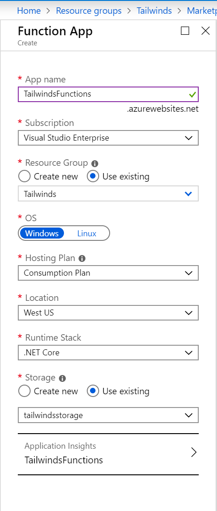
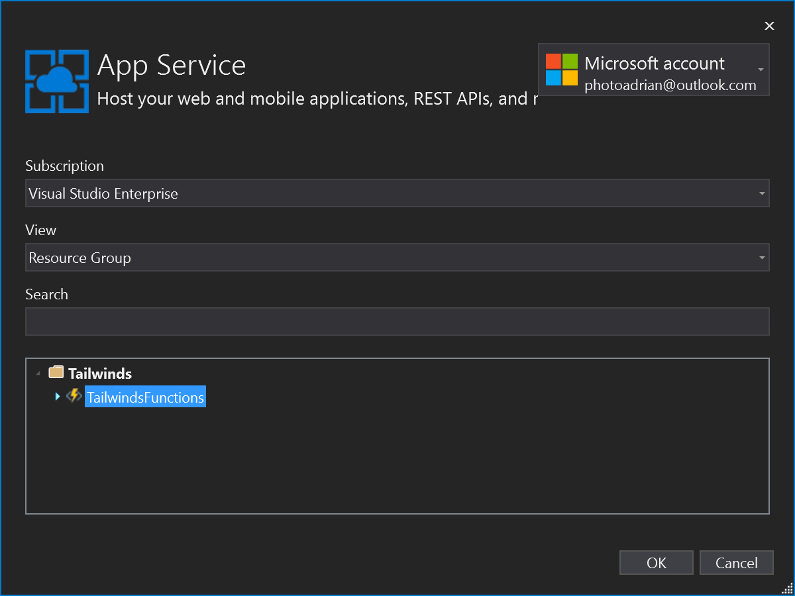
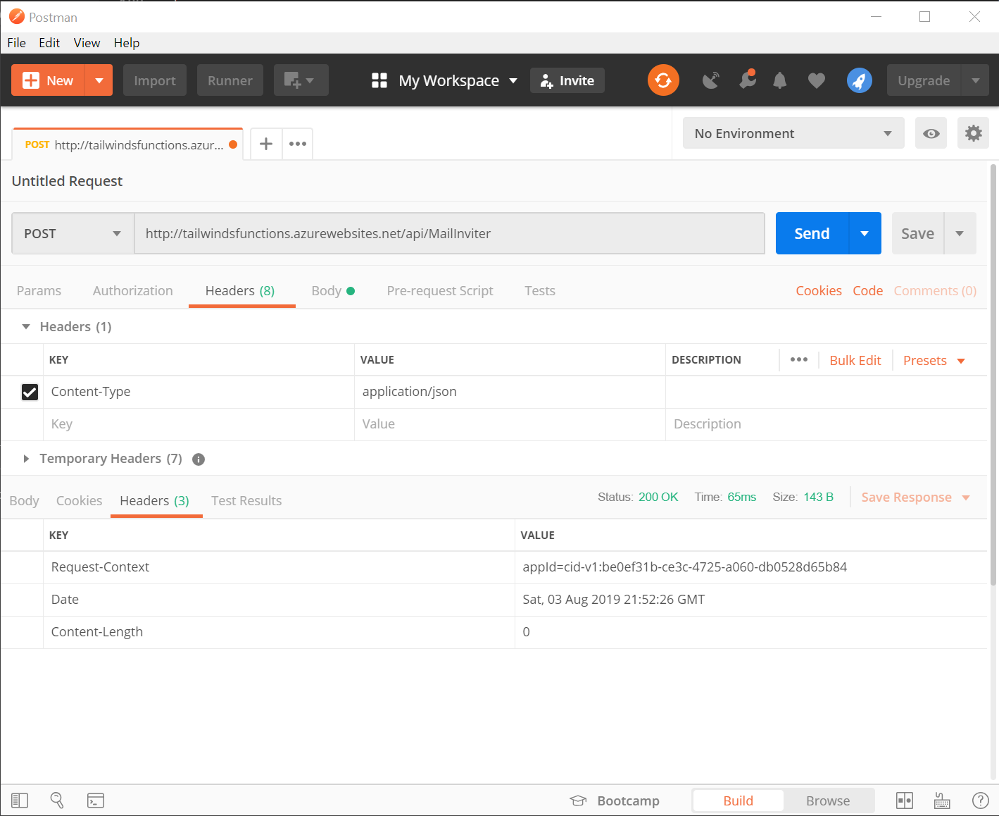

# RESTful services

REST, or [Representational State Transfer](https://www.restapitutorial.com/lessons/whatisrest.html) is a mechanism for providing a common API for communication.  It has several constraints, including the fact that it must be stateless (each request from client to server must contain all the information necessary to understand the request), and potentially cacheable (we inform the client if the result is cacheable.  If it is, then the client can reuse it).  It was first proposed by [Roy Fielding](https://www.ics.uci.edu/~fielding/pubs/dissertation/rest_arch_style.htm) and has since taken over as the predominent programming model for client-server applications.  In fact, both OData and GraphQL are technically REST interfaces.

From a coding perspective, RESTful transfer is generally split into three parts:

* A web API - in .NET, this will be an ASP.NET Core web API.
* A service object used on the client to communicate to the web API.
* A client object used on the client  to abstract service concepts away.

Although many developers choose to collapse the service object and client object into a single piece of code, I prefer to leave them separate.  The service object has a 1:1 correspondance with the web API.  Web APIs can be described in [Swagger](https://swagger.io/).  This data file allows you to generate the service object and stub out the web API using code generation.  This is important in larger systems as it significantly reduces the amount of code you have to maintain.  You just regenerate the source code when the Swagger file changes.  The client object, however, is inevitably hand written and it is this object that the rest of your application interacts with.  The client object deals with unified authentication and caching.

## Building an authenticated RESTful web API

We built a simple web API back in Chapter 1 when we were looking at the basic app.  However, it had many deficiencies, most notable of which was anyone could access it with no limits.  In this section, I'm going to take a look at what is required to create a simple data service with authentication.  I want my app to have a facility to "invite a user".  The app user will enter an email address.  The app will send the request (via a HTTP POST request) to the backend, and then the backend will send an invite message via email to the user.  

Let's start by thinking how we want to deploy the service.  There are two basic options:

1) As a serverless function, using [Azure Functions](https://azure.microsoft.com/en-us/services/functions/).
2) As an [ASP.NET Core](https://docs.microsoft.com/en-us/aspnet/core/?view=aspnetcore-2.2) application packaged within a Container.  You can deploy that container through [Azure App Service](https://azure.microsoft.com/en-us/services/app-service/), [Azure Kubernetes Service](https://azure.microsoft.com/en-us/services/kubernetes-service/), or [Service Fabric](https://azure.microsoft.com/en-us/services/service-fabric/).

It's a major decision since picking one determines the programming model that you want to use.  In more complex apps, there is also an architecture component.  Azure Functions can only run for a certain amount of time, but they are "infinitely" scaleable (in that you don't need to do anything to increase scaling).  If you choose a container service, you can test locally much more easily but you have to think about boilerplate code that you have to maintain, the runtime (which is always improving, but needs testing), and scaling the solution (which depends on where you run the application).

In this particular case, I'm going to opt for a serverless approach.  The application will consist of a single Azure Function that does all the work necessary.  In terms of the work:

* First, check the authentication of the request.
* If the authentication is good, then extract the email address and name from the token.
* Then look at the request and decode the email address that we need to send the message to.
* Finally, send the message!

For this piece of functionality, I'm going to use [SendGrid](https://www.sendgrid.com) to send emails.  You can configure it directly from the Azure portal and it comes with a free tier (for up to 25,000 emails per month).

### Configure Azure resources

The initial step is to configure the Sendgrid resource so that the Azure Function we write will be able to access it.  Sendgrid uses API keys to secure access to their service, so our process is to create the Sendgrid resource, then grab the API key for later.

1. Sign in to the [Azure portal](https://portal.azure.com).  Make sure your default directory is selected (especially important if this is the first thing you have done after the authentication chapter!).
2. Go to **Resource groups**, then select the resource group for your app resources.  Mine is called `Tailwinds`.
3. Click **+ Add** to add a resource.
4. Search for `SendGrid` - there is only one with that name.
5. Select `SendGrid`, then click **Create**.

    

6. Fill in the form, ensuring that you select **Use existing** for the resource group (select your existing resource group).
7. Click **Pricing tier** > **Configure required settings**, then select the **F1 Free** tier.

    

8. Make sure you fill in the contact information and legal terms.
9. Click **Create**.

As with all resources, it will take a little bit of time to deploy the resource.  Once deployed, the new resource will appear in your resource group (although you may have to refresh the listing).  

1. Go to the newly created resource.
2. Click **Manage**.  This will take you to the `https://app.sendgrid.com` site for further configuration.
3. If required, confirm your email address before continuing.
4. Expand the *Settings** menu option on the left hand side, then select **API Keys**.

    

5. Click **Create API Key**.
6. Give the API key a name; for example `TailwindsMailInviter`.
7. Create a **Restricted Access** key. 
8. Under **Access Details**, expand **Mail Send**, and ensure that the _Mail Send_ option is enabled.
9. Click **Create & View**.
10. Copy the API key (by clicking on it) - you will need it later and you can't get it back again. (I copy mine into a local notepad file).
11. Click **Done**.

!!! tip "Use services for common tasks"
    You don't have to code everything yourself.  The Azure marketplace has lots of services that you can use in your apps easily, such as SendGrid for sending email.  I almost always prefer to use a service as a component to writing the component myself.

Next, let's create an application definition within Azure AD B2C.  This allows us to obtain an access token later on that includes a scope we can use for authorization to our web API.

At this point, you should have the following information:

* The issuer of the JWT produced by Azure AD B2C.
* The audience of the JWT produced by Azure AD B2C.
* The client ID of the application within Azure AD B2C.
* The scope of the Web API.
* The API key for Sendgrid.

### Create the Azure Function

Now that we have a mechanism by which we can send email, we need to write the REST API that responds to the POST request in our app.  We're going to do this as an Azure Function.  This requires three resources:

* A storage account
* An App hosting plan
* The Azure Function App

I like to create the function app separately to uploading from the code because this allows me to set up all resources the same way - through the portal or via automation.  You can deploy the entire Azure Function, including all needed resources, through Visual Studio as well.  In fact, Visual Studio makes it easy for you.  However, you will have to go into the portal to adjust some settings for authentication and authorization later on.

!!! tip "Separate deployment from writing code"
    Deployment is always a separate step to writing code, and you should get into the habit of separating them.  You might change code several times an hour, but you will not deploy resources unless it's necessary to do so.

Let's start with creating the storage account.  I use a single storage account for each app I produce.  Think of the storage account as the storage facilities of your computer.  You might have a number of disks (which are akin to _containers_ in Azure Storage).  Each disk can have a lot of folders, and those folders contain files.  In Azure Storage, you have a lot of _blobs_.  Each blob has a key.  If you specify a path for the key, that's the folder.  It's even rendered this way in tooling such as the Azure Portal and Storage Explorer.

So, a _storage account_ has _containers_, and those containers contain _blobs_.  The resource is the _storage account_ and it's easy to create:

1. Open the [Azure portal](https://portal.azure.com).
2. If you are not already on the default directory, switch to the default directory.  You can do this by clicking on your user ID in the top-right corner, then selecting **Switch directory**.
3. Click **Resource groups**, then select your resource group (mind is `Tailwinds`).
4. Click **+ Add** to add a resource.
5. Enter _Storage_ in the search box, then select **Storage account**.
6. Click **Create**.
7. Fill in the form:
   * Ensure the right subscription and resource group are selected (they should be by default).
   * Enter a name (for example, `tailwindsstorage`)
   * Pick the same region as your other resources.
   * For the cheapest price, select **Standard** performance, **StorageV2**, and **Locally-redundant storage (LRS)**.
8. Click **Review + create**.
9. Click **Create**.

Wait for the deployment to finish before continuing with the Azure Function:

1. Go back to the resource group.
2. Click **+ Add**.
3. Enter _Function_ in the search box, then select **Function app**.
4. Click **Create**.
5. Fill in the form:
    * Enter a suitable name (for example, `TailwindsFunction`).
    * Pick your existing resource group.
    * Ensure the location is the same region as your other resources.
    * Use the storage account you have just created.
6. Click **Create**.



Waity for the deployment to complete before continuing.  The base configuration of an Azure Function gives you the ability to stream logs to and debug with Visual Studio, Application Insights for production logging, and a basic .NET Core runtime.  We also want to be able to authorize users with Azure AD B2C:

1. Once the function app is deployed, click **Go to resource**, or open the resource group and click on the new resource.
2. Click **Platform features**.
3. Click **Authentication / Authorization**
4. Turn the App Service Authentication to **On**.
5. Click the **Azure Active Directory** authentication provider.
6. Set **Management mode** to **Advanced**.
7. Fill in the form:
    * The **Client ID** is the `ApplicationId` within `IdentityManager.cs`.
    * The **Issuer Url** is of the following form: `https://TENANTNAME.b2clogin.com/tfp/TENANTNAME.onmicrosoft.com/B2C_1_Signin/v2.0/`.  
      * The `TENANTNAME` is the name of your Azure AD B2C tenant.  
      * The `B2C_1_Signin` is the policy name for your authentication policy.
    * The **Allowed Token Audiences** is your Client ID.  It's the `aud` field in the JWT.
8. Once complete, click **OK**, then **Save**.

!!! tip "Never show off security tokens"
    You may think it wierd that I am not showing screen shots of the actual values I am entering.  I treat anything I would not place in the code of my mobile app as a secret.  Never show secrets to anyone - even if they will be deleted.  Showing secrets needlessly is a bad habit.

We've now successfully configured an Azure Function app.  We can now move onto writing the code for it.  Let's start with a basic app that allows us to see what is going on:

1. Start Visual Studio.
2. Right-click the solution, then select **Add** > **New project...**.
3. Enter `Functions` in the search box, then select **Azure Functions** (it should be the first match).
4. Name the function `TailwindsFunctions`, then click **Create**.  (I use the same name for the project as I do for the resource.  A function app can contain many functions.)
5. Ensure **HTTP Trigger** is selected.
6. Click **Create**.

!!! info "Storage Emulator or Browse...?"
    The New Project dialog for an Azure Function gives you an option of using the storage emulator or an existing storage account.  You can run the Azure Function locally.  Pick the storage emulator and you can run the Azure Function locally without connectivity.  The storage location will be updated when you publish the function to Azure.

You get a default function called `Function1.cs`.  Delete it so we can call the function by our own name.  Let's create a new function from scratch that just does some logging. 

1. Right-click on `TailwindsFunctions` and select **Add** > **New Azure Function...**. 
2. Enter the name `MailInviter` in the box provided, then click **Add**.
3. Select **Http trigger**, and select **Anonymous** for the authorization level.
4. Click **OK**.

Before we continue, let's do some logging so we can actually use this function.  Replace the code for the `MailInviter` class with the following:

```csharp
namespace TailwindsFunctions
{
    public static class MailInviter
    {
        [FunctionName("MailInviter")]
        public static async Task<IActionResult> Run(
            [HttpTrigger(AuthorizationLevel.Function, "get", "post", Route = null)] HttpRequest req,
            ILogger log)
        {
            log.LogInformation("C# HTTP trigger function processed a request.");
            log.LogInformation("Request Headers: ");
            foreach (var header in req.Headers)
            {
                log.LogInformation($"Header {header.Key} = '{header.Value}'");
            }
            return new OkResult();
        }
    }
}
```

This dumps the request headers to the log, allowing us to analyze them.

### Deploy the Azure function

To deploy the Azure Function:

1. Right-click on the `TailwindsFunctions` project, and select **Publish...**.
2. Select **Select Existing**.
3. Check the **Run from package file (recommended)** box, then click **Publish**.

    

4. Select your resource group and the function you deployed earlier.  Then click **OK**.

    


Your Function app will now be compiled and pushed to your deployed resource.  At this point, you can access the endpoint using the provided Site URL.

Once deployment is done, the functions will be built and bundled, and then transferred to the newly deployed function app.  At this point, you can access them using the provided Site URL.


Right now, we have anonymous authorization, which means no authorization is required.  You can just hit the endpoint with Postman and it will return a 200 OK response while spitting out the headers.  To see for yourself, first open the **Cloud Explorer** (it's in the View menu if you are having problems finding it).  Expand the tree until you see the `TailwindsFunctions` function app. Click on the function app and you will see the actions that you can take.  Click **View Streaming Logs**.  In Postman, send a POST request with an empty body to `Site_URL/api/MailInviter` (note how the URL is constructed):



In the output window, you will see a bunch of logsthat show off the headers.  This is nothing exciting.  Now, let's change the authorization level and submit an authenticated request.  There are five levels of authorization.  We've used _Anonymous_ authorization which means any HTTP request to the endpoint will be passed to your function.  The _Function_, _System_, and _Admin_ authorization levels are all key-based, and it depends on where the key is generated. 

* The _Admin_ level requires a **host** key.  You can set (or see) the host key in the **Function app settings** page on the function app within the Azure portal.
* The _System_ level requires the **_master** key.  This can be viewed in the same **Function app settings** page on the function app within the Azure portal.
* The _Function_ level requires a **function** key.  These are unique to each function.  You can see the function key (or create a new one) within the **Manage** page of the individual function.

The final authorization type is _User_.  This requires that you send a JWT token as a bearer token in the `Authorization` header of the HTTP request.  The token must match the criteria that we set in the Authentication / Authorization section of the Azure function app earlier.  First, change the authorization level in `MailInviter.cs`:

```csharp
public static class MailInviter
{
    [FunctionName("MailInviter")]
    public static async Task<IActionResult> Run(
        [HttpTrigger(AuthorizationLevel.User, "get", "post", Route = null)] HttpRequest req,
        ILogger log)
    {
        log.LogInformation("C# HTTP trigger function processed a request.");
        log.LogInformation("Request Headers: ");
        foreach (var header in req.Headers)
        {
            log.LogInformation($"Header {header.Key} = '{header.Value}'");
        }
        return new OkResult();
    }
}
```

Publish the new function definition.  Now that the publication profile is set up, you can click on the **Publish** button to do the publication.  Go back to Postman and send the same request again:


You get a `401 Unauthorized` response back.  More interestingly, your function app was not executed.  You get charged on a per-execution basis with Azure Functions.  Setting authorization up means you don't get charged for failed attempts to execute your endpoint.

To get a valid JWT, you need to create one.  The easiest way to do that is to run the mobile app and set a breakpoint in the `IdentityManager` when a successful authentication occurs.  You can then read the `IdToken` from the result.  Use the **Text Visualizer** to get the full value.  You can open the Text Visualizer using the drop-down next to the value you are trying to retrieve.

